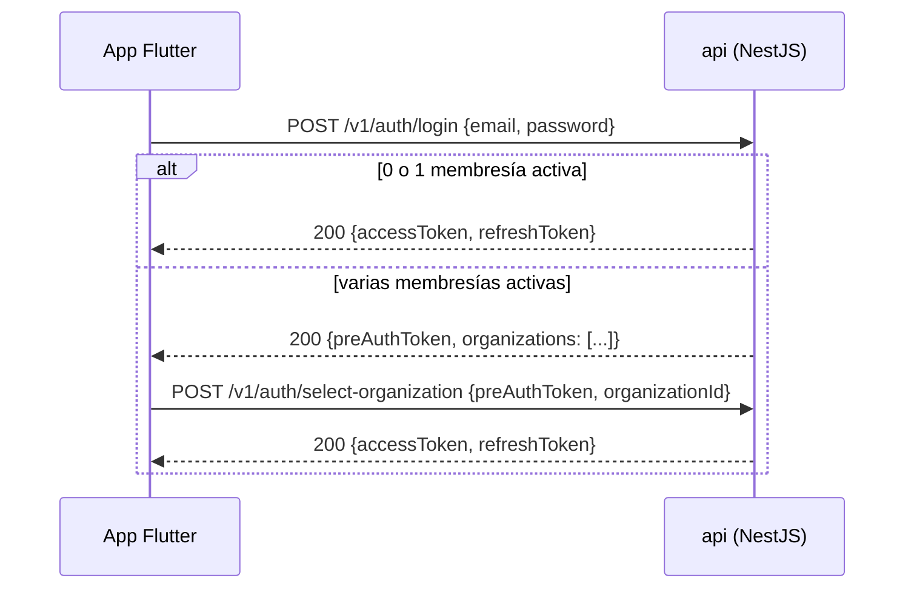

# API_DESIGN.md

## 0. Estado de este documento
- Etapa del proceso: 7 — Contrato de API
- Estado: En análisis (convenciones + `OPENAPI.yaml` de referencia, pendiente de tu validación)
- Última actualización: 2026-07-27
- Depende de: Etapas 0-6
- Bloquea: Etapa 8 (seguridad aplicada sobre estos endpoints), Etapa 13 (implementación backend), Etapa 14 (cliente Flutter)

Este documento fija **convenciones y contrato**, no la implementación. El detalle exhaustivo de cada endpoint vive en [`OPENAPI.yaml`](OPENAPI.yaml); aquí se explican las decisiones que no son visibles solo leyendo el YAML.

## 1. Decisiones tomadas en esta etapa

| Decisión | Elegido | Alternativa descartada |
|---|---|---|
| Versionado | Prefijo de ruta `/v1` desde el día 1 | Sin versionar; versionado por header |
| Idioma de rutas/campos JSON | Inglés (`installations`, `gateways`...), consistente con el código | Español (consistente con la documentación) |
| Namespaces de ruta | `/v1/...` (miembro, organización implícita del JWT) vs. `/v1/platform/...` (Admin de plataforma, sin organización activa) | Un único namespace con `organizationId` explícito siempre |
| Formato de error | RFC 7807 (Problem Details) | Formato de error propio ad-hoc |
| Paginación | Offset (`page`/`pageSize`) para catálogos pequeños; cursor para telemetría y auditoría | Cursor en todos los listados; offset en todos los listados |
| Idempotencia en POST | Header `Idempotency-Key` opcional en creaciones con efecto (miembros, gateways, dispositivos, sensores) | Ninguna, confiar solo en que el cliente no reintente |
| Convención de actualización | `PATCH` = parcial; `PUT` = reemplazo completo/idempotente (umbrales, alcance de miembro) | Usar `PUT` para todo |
| Formato de fecha/hora | ISO-8601 UTC en toda la API (igual que `MQTT_PROTOCOL.md`) | Timestamps Unix |
| Convención de anidamiento | Anidado para "listar hijos de un padre concreto" y "crear dentro de un padre"; plano para leer/editar/borrar por su propio id | Todo anidado; todo plano con query params |

## 2. Namespaces de ruta

- **`/v1/...`** — recursos de la organización activa del JWT del miembro autenticado. El `organizationId` nunca va en la URL ni en el body: se resuelve del token, evitando que un cliente malicioso o con un bug pase un `organizationId` ajeno (Etapa 3, aislamiento).
- **`/v1/platform/...`** — Admin de plataforma, sin organización activa. Cubre alta/baja de organizaciones, feature flags (`PERMISSIONS.md` sección 14) y auditoría de plataforma.
- **`/v1/platform/organizations/{organizationId}/...`** — la excepción de Directorio IoT del [ADR-0005](ADR/0005-admin-plataforma-gestion-global-iot.md): mismos recursos que en `/v1/...` (instalaciones→canales), pero con el `organizationId` explícito en la ruta, porque el Admin de plataforma no tiene uno implícito. Internamente reutiliza el mismo servicio de aplicación que la ruta de miembro — solo cambia de dónde se resuelve el `organizationId` (Etapa 13, detalle de implementación).

## 3. Autenticación y selección de organización



- `preAuthToken`: JWT de vida muy corta (~5 min), sin claim de organización, **solo** válido contra `/v1/auth/select-organization` — nunca sirve para leer ningún recurso. Evita emitir un token de acceso completo antes de que la organización activa esté decidida.
- Un usuario sin ninguna membresía (Admin de plataforma "puro") recibe directamente un `accessToken` sin organización, válido solo bajo `/v1/platform/...`.
- Refresh: `POST /v1/auth/refresh` con `{sessionId, secret}` (formato de sesión de `DATA_MODEL.md` sección 3) — rota el secreto en cada uso (refresh tokens rotativos, ya fijado como principio desde el inicio del proyecto).
- Recuperación de contraseña: `POST /v1/auth/forgot-password` (siempre responde 202 exista o no el email, para no filtrar qué cuentas existen) y `POST /v1/auth/reset-password` con un token de un solo uso enviado por email.

## 4. Formato de error (RFC 7807)

```json
{
  "type": "validation-error",
  "title": "Validation failed",
  "status": 400,
  "detail": "One or more fields are invalid.",
  "instance": "/v1/gateways",
  "errors": [{ "field": "name", "message": "must not be empty" }]
}
```
`type` es un código estable (no necesita ser una URL real dereferenciable, RFC 7807 lo permite). `errors` solo aparece en errores de validación de campo (400); el resto de errores (403, 404, 409...) usan `title`/`detail` sin ese array.

## 5. Paginación

- **Sin paginar** (instalaciones, zonas, gateways, dispositivos, sensores, canales, miembros, alertas, telemetría histórica, auditoría de organización y de plataforma — Etapa 2): la respuesta es un array plano, `[...]`. Los catálogos pequeños no lo necesitan a la escala del MVP (≤500 dispositivos, `NON_FUNCTIONAL_REQUIREMENTS.md` §2); telemetría/auditoría se limitan de otra forma (rango `from`/`to` obligatorio en telemetría; tope fijo de 200 filas más recientes en auditoría), no con cursor.

> **Decisión retroactiva (2026-07-27, `BACKLOG.md` #13)**: esta sección documentaba originalmente paginación offset (`?page&pageSize` → `{data, meta}`) para instalaciones/zonas/gateways/dispositivos/sensores/miembros/alertas, pero ningún `findAll()` de `apps/backend` la implementó nunca — cada uno devuelve un array plano vía `findMany()`. Se descubrió construyendo el cliente Flutter contra el backend real (Etapa 14): `installations_api.dart` esperaba el sobre documentado y habría fallado en tiempo de ejecución. En vez de retrofitar paginación real en ~7 endpoints sin nadie disponible para revisar un cambio de ese tamaño, se optó por la opción más conservadora: simplificar este documento y `OPENAPI.yaml` para que reflejen la realidad (array plano). Si el volumen real llega a justificarlo, se revisa como una tarea propia — ver `MAINTENANCE.md` §3 (umbrales de escala) para el criterio de cuándo reabrir esto.
>
> **Segunda ronda del mismo problema (2026-07-30, `BACKLOG.md` #15)**: esta sección afirmaba que la paginación por cursor de telemetría histórica y auditoría ("Esta sí es real") sí estaba implementada, a diferencia de la offset de arriba — resultó ser la misma clase de error. Ni `ReadingsController#getHistory` ni `AuditController#list`/`PlatformAuditController#list` aceptan `cursor`/`limit`; los tres devuelven un array plano (`$queryRaw` para telemetría, `findMany(...).take(200)` para auditoría). Encontrado al construir el visor de auditoría de organización en Flutter (Etapa 14) y comparar la respuesta real contra `OPENAPI.yaml`. Misma solución conservadora: se simplifican este documento y `OPENAPI.yaml` (se retiran los esquemas `AuditLogPage`/`ReadingPage`/`CursorMeta` y los parámetros `Cursor`/`Limit`, ya huérfanos) para reflejar el array plano real, en vez de construir cursor de verdad en tres endpoints más sin nadie disponible para revisarlo.

## 6. Idempotencia en escritura

Header opcional `Idempotency-Key` en `POST` con efectos secundarios (invitar miembro, crear gateway/dispositivo/sensor). El backend cachea la respuesta por `(endpoint, key)` durante 24h — un reintento del cliente con la misma clave devuelve la misma respuesta en vez de duplicar la creación. Complementa, a nivel de API, la idempotencia ya resuelta a nivel de ingesta MQTT (Etapa 6) y de negocio ("no crear una segunda organización con el mismo alta").

## 7. Credenciales de gateway: se muestran una sola vez

`POST /v1/gateways` y `POST /v1/gateways/{id}/rotate-credential` devuelven el secreto **en texto claro solo en esa respuesta** — el backend guarda únicamente su hash (`DATA_MODEL.md`, `gateway_credentials`). Si se pierde, la única opción es rotar (generar uno nuevo), nunca recuperar el anterior. Mismo patrón que tokens de acceso de proveedores cloud habituales.

## 8. Lecturas y agregación

`GET /v1/channels/{channelId}/readings?from&to&granularity=raw|hourly|daily` — `granularity` controla la **resolución temporal**, no la función de agregación: la función (`average` con min/max, o `sum`, Etapa 6 sección 9 vía `channel_types.default_aggregation`) se aplica automáticamente según el tipo de canal, sin que el cliente la elija en el MVP. `granularity=raw` está limitado a un rango máximo de 7 días (Etapa 2/6); rangos mayores exigen `hourly` o `daily`.

## 9. WebSocket (tiempo real)

- Un único endpoint `wss://.../v1/ws`, autenticado con el mismo `accessToken` (como query param o header en el handshake, según soporte del cliente Flutter — a confirmar en Etapa 13).
- El servidor une automáticamente al cliente a la "sala" de su organización activa (sin gestión de suscripción granular por sensor en el MVP — el volumen es bajo, Etapa 2, y Flutter filtra localmente lo que muestra).
- Eventos emitidos por el servidor: `reading.updated` (`{channelId, value, tsOrigin}`), `alert.created`, `alert.updated` — mismo payload que sus recursos REST equivalentes, para no mantener dos formatos.
- Sin eventos cliente→servidor en el MVP (canal de solo notificación, no de comandos — coherente con que los comandos remotos están diferidos a V2, `ARCHITECTURE.md` sección 10).

## 10. Riesgos
- Reutilizar el mismo servicio de aplicación para `/v1/...` y `/v1/platform/organizations/{id}/...` (sección 2) es cómodo pero exige disciplina: cualquier nuevo endpoint de organización debe recordar exponer (o deliberadamente no exponer) su variante de plataforma — se listará como checklist en Etapa 13, no se puede confiar solo en la revisión de código.
- El array `errors` de validación (sección 4) podría filtrar nombres de campos internos si no se mapean a los nombres públicos del DTO — a verificar en Etapa 8.

## 11. Entregables de esta etapa
- Este documento (`API_DESIGN.md`).
- [`OPENAPI.yaml`](OPENAPI.yaml) — especificación de referencia de los recursos del MVP (auth, organización, miembros, directorio IoT, telemetría, alertas, auditoría, plataforma).

## 12. Criterios de aceptación de esta etapa
- Todo endpoint tiene un verbo, una ruta, un código de éxito y al menos un caso de error documentado en `OPENAPI.yaml`.
- El flujo de login con selección de organización está completamente especificado (sin pasos implícitos).
- Ninguna ruta de organización acepta un `organizationId` explícito del cliente — siempre se resuelve del JWT (excepto el namespace de plataforma, sección 2).

## 13. Pruebas necesarias derivadas
- Login de un usuario con 2 membresías: confirmar que recibe `preAuthToken` (no `accessToken`) y que ese token es rechazado en cualquier endpoint que no sea `/v1/auth/select-organization`.
- Reenviar una petición `POST /v1/gateways` con el mismo `Idempotency-Key` dos veces y confirmar que se crea un único gateway.
- Pedir `granularity=raw` con un rango de 30 días y confirmar 400 (excede el máximo de 7 días).
- Confirmar que la respuesta de creación de un gateway incluye el secreto en claro, y que un `GET` posterior de ese gateway nunca lo incluye.

## 14. Lista de tareas de esta etapa
- [x] Definir convenciones (versionado, idioma, namespaces, errores, paginación, idempotencia).
- [x] Especificar el flujo de login + selección de organización.
- [x] Redactar `OPENAPI.yaml` de referencia.
- [ ] Revisión y validación por tu parte.
- [ ] Cerrar etapa y pasar a Etapa 8 (seguridad y modelo de amenazas).

## 15. Dependencias
- Depende de Etapas 0-6 (cerradas/en análisis).
- Bloquea Etapa 8 (rate limiting, CORS, cabeceras de seguridad sobre estos endpoints), Etapa 13 (implementación), Etapa 14 (cliente Flutter, incluido el flujo de selección de organización).

## 16. Aspectos que se aplazan explícitamente
- Endpoints de comandos remotos, firmware, API keys, exportación/informes — no existen en `OPENAPI.yaml` todavía (V2/Futuro).
- Gestión de suscripción granular por sensor en WebSocket — V2, si el volumen lo justifica.
- Documentar en `OPENAPI.yaml` los endpoints de plataforma para cada recurso de Directorio IoT de forma exhaustiva — se muestra `gateways` como representativo; el resto se mecaniza igual en Etapa 13.

## 17. Errores frecuentes a evitar
- No aceptar `organizationId` en el body/query de una ruta `/v1/...` de miembro, aunque coincida con el del JWT — es una superficie de confusión/ataque innecesaria; siempre se ignora y se usa el del token.
- No devolver el secreto de una credencial de gateway más que en la respuesta de creación/rotación.
- No usar `PUT` para actualizaciones parciales ni `PATCH` para reemplazos completos — rompe la convención de la sección 1 y confunde a quien consuma la API después.
- No inventar un formato de error nuevo por endpoint — todos usan RFC 7807.

## 17 bis. Rutas de parcelas y satélite (BACKLOG.md #36)

Contrato completo en `OPENAPI.yaml`. Lo que conviene saber al leerlo:

- **Las parcelas siguen el patrón de las zonas**: `/installations/{id}/parcels` para crear y listar, `/parcels/{id}` para el resto. Nada nuevo.
- **La geometría entra y sale siempre como GeoJSON en EPSG:4326**, independientemente de cómo se guarde ([ADR-0009](ADR/0009-geometria-de-parcelas-en-postgis.md)). Se admite `Polygon` o `MultiPolygon` y se normaliza a `MultiPolygon`; el anillo se cierra solo si llega abierto, porque la app dibuja tocando puntos.
- **La serie de NDVI usa `tsOrigin` y `value`**, los mismos nombres que el histórico de un canal de telemetría (`/channels/{id}/readings`). No es casualidad: así el cliente reutiliza sus gráficas sin traducir nada. Lo que se añade es la calidad, que en satélite no es un detalle.
- **La calidad viaja siempre con el valor.** `validPixelPercent` va redondeado a entero desde el servidor: enseñar "92,348729 % de superficie válida" sería falsa precisión, y el número solo sirve para saber si fiarse del dato.
- **`/satellite/latest` puede devolver `null`**, y eso no es un error: una parcela recién creada todavía no tiene observaciones. El cliente tiene que distinguir "no hay dato" de "el dato es cero".
- **Los archivos no se sirven desde la API**: `/assets/{id}/url` devuelve una URL firmada con caducidad. El bucket es privado y sus credenciales no salen del backend.
- **`POST /satellite/refresh` responde 429** si esa parcela ya se refrescó hace menos de una hora. No es un límite de tráfico genérico: es que cada llamada gasta cuota de Copernicus.

## 17 ter. Rutas de campañas (BACKLOG.md #60)

Contrato completo en `OPENAPI.yaml`. Lo que conviene saber al leerlo:

- **El alta cuelga de la finca** (`POST /installations/{id}/campaigns`), como parcelas y zonas; el resto, de la campaña (`/campaigns/{id}`). El listado (`GET /campaigns`) cruza fincas y respeta el alcance del miembro; se filtra por `status`, `installationId`, `year` (campañas que tocan ese año) y `cropId`.
- **Una campaña se crea de una vez con sus unidades de cultivo y parcelas.** Una campaña sin cultivo ni sitio no sirve para nada, y así el asistente de la app hace una sola llamada. El nombre es opcional: sin él sale "Aguacate Hass · 2026", o "Olivo · 2026/27" si cruza de año.
- **Fechas sin hora como `AAAA-MM-DD`**, en la entrada y en la salida (`startDate`, `endDate`...). Son fechas del campo, no instantes: un `2026-02-03T00:00:00Z` saldría como el 2 de febrero en cualquier huso al oeste de Greenwich.
- **Superficies en hectáreas, calculadas en el servidor**: la de cada parcela (del contorno), la declarada si no se usa entera, la de cada unidad (la declarada o la suma de sus parcelas) y la de la campaña. El cliente no suma nada.
- **El estado y el modo tienen rutas propias**, no un `PATCH`: `POST /campaigns/{id}/upgrade` (sencilla → completa), `/close` (con fecha de fin; guarda la instantánea) y `/reopen` (con motivo obligatorio). Cada una es una decisión que queda auditada, y así no se cuela un cambio de estado dentro de una edición cualquiera.
- **Toda acción sobre la campaña o sus unidades devuelve la ficha completa**: cambia la superficie, las parcelas y los cultivos, y la app se refresca de una vez.
- **409 con el motivo en español** cuando la acción choca con el estado: campaña cerrada ("reábrela para modificarla"), última unidad de cultivo, parcela con actividades registradas (dice cuál).
- **`GET /crops` devuelve el catálogo entero** (es pequeño) y la app filtra mientras se escribe, sin distinguir tildes.
- **Actividades: un solo alta para todos los tipos** (`POST /campaigns/{id}/activities`), con el detalle del tipo en su propia clave (`irrigation`, `fertilization`, `phytosanitary`, `harvest`, `fieldWork`). Rutas separadas por tipo triplicarían la API sin validar mejor.
- **Nada del cuaderno completo es obligatorio para guardar** ([ADR-0013](ADR/0013-campana-sencilla-y-cuaderno-completo.md)): quien está en el campo apunta un tratamiento en segundos y lo completa después. Se rechaza lo incoherente, con el motivo: detalle de otro tipo, un valor sin su unidad, una parcela de fuera de la campaña, una fecha anterior a la campaña o que todavía no ha pasado.
- **Una actividad sobre varias parcelas es un registro con varios destinos.** Si una parcela está en una sola unidad de cultivo, no hace falta decir cuál; si está en dos, sí.
- **Los valores normalizados los calcula el servidor y los devuelve**: `volumeM3` de un riego escrito en m³/ha, `nKgHa` de un abonado a partir de su dosis y riqueza (nulo si la dosis va en litros: haría falta la densidad), `quantityKg` de una cosecha en toneladas.
- **Corregir sustituye entero** el detalle o los destinos que se manden, y lo anterior queda en la auditoría. **Borrar es lógico**, con motivo opcional en la consulta (`?reason=`): un cuerpo en un `DELETE` lo tiran algunos proxies.
- **"Repetir" no tiene ruta propia**: la app rellena el formulario con la actividad anterior y, tras confirmar, la envía con `repeatedFromId`.
- **El resumen (`/summary`) no enseña ceros que parezcan medidas**: un apartado sin actividades es `null`, y lo que no se pudo calcular se cuenta aparte (`withoutVolume`, `withoutKg`...).
- **Catálogos del cuaderno en `/notebook/people` y `/notebook/equipment`** (fase 5): aplicadores, asesores y equipos de aplicación, dados de alta una vez y elegidos después por su identificador (`applicatorId`, `adviserId`, `equipmentId`). Con `installationId` nulo valen para todas las fincas, que es lo normal en una explotación de un solo titular. Elegirlos es leer (`campaigns.read`, que tiene el Operador); mantenerlos, `campaigns.update`. La baja es lógica: los tratamientos guardan su propia copia, pero el enlace tiene que poder resolverse.
- **`GET /campaigns/{id}/completeness` dice qué falta, no si "cumple"** ([ADR-0013](ADR/0013-campana-sencilla-y-cuaderno-completo.md)). Solo aplica al modo completo (`applicable: false` en una campaña sencilla). Cada aviso trae `code` estable, `kind` (`missing` = información pendiente, `warning` = conviene revisarlo), el `label` en español, el `why` y **la fuente** (`source`/`sourceLabel`): la norma concreta, o `plataforma` cuando el dato hace falta para calcular algo y no por normativa. El conjunto de reglas va versionado (`rules.id`, hoy `ES-2026.1`), para saber con qué reglas se revisó cada campaña.
- **Cerrar avisa, no impide**: `POST /campaigns/{id}/close` devuelve la ficha con `completeness` incluido y deja contados en la auditoría lo pendiente, los avisos y la versión de las reglas. Quien cierra sabe mejor que la aplicación si le faltan datos, y siempre puede reabrir.

## 18. Historial de decisiones de esta etapa

| Fecha | Decisión | Alternativas consideradas |
|---|---|---|
| 2026-07-27 | Prefijo `/v1`, rutas/campos en inglés | Sin versionar; rutas en español |
| 2026-07-27 | Namespace `/v1/platform/...` separado, con `organizationId` explícito solo ahí | Un único namespace con `organizationId` siempre explícito |
| 2026-07-27 | Errores RFC 7807 | Formato propio |
| 2026-07-27 | Paginación offset (catálogos) + cursor (telemetría/auditoría) | Una sola estrategia para todo |
| 2026-07-27 | `Idempotency-Key` opcional en POST con efecto | Sin mecanismo de idempotencia a nivel de API |
| 2026-07-27 | Login con `preAuthToken` intermedio si hay >1 membresía | Emitir siempre un `accessToken` con la primera organización por defecto |
