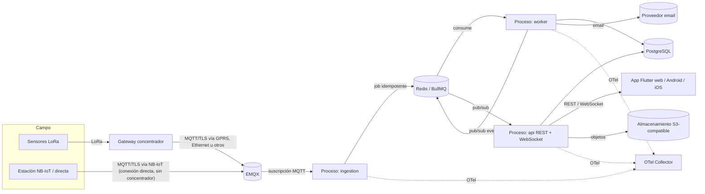
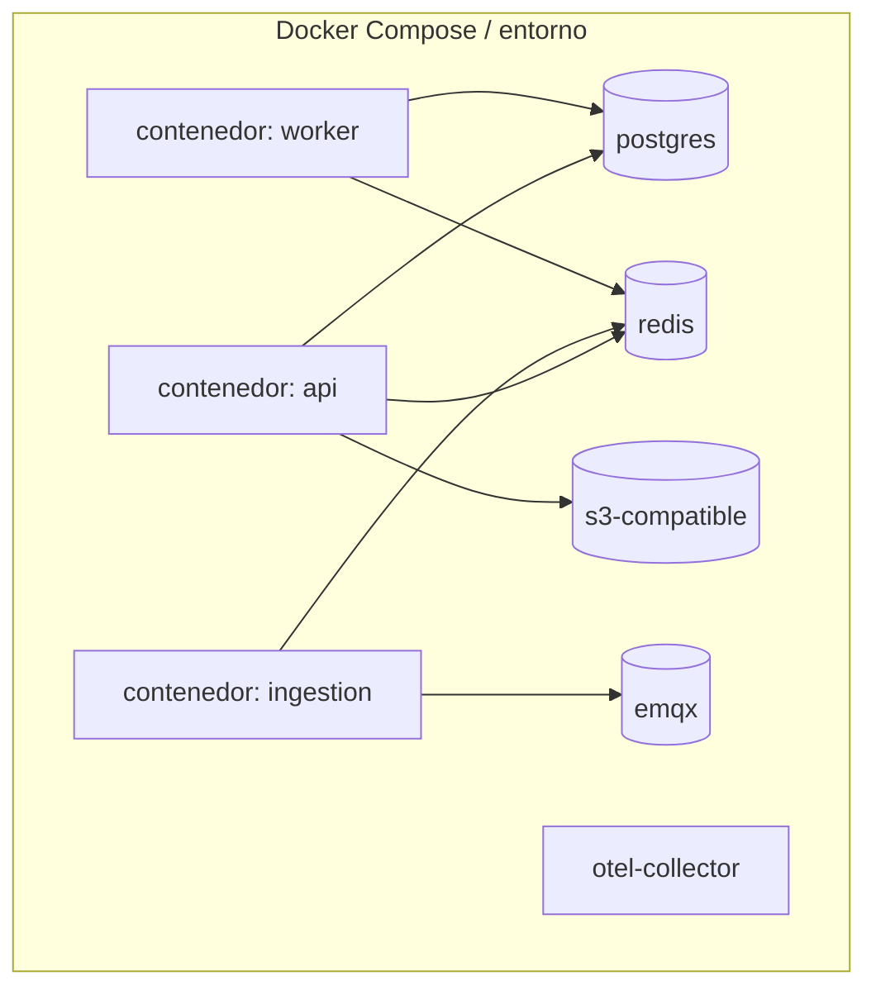
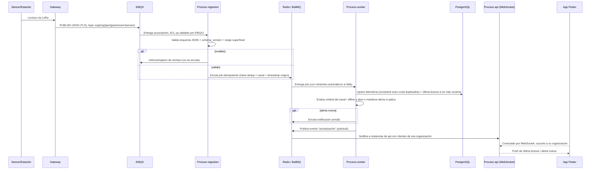

# ARCHITECTURE.md

## 0. Estado de este documento
- Etapa del proceso: 3 — Arquitectura
- Estado: En análisis (propuesta completa, pendiente de tu validación)
- Última actualización: 2026-07-27
- Depende de: Etapas 0, 1, 2
- Bloquea: Etapa 4 (permisos), Etapa 5 (datos), Etapa 6 (MQTT), Etapa 7 (API), Etapa 8 (seguridad), Etapa 9 (infraestructura)

## 1. Objetivo
Definir cómo encajan las piezas ya fijadas (Flutter, NestJS, EMQX, PostgreSQL, Redis/BullMQ, WebSocket, S3, OTel) para cumplir los requisitos funcionales (Etapa 1) y las cifras no funcionales (Etapa 2), respetando los principios arquitectónicos ya establecidos: monolito modular + workers, separación API de usuarios / canal de dispositivos, auth de usuario separada de auth de dispositivo, multitenant en cada capa, sin microservicios ni Kubernetes sin necesidad medida.

Esta etapa **no** decide esquema de tablas (Etapa 5), ni payload exacto MQTT (Etapa 6), ni endpoints de API (Etapa 7) — fija la forma del sistema para que esas etapas tengan un marco donde encajar.

## 2. Principios que restringen este diseño (ya fijados, no se reabren aquí)
- Monolito modular + workers independientes; nada de microservicios sin necesidad medible.
- API de usuarios y canal de dispositivos, en procesos separados.
- Auth de usuario y auth de dispositivo son dominios distintos, sin credenciales compartidas entre dispositivos.
- Todo módulo con soporte multitenant, aislamiento aplicado en backend **y** en base de datos.
- Nada de tareas pesadas dentro de una petición HTTP.
- Operaciones idempotentes; tolerancia a duplicados, desorden, picos y reconexiones (Etapa 1).
- Sin Kubernetes salvo justificación real de carga/disponibilidad — a esta escala (Etapa 2: ~3 msg/s sostenidos, 500 estaciones, 100-500€/mes) no está justificado.

## 3. Vista de componentes

Tres procesos NestJS desplegables, **un único monorepo/código base** (monolito modular, no microservicios):

| Proceso | Responsabilidad | Habla con |
|---|---|---|
| `api` | REST (OpenAPI) + WebSocket para la app Flutter. Todos los módulos de gestión (usuarios, organizaciones, miembros, roles, instalaciones, zonas, gateways, dispositivos, sensores, alertas, auditoría, API keys). | PostgreSQL, Redis (pub/sub), S3 |
| `ingestion` | Único punto que habla MQTT. Se suscribe a EMQX, valida esquema/rango a nivel superficial y encola. No escribe en PostgreSQL directamente. | EMQX, Redis (BullMQ) |
| `worker` | Consume la cola: deduplica, escribe telemetría, actualiza últimas lecturas, evalúa umbrales/offline, crea alertas, encola notificaciones, envía email. | Redis, PostgreSQL, SMTP |

## 4. Vista de despliegue (contenedores)

Los tres procesos comparten imagen Docker y código (mismos módulos NestJS compilados); solo cambia el `CMD`/entrypoint (`main.api.ts`, `main.ingestion.ts`, `main.worker.ts`), cada uno bootstrapea solo los módulos que necesita. Esto evita mantener tres repositorios o duplicar la capa de acceso a datos, sin mezclar sus ciclos de vida de despliegue (se pueden escalar o reiniciar por separado).

## 5. Módulos de dominio agrupados (los 20 módulos, dentro del monolito)

| Grupo | Módulos | Proceso principal |
|---|---|---|
| IAM | Usuarios, Organizaciones, Miembros, Roles, Permisos, Sesiones | `api` |
| Directorio IoT | Instalaciones, Zonas, Gateways, Dispositivos, Sensores | `api` (gestión); leído por `ingestion`/`worker` para resolver topic → organización/dispositivo |
| Telemetría | Telemetría, Últimas lecturas | escrito por `worker`, leído por `api` |
| Alertas y notificaciones | Alertas, Notificaciones | evaluado/generado en `worker`, gestionado/consultado en `api` |
| Seguridad de dispositivos | Credenciales de dispositivos, API keys | gestionado en `api`; consumido por EMQX (auth hook) e `ingestion` |
| Diferido a V2 (reservado, sin lógica) | Comandos remotos, Firmware | `api` (solo estructura de datos, sin flujo activo) |
| Transversal | Auditoría | escrito desde cualquier acción administrativa en `api`, consultado en `api` |

## 6. Autenticación (dos dominios separados)

- **Usuarios**: login con contraseña (Argon2id, detalle en Etapa 8) → JWT de acceso de vida corta + refresh token rotativo persistido (hasheado) y revocable, gestionado por el módulo Sesiones. Un usuario con varios Miembros (Etapa 1, sección 3) elige una organización activa; el JWT lleva el `organization_id` activo como claim, no una lista — cambiar de organización re-emite el token, nunca es un cambio solo de interfaz.
- **Gateway = unidad de conexión MQTT** (revisado, [ADR-0004](ADR/0004-unidad-de-conexion-lora-y-nbiot.md)): cubre dos topologías físicas distintas con el mismo mecanismo de seguridad:
  1. **Concentrador LoRa**: varios sensores llegan por LoRa a un gateway físico, que es el único con GPRS/Ethernet y por tanto el único que abre la conexión MQTT.
  2. **Estación de conexión directa** (NB-IoT u otra tecnología con IP propia): la propia estación tiene conectividad y abre la conexión MQTT — se modela como un gateway de un solo dispositivo asociado (sin concentrador físico intermedio).
  - En ambos casos, al pre-registrarse (Etapa 1, sección 6) se recibe una credencial MQTT propia (usuario/contraseña o token único), validada por EMQX contra el backend, con una **ACL** que restringe a esa credencial a publicar únicamente bajo su propio prefijo de topic (`org/{orgId}/gw/{gatewayId}/...`). Ningún gateway puede publicar ni suscribirse fuera de su propio espacio — aislamiento multitenant reforzado también a nivel de broker, no solo en base de datos.
- **Dispositivos detrás de un concentrador LoRa** no tienen credencial de red propia — se identifican dentro del JSON que publica su gateway (Etapa 1, sección 9). Su "pre-registro obligatorio" significa que el proceso `ingestion` **rechaza a nivel de aplicación** cualquier dato que referencie un `device_id` no pre-registrado para ese gateway/organización, aunque la conexión MQTT del gateway sea válida — evita que un gateway comprometido o mal configurado inyecte datos de dispositivos inventados. Una estación de conexión directa, al ser un gateway de un solo dispositivo, hereda esta misma comprobación de forma trivial (su único `device_id` ya está pre-registrado por construcción).
- Los dos dominios no comparten tabla, ni middleware, ni secretos. Un token de usuario nunca es válido contra EMQX y viceversa.
- El Admin de plataforma no tiene "organización activa": sus endpoints viven en un espacio separado (`/platform/*`) sin acceso a los de una organización concreta (Etapa 1, sección 4, nota ¹) — **con una excepción acotada y auditada** sobre Directorio IoT (instalaciones→canales), añadida en Etapa 4 ([ADR-0005](ADR/0005-admin-plataforma-gestion-global-iot.md)): puede gestionar infraestructura de cualquier organización sin ser miembro de ella, nunca leer su telemetría/alertas/miembros.

## 7. Multitenancy en cada capa
- **Aplicación**: cada request autenticado de usuario resuelve un contexto de tenant (`organization_id` del JWT), propagado con `AsyncLocalStorage` para no tener que pasarlo manualmente por cada función/repositorio.
- **Base de datos** (defensa en profundidad, no la única barrera): Row-Level Security de PostgreSQL sobre una variable de sesión fijada por transacción (vía `set_config(..., true)` con parámetro ligado, nunca `SET`/`SET LOCAL` con el valor interpolado en la sentencia — corregido en Etapa 8, `SECURITY.md`). El mecanismo se detalla en Etapa 5 — aquí se fija el principio: ninguna fila se lee ni se escribe sin pasar por las dos capas (aplicación + RLS).
- **Broker MQTT**: ACL por credencial de dispositivo (sección 6) — un dispositivo comprometido de la Organización A no puede publicar ni leer datos de la Organización B, aunque lograse robar credenciales de otro dispositivo, ya que cada credencial es única e intransferible.

## 8. Flujo de ingesta de telemetría (secuencia)

Para una estación de conexión directa (NB-IoT, ADR-0004), la secuencia es idéntica a partir del `PUBLISH`: los pasos "Sensor→LoRa→Gateway" se sustituyen por la propia estación publicando directamente con su credencial; todo lo posterior (EMQX, ingestion, cola, worker, tiempo real) no cambia.

Esto satisface directamente los requisitos de tolerancia de la Etapa 1: duplicados (constraint + clave de dedup), desorden (última lectura solo se actualiza si el timestamp es más reciente), picos (cola absorbe el pico de 150 msg/s sin que el worker necesite procesarlo instantáneamente), fallos de procesamiento (reintentos automáticos de BullMQ con backoff), y separación estricta entre el canal de ingesta y el de usuarios (ninguna escritura de telemetría pasa por el proceso `api`).

## 9. Tiempo real (WebSocket)
- El proceso `api` expone el WebSocket (no `worker` ni `ingestion`, que nunca hablan directamente con clientes de usuario).
- Como puede haber varias instancias de `api` en paralelo (sección 10), un cliente conectado a la instancia X debe enterarse de eventos generados por `worker` en otro proceso: se usa **Redis pub/sub** como bus interno de eventos (nueva lectura, nueva alerta, alerta resuelta), no memoria local del proceso.
- Cada cliente WebSocket se suscribe únicamente a los canales de su organización activa (mismo principio de aislamiento que en HTTP).

## 10. Diseño reservado para V2/Futuro (sin implementar aún)
- **Comandos remotos**: se reserva el espacio de topic MQTT en dirección backend→dispositivo (`org/{orgId}/gw/{gatewayId}/cmd`) desde ya en el diseño de namespaces, aunque no haya lógica ni endpoint todavía. Evita un cambio incompatible de esquema de topics cuando se implemente en V2 (Etapa 6 lo detallará).
- **Firmware**: el módulo existe como estructura reservada (sin flujo de distribución activo).
- **Agente de IA sobre los datos** (Futuro, `BACKLOG.md`): no se diseña ahora, pero se deja constancia de que este diseño no lo bloquea — la telemetría vive en PostgreSQL, consultable directamente por un futuro proceso de lectura (análogo a un 4º proceso desplegable, p. ej. `app-ai`, o un job batch), sin necesitar cambios en `ingestion`/`worker`/`api`. Si en el futuro escribe recomendaciones o alertas, puede hacerlo sobre las tablas ya existentes (`alerts`) o una tabla nueva (`recommendations`) sin romper nada de lo ya construido. El feedback del usuario sobre esas recomendaciones (útil como dato de entrenamiento futuro) debería capturarse desde el primer momento en que se construya la función de recomendaciones, no añadirse después.

## 11. Alternativas consideradas y recomendación

| Decisión | Alternativas consideradas | Recomendación | Detalle |
|---|---|---|---|
| Microservicios por módulo vs. monolito modular con 3 procesos | Microservicios por dominio | Monolito modular (3 procesos) | Ver [ADR-0001](ADR/0001-monolito-modular-con-procesos-separados.md) |
| mTLS con PKI propia vs. credenciales por dispositivo + ACL | mTLS con certificados de cliente por dispositivo | Credenciales propias (usuario/token) + TLS de transporte + ACL | Ver [ADR-0002](ADR/0002-autenticacion-dispositivos-sin-mtls.md) |
| Ingesta con shared subscriptions vs. suscripción directa | `$share/grupo/...` desde el día 1 | Suscripción directa, una sola instancia de `ingestion` por ahora | Ver [ADR-0003](ADR/0003-ingestion-suscripcion-directa.md) |
| Modelar estaciones NB-IoT/directas: tabla de credenciales paralela vs. reutilizar "Gateway" | `device_credentials` paralela con ACL propia | "Gateway" como unidad de conexión (concentrador LoRa o estación de un solo dispositivo) | Ver [ADR-0004](ADR/0004-unidad-de-conexion-lora-y-nbiot.md) |

## 12. Riesgos
- Si el proceso `ingestion` cae, hay una ventana sin consumidor de EMQX — mitigado por la persistencia de sesión/mensajes de EMQX según QoS (detalle de configuración en Etapa 9), pero debe verificarse con una prueba real, no darse por hecho.
- RLS mal configurado da una falsa sensación de seguridad ("ya está aislado a nivel de BD") si la variable de sesión no se fija correctamente en cada conexión del pool — se marca como punto crítico para la revisión de seguridad de la Etapa 8.
- Redis pub/sub para tiempo real no persiste eventos: si una instancia de `api` se reinicia, un cliente puede perderse una actualización puntual (se corrige solo con la siguiente lectura periódica desde la app, no es crítico, pero debe documentarse como comportamiento esperado, no como bug).
- Empezar con una única instancia de `ingestion` (ADR-0003) es un punto único de fallo para la ingesta (no para la API): aceptable a esta escala, pero debe figurar en `INCIDENT_RESPONSE.md` (etapa posterior) cómo se detecta y se reinicia.

## 13. Entregables de esta etapa
- Este documento (`ARCHITECTURE.md`) con diagramas Mermaid.
- `ADR/0001-monolito-modular-con-procesos-separados.md`
- `ADR/0002-autenticacion-dispositivos-sin-mtls.md`
- `ADR/0003-ingestion-suscripcion-directa.md`

## 14. Criterios de aceptación de esta etapa
- Cada requisito funcional de la Etapa 1 (duplicados, desorden, picos, reconexión, separación de canales) tiene un mecanismo arquitectónico concreto que lo cubre (sección 8).
- Ninguna decisión de esta etapa contradice los principios de la sección 2.
- Las decisiones que se apartan de "lo obvio" (monolito en vez de microservicios, sin mTLS, sin shared subscriptions) están justificadas con alternativas y consecuencias en un ADR.

## 15. Pruebas necesarias derivadas de esta etapa
- Matar el proceso `ingestion` a mitad de una ráfaga de mensajes y confirmar que, al reiniciarlo, los mensajes pendientes en EMQX se entregan sin pérdida.
- Desconectar el proceso `worker` con jobs en cola y confirmar que se procesan al reiniciar (sin duplicar filas de telemetría, gracias al constraint de dedup).
- Conectar dos clientes WebSocket a dos instancias distintas de `api` (simulado) y confirmar que ambos reciben el evento cuando `worker` publica una actualización de una organización a la que ambos están suscritos, y que ninguno recibe eventos de otra organización.
- Intentar publicar en EMQX con la credencial de un dispositivo hacia el topic de otro dispositivo/organización y confirmar que la ACL lo rechaza.

## 16. Lista de tareas de esta etapa
- [x] Diagramas de componentes, despliegue y secuencia de ingesta.
- [x] Redactar los 3 ADR de esta etapa.
- [ ] Revisión y validación por tu parte.
- [ ] Cerrar etapa y pasar a Etapa 4 (modelo de permisos) o Etapa 5 (modelo de datos) — orden a confirmar contigo.

## 17. Dependencias
- Depende de Etapas 0, 1 y 2 (cerradas).
- Bloquea Etapas 4 a 9 (todas construyen sobre esta forma del sistema).

## 18. Aspectos que se aplazan explícitamente
- Esquema exacto de tablas, constraints de deduplicación e implementación concreta de RLS (Etapa 5).
- Formato exacto de topics y payload MQTT, incluyendo el reservado para comandos (Etapa 6).
- Endpoints, DTOs y `OPENAPI.yaml` (Etapa 7).
- Mecanismo criptográfico exacto de credenciales de dispositivo y política de rotación (Etapa 8).
- Elección de proveedor cloud/VPS concreto y configuración de EMQX en clúster (Etapa 9) — aquí solo se fija que, a esta escala, un único nodo de EMQX es suficiente para empezar.

## 19. Errores frecuentes a evitar
- No dejar que el proceso `api` toque el broker MQTT directamente ni que `ingestion`/`worker` respondan peticiones HTTP de usuarios — la separación de canales es un principio fijado, no una preferencia.
- No confiar en que "está en la misma base de datos" es suficiente aislamiento — necesita las tres capas (aplicación, RLS, ACL de broker) descritas en la sección 7.
- No añadir Kubernetes, shared subscriptions, o mTLS "por si acaso": ya se ha justificado por qué no hace falta a esta escala (secciones 11-12); si la escala cambia (Etapa 2 revisada), se reabre la decisión con datos, no por intuición.
- No mezclar el bus de eventos de tiempo real (Redis pub/sub, informativo, no crítico) con la cola de trabajo (BullMQ, sí crítica, con reintentos) — son mecanismos distintos con garantías distintas.

## 20. Historial de decisiones de esta etapa

| Fecha | Decisión | Alternativas consideradas |
|---|---|---|
| 2026-07-27 | Monolito modular con 3 procesos desplegables (api/ingestion/worker) desde un único código base | Microservicios por módulo; proceso único sin separar canales |
| 2026-07-27 | Autenticación de dispositivos con credencial propia + ACL en EMQX, TLS obligatorio, sin mTLS en MVP | mTLS con PKI propia por dispositivo |
| 2026-07-27 | Ingesta con suscripción MQTT directa, una instancia de `ingestion` | Suscripciones compartidas (`$share/`) desde el día 1 |
| 2026-07-27 | Tiempo real vía WebSocket en `api` + Redis pub/sub como bus interno entre procesos | WebSocket con estado en memoria de una única instancia de `api` (no escalable) |
