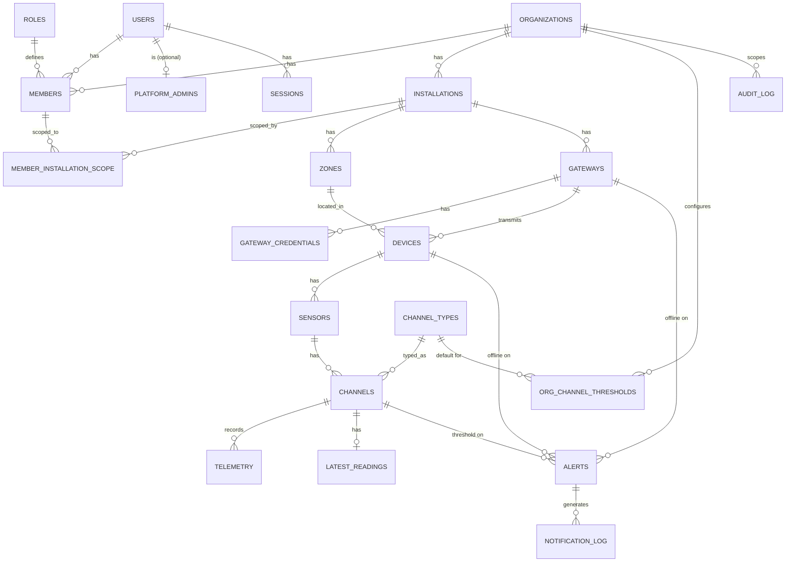

# DATA_MODEL.md

## 0. Estado de este documento
- Etapa del proceso: 5 — Modelo de datos
- Estado: En análisis (esquema completo, pendiente de tu validación)
- Última actualización: 2026-07-27
- Depende de: Etapas 0, 1, 2, 3, 4
- Bloquea: Etapa 6 (MQTT: qué campos vienen del payload), Etapa 7 (API/OpenAPI), Etapa 8 (seguridad), Etapa 13 (implementación backend)

Motor: PostgreSQL. Acceso a datos: Prisma o Drizzle (Etapa 13 decide cuál; este documento no depende de esa elección). Todas las tablas usan `uuid` como clave primaria salvo `telemetry` y `audit_log`, justificado en sus secciones.

---

## 1. Decisiones tomadas en esta etapa

| Decisión | Elegido | Motivo |
|---|---|---|
| Solo el gateway tiene credencial de red; el dispositivo se autoriza a nivel de aplicación | Confirmado (corrige `ARCHITECTURE.md`) | Los sensores llegan por LoRa; solo el gateway tiene GPRS/Ethernet |
| Roles como tabla de referencia, no `enum` de PostgreSQL | Tabla `roles` con 4 filas fijas | Añadir un rol futuro no exige `ALTER TYPE` (más simple de migrar si V2 permite roles adicionales) |
| Admin de plataforma no es un rol de organización | Tabla `platform_admins` separada | Nunca tiene `organization_id` activo (Etapa 3); modelarlo como marca global evita que aparezca por error en consultas de `members` |
| `organization_id` denormalizado en tablas de bajo nivel (zonas, gateways, dispositivos, sensores, canales, telemetría, últimas lecturas, alertas) | Sí | Permite que la política de RLS y los filtros de aplicación sean uniformes (`WHERE organization_id = ...`) sin JOIN a través de toda la jerarquía en cada consulta — coste: mantener la columna consistente (se rellena una vez al crear la fila, nunca cambia) |
| Retención "archivada" de telemetría (Etapa 2) | Se mantiene en PostgreSQL particionado, no se exporta a S3 en el MVP | Revisado con cifras reales: ~20-22 GB/año a escala completa; incluso a 2+ años son ~40-50 GB, trivial para una instancia gestionada dentro de 100-500€/mes. Exportar a S3 añadiría un job de export/restore sin necesidad real todavía — se revisará si el volumen real se aleja mucho de la estimación de la Etapa 2 |

Esta última decisión **simplifica** `NON_FUNCTIONAL_REQUIREMENTS.md` sección 6 (se actualiza también ahí).

## 2. Diagrama entidad-relación (simplificado)



## 3. IAM (usuarios, organizaciones, miembros, roles, sesiones)

### `organizations`
| Columna | Tipo | Restricción |
|---|---|---|
| id | uuid | PK |
| slug | text | UNIQUE, NOT NULL |
| name | text | NOT NULL |
| contact_email | text | NOT NULL |
| status | enum(`active`,`suspended`) | NOT NULL, default `active` |
| created_at | timestamptz | NOT NULL, default now() |
| updated_at | timestamptz | NOT NULL |
| deleted_at | timestamptz | NULL (baja lógica) |

Índices: único en `slug` (necesario para resolver la organización al hacer login/selector). Sin índice en `status`: la tabla tendrá como mucho unos cientos de filas (Etapa 2), un escaneo completo es más barato que mantener un índice para una consulta que solo usa el Admin de plataforma.

### `users` (identidad global)
| Columna | Tipo | Restricción |
|---|---|---|
| id | uuid | PK |
| email | citext | UNIQUE, NOT NULL |
| password_hash | text | NOT NULL (Argon2id, Etapa 8) |
| full_name | text | NOT NULL |
| status | enum(`active`,`disabled`) | NOT NULL, default `active` |
| created_at / updated_at | timestamptz | NOT NULL |
| deleted_at | timestamptz | NULL |

Índices: único en `email` — es la consulta más frecuente del sistema (cada login). `citext` evita bugs de mayúsculas/minúsculas en el email sin lógica adicional en la aplicación.

### `platform_admins`
| Columna | Tipo | Restricción |
|---|---|---|
| user_id | uuid | PK, FK → `users.id` |
| granted_at | timestamptz | NOT NULL |
| granted_by | uuid | FK → `users.id`, NULL (el primero se crea por script de bootstrap, no por otro admin) |

Sin más índices: se consulta por `user_id` (la PK) en cada request para saber si el usuario autenticado es Admin de plataforma.

### `roles` (catálogo fijo, 4 filas — Admin de plataforma no es un rol de organización)
| Columna | Tipo | Restricción |
|---|---|---|
| code | text | PK (`org_admin`, `technician`, `operator`, `read_only`) |
| label | text | NOT NULL |

### `members`
| Columna | Tipo | Restricción |
|---|---|---|
| id | uuid | PK |
| user_id | uuid | FK → `users.id`, NOT NULL |
| organization_id | uuid | FK → `organizations.id`, NOT NULL |
| role_code | text | FK → `roles.code`, NOT NULL |
| status | enum(`invited`,`active`,`suspended`) | NOT NULL, default `invited` |
| invited_by | uuid | FK → `users.id`, NULL |
| invited_at / activated_at | timestamptz | NULL |
| created_at / updated_at | timestamptz | NOT NULL |
| deleted_at | timestamptz | NULL (baja lógica) |

Restricciones: `UNIQUE (user_id, organization_id)` — un usuario tiene como mucho una membresía (un rol) por organización (Etapa 1).

Índices: el índice de la restricción única (líder `user_id`) ya resuelve "mis organizaciones" (selector de organización activa, Etapa 3). Se añade un índice explícito en `organization_id` porque es la consulta inversa igual de frecuente ("listar miembros de mi organización", pantalla de administración) y no queda cubierta eficientemente por el índice anterior.

### `member_installation_scope` (Etapa 4)
| Columna | Tipo | Restricción |
|---|---|---|
| member_id | uuid | FK → `members.id`, NOT NULL |
| installation_id | uuid | FK → `installations.id`, NOT NULL |
| created_at | timestamptz | NOT NULL |

PK compuesta `(member_id, installation_id)` — evita asignaciones duplicadas y su índice ya sirve para la consulta de autorización más frecuente ("instalaciones asignadas a este miembro"). No se añade índice inverso por `installation_id`: "quién tiene acceso a esta instalación" es una consulta administrativa poco frecuente, no una comprobación en el camino caliente de cada petición.

### `sessions`
| Columna | Tipo | Restricción |
|---|---|---|
| id | uuid | PK |
| user_id | uuid | FK → `users.id`, NOT NULL |
| organization_id | uuid | FK → `organizations.id`, NULL (NULL para sesiones de Admin de plataforma) |
| refresh_secret_hash | text | NOT NULL |
| user_agent | text | NULL |
| ip_address | inet | NULL |
| created_at / last_used_at / expires_at | timestamptz | NOT NULL |
| revoked_at | timestamptz | NULL |

Diseño del token: el cliente recibe `{sessionId}.{secret}`. Al refrescar, el backend busca la sesión **por `id` (PK)**, no por el secreto — evita necesitar un índice sobre un hash (y el riesgo de timing de una búsqueda por hash indexado), y la comparación del secreto se hace con comparación de tiempo constante tras la búsqueda por PK.

Índices: `user_id` (listar/revocar todas las sesiones de un usuario — cambio de contraseña, incidente). Índice parcial `organization_id WHERE revoked_at IS NULL` (Admin de organización revocando sesiones activas de sus miembros, Etapa 4 `sessions.revoke_others`) — parcial porque las sesiones revocadas/expiradas no se vuelven a consultar salvo auditoría puntual, y crecen sin límite si se indexaran todas.

## 4. Directorio IoT (instalaciones, zonas, gateways, dispositivos, sensores, canales)

### `installations`
| Columna | Tipo | Restricción |
|---|---|---|
| id | uuid | PK |
| organization_id | uuid | FK, NOT NULL |
| name | text | NOT NULL |
| location_text | text | NULL |
| latitude | double precision | NULL |
| longitude | double precision | NULL |
| status | enum(`active`,`inactive`) | NOT NULL, default `active` |
| created_at / updated_at | timestamptz | NOT NULL |
| deleted_at | timestamptz | NULL |

Índices: `organization_id` (toda listado de instalaciones parte de aquí; RLS también lo usa).

**`latitude`/`longitude`** (añadido a partir del volcado de ideas): coordenadas GPS de la instalación. Se añaden ya en el MVP aunque la funcionalidad que las consume (pestaña de tiempo/clima, V2 — ver `BACKLOG.md`) no se construya todavía — es un campo barato de añadir ahora y caro de migrar después (retro-rellenar coordenadas de instalaciones ya creadas). Un polígono de parcela (para casos como imágenes satelitales, `BACKLOG.md`) no se modela todavía: un punto es suficiente para lo que sí está planificado (V2); se revisita si la integración de satélite avanza (Futuro).

### `zones`
| Columna | Tipo | Restricción |
|---|---|---|
| id | uuid | PK |
| installation_id | uuid | FK → `installations.id`, NOT NULL |
| organization_id | uuid | FK, NOT NULL (denormalizado, sección 1) |
| name | text | NOT NULL |
| zone_type | text | NULL |
| created_at / updated_at | timestamptz | NOT NULL |
| deleted_at | timestamptz | NULL |

Índices: `installation_id` (listar zonas de una instalación) y `organization_id` (RLS/alcance).

### `gateways` (unidad de conexión MQTT — [ADR-0004](ADR/0004-unidad-de-conexion-lora-y-nbiot.md))
| Columna | Tipo | Restricción |
|---|---|---|
| id | uuid | PK |
| organization_id | uuid | FK, NOT NULL |
| installation_id | uuid | FK → `installations.id`, NOT NULL (Etapa 4: un gateway pertenece a una única instalación) |
| external_identifier | text | UNIQUE, NOT NULL |
| name | text | NOT NULL |
| connectivity_type | enum(`lora_concentrator`,`direct_nbiot`,`direct_other`) | NOT NULL |
| status | enum(`not_provisioned`,`online`,`offline`,`disabled`) | NOT NULL, default `not_provisioned` |
| last_seen_at | timestamptz | NULL |
| heartbeat_interval_seconds | int | NULL (si es NULL, se usa el valor por defecto de la organización, Etapa 2) |
| created_at / updated_at | timestamptz | NOT NULL |
| deleted_at | timestamptz | NULL |

`connectivity_type` es puramente descriptivo (filtrar/mostrar en el frontend "concentradores LoRa" vs. "estaciones directas") — no cambia la lógica de autenticación, ACL, credenciales, heartbeat ni particionamiento, que es idéntica para los tres valores.

Cuando `connectivity_type = lora_concentrator`, el gateway tiene típicamente varios `devices` asociados. Cuando es `direct_nbiot`/`direct_other`, tiene exactamente **un** `device` asociado (la propia estación) — no se modela como una restricción de base de datos (sería un `CHECK` entre tablas, igual que la regla Zona↔Gateway), sino como una convención validada por la aplicación al aprovisionar.

Índices: único en `external_identifier` (resuelve el gateway en cada mensaje MQTT entrante — camino caliente de ingesta). `organization_id` e `installation_id` (listados y comprobación de alcance).

**No se indexa `last_seen_at`** para el job de detección de offline: a esta escala (≤500 gateways, Etapa 2), recorrer la tabla completa cada ciclo del job es más barato que mantener un índice adicional. Se revisará si la escala crece un orden de magnitud.

### `gateway_credentials`
| Columna | Tipo | Restricción |
|---|---|---|
| id | uuid | PK |
| gateway_id | uuid | FK → `gateways.id`, NOT NULL |
| secret_hash | text | NOT NULL |
| status | enum(`active`,`revoked`) | NOT NULL, default `active` |
| created_at | timestamptz | NOT NULL |
| revoked_at | timestamptz | NULL |

Restricción: índice único parcial `(gateway_id) WHERE status = 'active'` — como mucho una credencial activa por gateway, pero se conserva el historial de credenciales revocadas (rotación, Etapa 8).

### `devices`
| Columna | Tipo | Restricción |
|---|---|---|
| id | uuid | PK |
| organization_id | uuid | FK, NOT NULL |
| gateway_id | uuid | FK → `gateways.id`, NOT NULL |
| zone_id | uuid | FK → `zones.id`, NOT NULL |
| external_identifier | text | NOT NULL (id del dispositivo dentro del JSON del gateway) |
| name | text | NOT NULL |
| status | enum(`not_provisioned`,`online`,`offline`,`disabled`) | NOT NULL, default `not_provisioned` |
| last_seen_at | timestamptz | NULL |
| created_at / updated_at | timestamptz | NOT NULL |
| deleted_at | timestamptz | NULL |

Restricción: `UNIQUE (gateway_id, external_identifier)` — no globalmente único, porque distintos fabricantes/gateways pueden reutilizar identificadores simples (`"1"`, `"2"`).

**Regla de integridad** (Etapa 4): la `zone_id` de un dispositivo debe pertenecer a la misma `installation_id` que su `gateway_id`. PostgreSQL no permite un `CHECK` que consulte otra tabla directamente — se implementa con un trigger `BEFORE INSERT OR UPDATE` que compara `zones.installation_id` con `gateways.installation_id` y lanza una excepción si no coinciden.

Índices: `UNIQUE (gateway_id, external_identifier)` (camino caliente de ingesta, resuelve "dispositivo Y del gateway X" en cada mensaje). `organization_id` y `zone_id` (listados y alcance).

### `sensors`
| Columna | Tipo | Restricción |
|---|---|---|
| id | uuid | PK |
| organization_id | uuid | FK, NOT NULL |
| device_id | uuid | FK → `devices.id`, NOT NULL |
| external_identifier | text | NOT NULL |
| label | text | NULL |
| created_at / updated_at | timestamptz | NOT NULL |
| deleted_at | timestamptz | NULL |

Restricción: `UNIQUE (device_id, external_identifier)`. Un dispositivo tiene como mucho 4 sensores (Etapa 2) — la restricción no fuerza ese límite numérico (se valida en la aplicación al pre-registrar, no vale la pena un trigger de conteo para un límite de negocio, no de integridad).

Índices: el índice de la restricción única cubre el camino caliente de ingesta.

### `channel_types` (catálogo de plataforma)
| Columna | Tipo | Restricción |
|---|---|---|
| code | text | PK (`temperature_air`, `humidity_air`, `humidity_soil`, `conductivity`, `tank_level`, `battery`, `signal_strength`, `precipitation`, ampliable) |
| unit | text | NOT NULL |
| data_type | enum(`continuous`,`boolean`,`counter`) | NOT NULL |
| default_aggregation | enum(`average`,`sum`,`count_true`) | NOT NULL |
| min_valid | double precision | NULL |
| max_valid | double precision | NULL |

Tabla diminuta y de cambio muy infrecuente — sin índices adicionales; se recomienda cachear en memoria de aplicación en vez de consultarla en cada mensaje ingerido (detalle de implementación, Etapa 13, no de base de datos).

**`default_aggregation`** (añadido a partir de tu aclaración sobre gráficas): cómo se resume un canal al agregarlo por periodo (hora/día) en gráficas e informes.
- `average` para magnitudes instantáneas tipo `continuous` (temperatura, humedad, conductividad, nivel) — junto al promedio, las consultas de agregación también calculan min/max del periodo (no es una columna, es cómo se construye la consulta SQL de agregación, Etapa 13).
- `sum` para magnitudes acumulativas tipo `counter` (precipitación: no tiene sentido "la temperatura media de la lluvia", interesa el acumulado por hora/día).
- `count_true` para `boolean` (p. ej. "cuánto tiempo estuvo activo un relé").
- [SUPOSICIÓN, a confirmar en Etapa 6]: se asume que un sensor de lluvia reporta el **incremento desde la última lectura** (p. ej. mm caídos en los últimos 15-30 min), no un contador acumulado que solo crece — así `sum` sobre las filas de `telemetry` de un periodo da directamente el total de ese periodo. Si el hardware real reporta un contador acumulado sin reiniciar, la agregación tendría que ser una diferencia entre el primer y último valor del periodo en vez de una suma — a verificar con el fabricante/gateway real antes de implementarlo (Etapa 6).

### `channels`
| Columna | Tipo | Restricción |
|---|---|---|
| id | uuid | PK |
| organization_id | uuid | FK, NOT NULL |
| sensor_id | uuid | FK → `sensors.id`, NOT NULL |
| channel_type_code | text | FK → `channel_types.code`, NOT NULL |
| alert_threshold_min | double precision | NULL (override) |
| alert_threshold_max | double precision | NULL (override) |
| created_at / updated_at | timestamptz | NOT NULL |
| deleted_at | timestamptz | NULL |

Restricción: `UNIQUE (sensor_id, channel_type_code)` [SUPOSICIÓN: un sensor no repite la misma magnitud dos veces; si un futuro sensor lo necesitara, se revisita].

Índices: el índice de la restricción única resuelve "canales de este sensor" (usado al ingerir cada mensaje, que trae varias lecturas por sensor).

### `features` (catálogo de plataforma) y `organization_features` (Etapa 4, `PERMISSIONS.md` sección 14)
| Tabla | Columna | Tipo | Restricción |
|---|---|---|---|
| `features` | code | text | PK (`reports_pdf`, `campaigns`, `weather_widget`, `satellite_imagery`, `recommendations`, ampliable) |
| `features` | label | text | NOT NULL |
| `organization_features` | organization_id | uuid | FK, NOT NULL |
| `organization_features` | feature_code | text | FK → `features.code`, NOT NULL |
| `organization_features` | enabled | boolean | NOT NULL, default `false` |
| `organization_features` | updated_at | timestamptz | NOT NULL |
| `organization_features` | updated_by | uuid | FK → `users.id`, NOT NULL (siempre un Admin de plataforma) |

PK de `organization_features`: `(organization_id, feature_code)`. Sin fila para un par (org, feature) ⇒ desactivada por defecto — una función nueva no se activa sola para nadie al desplegarse.

**RLS distinto del resto** ([ADR-0005](ADR/0005-admin-plataforma-gestion-global-iot.md)): cualquier miembro de la organización necesita **leer** su propia fila (para saber qué pestañas mostrar), pero solo el Admin de plataforma puede **escribir**, y el Admin de plataforma no tiene `app.current_org_id` (no pertenece a la organización). Política de dos partes:
```sql
ALTER TABLE organization_features ENABLE ROW LEVEL SECURITY;
CREATE POLICY tenant_read ON organization_features FOR SELECT
  USING (organization_id = current_setting('app.current_org_id', true)::uuid);
CREATE POLICY platform_admin_write ON organization_features FOR ALL
  USING (current_setting('app.is_platform_admin', true)::boolean IS TRUE)
  WITH CHECK (current_setting('app.is_platform_admin', true)::boolean IS TRUE);
```
Esto introduce una segunda variable de sesión, `app.is_platform_admin`, fijada por `SET LOCAL` solo en peticiones autenticadas como Admin de plataforma (sección 7 la generaliza al resto de tablas que necesitan esta misma excepción).

### `org_channel_thresholds` (umbral por defecto por organización y tipo — Etapa 1/4)
| Columna | Tipo | Restricción |
|---|---|---|
| organization_id | uuid | FK, NOT NULL |
| channel_type_code | text | FK → `channel_types.code`, NOT NULL |
| default_min | double precision | NULL |
| default_max | double precision | NULL |
| created_at / updated_at | timestamptz | NOT NULL |

PK compuesta `(organization_id, channel_type_code)` — es exactamente la clave de búsqueda usada al evaluar un umbral (`channels.alert_threshold_* ?? org_channel_thresholds.default_* ?? sin alerta`), no hace falta índice adicional.

## 5. Telemetría, últimas lecturas y alertas

### `telemetry` (particionada, sin columna `id` superficial)
```sql
CREATE TABLE telemetry (
  channel_id       UUID NOT NULL REFERENCES channels(id),
  organization_id  UUID NOT NULL REFERENCES organizations(id),
  ts_origin        TIMESTAMPTZ NOT NULL,
  ts_received      TIMESTAMPTZ NOT NULL DEFAULT now(),
  value            DOUBLE PRECISION NOT NULL,
  message_id       TEXT,
  PRIMARY KEY (channel_id, ts_origin)
) PARTITION BY RANGE (ts_origin);
```
- **Sin `id` propio**: ninguna otra tabla necesita referenciar una fila de telemetría individual (las alertas referencian `channel_id` + el valor que las disparó, no una fila concreta) — la clave natural `(channel_id, ts_origin)` ya sirve como PK y como índice principal de consulta, añadir un `id` sería una columna sin uso.
- **Prevención de duplicados** (Etapa 1): la PK `(channel_id, ts_origin)` es la clave de deduplicación — al insertar se usa `ON CONFLICT (channel_id, ts_origin) DO NOTHING`. `message_id` queda como señal auxiliar de mejor esfuerzo (comprobación en la aplicación antes de insertar), no como segunda restricción de BD: PostgreSQL exige que toda restricción única de una tabla particionada incluya la columna de partición (`ts_origin`), así que una segunda `UNIQUE (channel_id, message_id, ts_origin)` no impediría duplicados entre timestamps distintos — limitación conocida y aceptada, documentada aquí para no repetir la discusión en Etapa 13.
- **Consulta histórica** (Etapa 1, sección 11): el índice de la PK, con `channel_id` como columna líder, es exactamente el patrón de consulta "lecturas de este canal entre dos fechas" — no se necesita ningún índice adicional para el caso de uso principal.
- **`organization_id` sin índice propio**: toda consulta llega ya acotada por uno o varios `channel_id` (resueltos antes a través de la jerarquía zona/instalación con alcance, Etapa 4); el filtro de `organization_id` de RLS actúa sobre un resultado ya pequeño, indexarlo aparte añadiría coste de escritura sin beneficio de lectura medible a este volumen.
- **Sin columna de "calidad"**: los valores fuera de rango se descartan antes de llegar aquí (Etapa 1, sección 9) — esta tabla solo contiene lecturas válidas. El conteo de lecturas inválidas es una métrica de observabilidad (Etapa 10), no una fila de esta tabla.
- **Sin `schema_version`**: es un detalle del protocolo de ingesta (Etapa 6), no un atributo de negocio de la medición — si hace falta para depurar, va en los logs estructurados de `ingestion`, no en esta tabla de alto volumen.
- **Particiones**: mensuales, creadas con antelación por un job programado (no manualmente en cada despliegue):
  ```sql
  CREATE TABLE telemetry_2026_07 PARTITION OF telemetry
    FOR VALUES FROM ('2026-07-01') TO ('2026-08-01');
  ```
  Retención: 13 meses "calientes" + resto conservado sin SLA de latencia (Etapa 2) — con la decisión de la sección 1, esto significa simplemente **no borrar** particiones antiguas, no exportarlas.

### `latest_readings`
| Columna | Tipo | Restricción |
|---|---|---|
| channel_id | uuid | PK, FK → `channels.id` |
| organization_id | uuid | FK, NOT NULL |
| value | double precision | NOT NULL |
| ts_origin | timestamptz | NOT NULL |
| ts_received | timestamptz | NOT NULL |
| updated_at | timestamptz | NOT NULL |

```sql
INSERT INTO latest_readings (channel_id, organization_id, value, ts_origin, ts_received, updated_at)
VALUES ($1, $2, $3, $4, now(), now())
ON CONFLICT (channel_id) DO UPDATE
  SET value = EXCLUDED.value, ts_origin = EXCLUDED.ts_origin,
      ts_received = EXCLUDED.ts_received, updated_at = now()
  WHERE EXCLUDED.ts_origin > latest_readings.ts_origin;
```
La cláusula `WHERE` es el mecanismo concreto de **tolerancia al desorden** (Etapa 1): un mensaje que llega tarde con un `ts_origin` antiguo no pisa una lectura más reciente ya registrada.

Índices: `organization_id` — a diferencia de `telemetry`, aquí sí se justifica: es una tabla pequeña (una fila por canal, ~4.000 a escala completa) consultada en el camino más caliente y sensible a latencia de todos (dashboard principal, límite de 300ms p95, Etapa 2).

### `alerts`
| Columna | Tipo | Restricción |
|---|---|---|
| id | uuid | PK |
| organization_id | uuid | FK, NOT NULL |
| alert_type | enum(`threshold`,`offline`) | NOT NULL |
| channel_id | uuid | FK → `channels.id`, NULL |
| device_id | uuid | FK → `devices.id`, NULL |
| gateway_id | uuid | FK → `gateways.id`, NULL |
| status | enum(`open`,`acknowledged`,`resolved`) | NOT NULL, default `open` |
| opened_at | timestamptz | NOT NULL |
| acknowledged_at / acknowledged_by | timestamptz / uuid (FK users) | NULL |
| resolved_at / resolved_by | timestamptz / uuid (FK users) | NULL (`resolved_by` NULL si se auto-resolvió) |
| details | jsonb | NULL (valor que disparó la alerta, umbral, etc.) |
| created_at / updated_at | timestamptz | NOT NULL |

Restricciones (Etapa 1: "una única alerta abierta por canal/dispositivo + tipo"):
```sql
CREATE UNIQUE INDEX alerts_open_threshold_uniq ON alerts (channel_id, alert_type)
  WHERE status <> 'resolved' AND channel_id IS NOT NULL;
CREATE UNIQUE INDEX alerts_open_device_offline_uniq ON alerts (device_id, alert_type)
  WHERE status <> 'resolved' AND device_id IS NOT NULL;
CREATE UNIQUE INDEX alerts_open_gateway_offline_uniq ON alerts (gateway_id, alert_type)
  WHERE status <> 'resolved' AND gateway_id IS NOT NULL AND device_id IS NULL;
```
Estos mismos índices sirven además como comprobación rápida ("¿ya hay una alerta abierta?") antes de crear una nueva.

Índices: `(organization_id, status)` — consulta principal "alertas abiertas de mi organización" (dashboard, ≤300ms p95).

No hay borrado lógico ni físico de alertas: permanecen siempre visibles en el histórico (Etapa 1), el `status` ya captura su ciclo de vida.

### `notification_log`
| Columna | Tipo | Restricción |
|---|---|---|
| id | uuid | PK |
| organization_id | uuid | FK, NOT NULL |
| alert_id | uuid | FK → `alerts.id`, NOT NULL |
| recipient_user_id | uuid | FK → `users.id`, NOT NULL |
| channel | enum(`email`) | NOT NULL |
| status | enum(`sent`,`failed`) | NOT NULL |
| sent_at | timestamptz | NOT NULL |
| error | text | NULL |

Restricción: `UNIQUE (alert_id, recipient_user_id)` — es el mecanismo concreto que evita reenviar el email repetidamente por la misma alerta abierta (Etapa 1, sección 15): antes de notificar, el worker comprueba si ya existe la fila.

## 6. Auditoría

### `audit_log`
| Columna | Tipo | Restricción |
|---|---|---|
| id | bigint | PK, `GENERATED ALWAYS AS IDENTITY` |
| organization_id | uuid | FK, NULL (NULL para acciones de plataforma, p. ej. alta de organización) |
| actor_user_id | uuid | FK → `users.id`, NULL (NULL si el origen es el sistema, p. ej. auto-resolución de alerta) |
| action | text | NOT NULL (mismo catálogo que `PERMISSIONS.md` sección 3, p. ej. `gateway.disable`) |
| target_type / target_id | text / text | NULL (referencia polimórfica al recurso afectado) |
| metadata | jsonb | NULL |
| created_at | timestamptz | NOT NULL, default now() |

**`bigint identity` en vez de `uuid`**: tabla de solo-inserción, potencialmente de alto volumen a largo plazo; un entero secuencial de 8 bytes es más compacto y más amigable con el índice de la PK (inserciones siempre al final) que un `uuid` v4 aleatorio, que fragmentaría el árbol. No hay necesidad de que el id sea impredecible (no es un recurso expuesto públicamente por URL).

**Inmutable por diseño**: sin `updated_at`, sin borrado lógico ni físico. El rol de base de datos que usan `api`/`worker` no debería tener permiso `UPDATE`/`DELETE` sobre esta tabla — solo `INSERT`/`SELECT` (detalle a aplicar en Etapa 8).

Índices: `(organization_id, created_at DESC)` — consulta principal "auditoría de mi organización, más reciente primero". **No se indexa `actor_user_id`**: "qué hizo este usuario" es una consulta de investigación puntual y poco frecuente a este volumen; un filtro adicional sobre el resultado ya acotado por organización es suficiente sin mantener un índice más.

## 7. Seguridad por fila (RLS)

- RLS **activado** en toda tabla con `organization_id`: `members`, `member_installation_scope` (vía `members`), `installations`, `zones`, `gateways`, `gateway_credentials` (vía `gateways`), `devices`, `sensors`, `channels`, `org_channel_thresholds`, `organization_features`, `telemetry`, `latest_readings`, `alerts`, `notification_log`, `audit_log` (política que permite `organization_id IS NULL` además del match, para las filas de plataforma).
- Política estándar:
  ```sql
  ALTER TABLE installations ENABLE ROW LEVEL SECURITY;
  CREATE POLICY tenant_isolation ON installations
    USING (organization_id = current_setting('app.current_org_id', true)::uuid);
  ```
- **Excepción de Directorio IoT** ([ADR-0005](ADR/0005-admin-plataforma-gestion-global-iot.md)): `installations`, `zones`, `gateways`, `gateway_credentials`, `devices`, `sensors`, `channels` añaden una condición `OR` a la política estándar en vez de sustituirla:
  ```sql
  CREATE POLICY tenant_isolation_or_platform_admin ON installations
    USING (
      organization_id = current_setting('app.current_org_id', true)::uuid
      OR current_setting('app.is_platform_admin', true)::boolean IS TRUE
    );
  ```
  `telemetry`, `alerts`, `members`, `sessions` y `audit_log` **no** llevan esta excepción — mantienen la política estándar sin condición adicional, precisamente porque el ADR-0005 acota la excepción a infraestructura, no a datos de negocio.
- **`audit_log` necesitaba `USING`/`WITH CHECK` distintos, no la misma expresión para leer y escribir — bug real encontrado en vivo (2026-07-30)**: su política (`tenant_isolation_or_platform_admin`) deja leer, a un Admin de plataforma, auditoría de negocio de otra organización solo si la propia `action` empieza por `platform.` (para que pueda ver sus propias altas/bajas de organización sin poder curiosear el resto de la auditoría de un cliente) — correcto para lectura. El problema: sin un `WITH CHECK` propio, Postgres reutiliza esa misma expresión, más estrecha, para las escrituras — y acciones de plataforma legítimas que NO llevan ese prefijo (`org_features.update`, la única que ejecuta un Admin de plataforma sin prefijo `platform.`) no podían ni insertar su propia fila de auditoría: `PlatformFeaturesService#setForOrganization` rompía con 500 ("new row violates row-level security policy for table audit_log") en cualquier alta/baja de función de organización. Corregido en dos partes (`prisma/migrations/0004_audit_log_platform_write_check`): (1) `WITH CHECK` separado y más permisivo (cualquier escritura de un Admin de plataforma es válida — la autorización de negocio real ya la hizo `RequirePermission` antes de llegar aquí, RLS solo evita cruzar organizaciones por error, no repite esa autorización mirando el nombre de la acción); (2) `AuditLogService#record` pasó de `tx.auditLogEntry.create()` a un `INSERT` con `$executeRaw` sin `RETURNING` — Prisma's `.create()` siempre pide la fila de vuelta, y Postgres exige que esa fila devuelta *también* pase la política de lectura (`USING`), así que aunque el `WITH CHECK` ya lo permitiera, el propio `RETURNING` seguía rompiendo para acciones sin prefijo `platform.`. Nadie usaba el valor de retorno de `record()` (ya era `Promise<void>`), así que quitar el `RETURNING` no pierde nada. Verificado en vivo: la escritura ya no falla, y la organización afectada sigue viendo la entrada en su propia auditoría (`GET /audit-log`) — la transparencia hacia el cliente que exige el ADR-0005 se mantiene intacta.
- **Mecanismo para fijar la variable de sesión** (pendiente en Etapa 3, resuelto aquí): con efecto **local a la transacción** (nunca de sesión), al inicio de la transacción de cada petición. **Corregido en Etapa 8** ([`SECURITY.md`](SECURITY.md)): no como una sentencia `SET LOCAL app.current_org_id = '<valor>'` con el valor interpolado en la cadena SQL — `SET` no admite parámetros ligados (bind parameters) de forma segura en el protocolo de PostgreSQL, así que interpolar ahí el valor sería una vía de inyección SQL si alguna vez ese valor no está perfectamente saneado. Se usa en su lugar la función `set_config`, que sí es una llamada SQL normal parametrizable:
  ```sql
  BEGIN;
  SELECT set_config('app.current_org_id', $1, true); -- $1 = uuid de la organización activa del JWT, como parámetro ligado
  -- consultas de la petición
  COMMIT;
  ```
  El tercer argumento (`true`) de `set_config` es el equivalente exacto de `SET LOCAL`: efecto solo dentro de la transacción actual, revertido automáticamente al terminarla — imprescindible con un pool de conexiones (o PgBouncer en modo transacción), donde la misma conexión física se reutiliza entre peticiones de distintas organizaciones; una variable de sesión (sin este efecto local) filtraría el contexto de una petición a la siguiente.
  - Una petición autenticada como Admin de plataforma no tiene organización activa: en su lugar se fija `SELECT set_config('app.is_platform_admin', $1, true)` con `$1 = 'true'` (y `app.current_org_id` se fija explícitamente a `NULL`, nunca simplemente se omite — ver el matiz de `NULLIF` justo abajo). Es la variable que habilita la excepción de la sección anterior — ninguna otra tabla la comprueba, así que no amplía el acceso más allá de lo explícitamente decidido en el ADR-0005.
  - **Regla general, sin excepciones**: cualquier valor que dependa de una petición (JWT, parámetros de usuario) y deba fijarse como variable de sesión de PostgreSQL se pasa siempre vía `set_config(..., $n, true)` con parámetro ligado — nunca construyendo la sentencia `SET`/`SET LOCAL` con interpolación de texto.
  - **`NULLIF(current_setting(...), '')::uuid`, no `current_setting(...)::uuid` a secas — descubierto en vivo (2026-07-28, primera vez que este proyecto corrió contra un Postgres real)**: `set_config(name, NULL, true)` no guarda SQL `NULL` — PostgreSQL lo convierte en cadena vacía (`''`), porque los parámetros GUC/`current_setting` son siempre texto y no distinguen "sin valor" de "cadena vacía". Sin el `NULLIF`, cualquier consulta con `organizationId`/`userId` todavía desconocido (login antes de elegir organización, refresh de sesión, accept-invitation) rompía con `ERROR: invalid input syntax for type uuid: ""` en vez de simplemente no cumplir esa condición — un 500 en el login, no una fila filtrada. Corregido en las 9 políticas afectadas (`prisma/migrations/0002_rls_and_constraints`, `0003_telemetry_and_alerts`) y en `PrismaService.runInTenantContext` (pasa `null`, no `''`, aunque el problema real estaba en el lado de la política SQL, no en la aplicación).
- El rol de base de datos usado por `api`/`ingestion`/`worker` **no** tiene `BYPASSRLS` ni es superusuario — un rol separado (`iot_platform`, dueño de las tablas), usado solo por la herramienta de migraciones, sí puede saltarse RLS para cambios de esquema. **Implementado de verdad, no solo documentado, a partir del 2026-07-28**: `infra/docker/postgres-init/01-app-role.sql` crea `iot_platform_app` (sin `BYPASSRLS`/superusuario) la primera vez que se inicializa el volumen de Postgres del entorno de desarrollo. Antes de esto, `docker-compose.yml` conectaba `api`/`ingestion`/`worker` con el mismo rol `iot_platform` que posee las tablas — un superusuario/dueño se salta cualquier política de RLS por diseño de PostgreSQL, con o sin `ENABLE ROW LEVEL SECURITY`, así que el aislamiento multi-tenant llevaba **sin tener ningún efecto real** desde que existe este proyecto, invisible mientras nunca se hubiera podido probar contra un Postgres de verdad. Verificado con dos organizaciones reales creadas en caliente: antes del rol separado, cada una veía las instalaciones de la otra en `GET /installations`; después, cada una ve solo las suyas, y un acceso directo por ID a un recurso de otra organización devuelve 404 (no 403 — PERMISSIONS.md §9/§13).
- Tablas **sin** RLS (no tienen un único propietario tenant): `organizations`, `users`, `platform_admins`, `roles`, `channel_types`. Su control de acceso es responsabilidad de la capa de aplicación (p. ej. nunca exponer un listado abierto de `users` a un rol de organización) — no tiene sentido una política RLS sin una columna de tenant sobre la que decidir.
- **`members` y `sessions` — caso especial descubierto al implementar el login (Etapa 13)**: antes de que exista una organización activa (login inicial, selección de organización, refresh de token), la aplicación necesita leer las filas **propias** de un usuario ("¿a qué organizaciones pertenezco?") sin contexto de organización todavía. Sus políticas añaden `OR user_id = current_setting('app.current_user_id', true)::uuid` a la condición estándar — un usuario siempre puede leer sus propias membresías/sesiones, nunca las de otro. No es una fuga de aislamiento: sigue sin poder ver filas de otro usuario de otra organización.

## 8. Estrategia de migraciones
- Migraciones versionadas hacia delante (`forward-only`): una vez aplicada en un entorno compartido (staging/producción), nunca se edita — los cambios posteriores son migraciones nuevas.
- Generadas y aplicadas por la herramienta del ORM elegido en Etapa 13 (Prisma o Drizzle), ejecutadas automáticamente por el pipeline de CI/CD antes de desplegar la nueva versión de la app (Etapa 9).
- La creación/mantenimiento de particiones mensuales de `telemetry` **no** es una migración de esquema — es un job operativo programado (p. ej. tarea repetible de BullMQ) que crea la partición del mes siguiente con antelación. Se detalla en Etapa 9.
- **`0001_init` (creación de todas las tablas base) faltó del repositorio hasta el 2026-07-28** — `0002_rls_and_constraints` y `0003_telemetry_and_alerts` siempre asumieron su existencia (sus propias cabeceras ya decían "generada automáticamente contra una base de datos real, no incluida a mano"), pero nunca se había podido generar de verdad sin un Postgres vivo al que conectarse. `prisma migrate deploy` fallaba siempre en `0002` (`relation "gateway_credentials" does not exist`) hasta que se generó con `prisma migrate diff --from-empty --to-schema-datamodel` y se editó a mano para excluir las 4 tablas que `0003` crea particionadas (`telemetry`, `latest_readings`, `alerts`, `notification_log` — Prisma no expresa particionamiento nativamente, igual que ya pasaba con RLS).

## 9. Riesgos
- El trigger de integridad Zona↔Gateway (sección 4) es la única lógica no declarativa de este esquema — debe cubrirse con una prueba de integración explícita (sección 11), no solo confiar en la revisión de código.
- ~~Si `SET LOCAL app.current_org_id` se omite en alguna ruta de código nueva, la política RLS con `current_setting(..., true)` devolvería `NULL`, y `NULL = uuid` es `NULL` (falso) en SQL — el efecto es "no se ve nada", no "se ve todo". Es un fallo seguro.~~ **Esta suposición era incorrecta en dos frentes, ambos descubiertos en vivo el 2026-07-28 (primera vez que el proyecto corrió contra un Postgres real), no en revisión de código ni en pruebas unitarias (que mockean Prisma y nunca ejercitan RLS de verdad):**
  1. El fallo real observado **no fue** "no se ve nada" — fue "se ve todo": mientras la conexión de la aplicación use el mismo rol dueño de las tablas (superusuario de arranque de la imagen de Postgres), RLS se salta por completo, con o sin `ENABLE ROW LEVEL SECURITY`. Corregido con un rol de aplicación separado sin `BYPASSRLS`/superusuario (sección 7, `infra/docker/postgres-init/01-app-role.sql`).
  2. Incluso con el rol correcto, el fallo tampoco era "no se ve nada" sino un **500** — `set_config(name, NULL, true)` no guarda `NULL` real, lo convierte en `''`, y `''::uuid` lanza un error de PostgreSQL en vez de evaluarse a `NULL`. Corregido con `NULLIF(current_setting(...), '')::uuid` (sección 7).

  Ninguno de los dos era "un fallo seguro" — uno era una fuga total de aislamiento entre organizaciones, el otro un error 500 en cualquier login. Debe verificarse con una prueba de integración específica contra un Postgres real (Etapa 8/11), no solo con pruebas unitarias sobre un Prisma mockeado.
- `org_channel_thresholds` sin fila para un tipo de canal concreto implica "sin umbral por defecto" (no error) — debe quedar claro en la lógica de evaluación de alertas (Etapa 13) para no confundir "sin configurar" con "en rango".

## 10. Entregables de esta etapa
- Este documento (`DATA_MODEL.md`) con DDL de referencia para las tablas no triviales.
- Actualización de `NON_FUNCTIONAL_REQUIREMENTS.md` sección 6 (retención: se mantiene todo en PostgreSQL, sin export a S3 en el MVP).

## 11. Criterios de aceptación de esta etapa
- Toda tabla tiene sus claves primarias, foráneas y restricciones de unicidad especificadas sin ambigüedad.
- Cada índice de este documento tiene una justificación explícita; cada decisión de **no** indexar algo también la tiene.
- El mecanismo de RLS resuelve exactamente el punto que quedó pendiente de la Etapa 3 (cómo se fija la variable de sesión con un pool de conexiones).

## 12. Pruebas necesarias derivadas
- Insertar un dispositivo cuya zona pertenezca a una instalación distinta a la de su gateway y confirmar que el trigger lo rechaza.
- Insertar dos veces la misma medición (mismo `channel_id` + `ts_origin`) y confirmar que la segunda no genera una fila duplicada (`ON CONFLICT DO NOTHING`).
- Insertar una medición con `ts_origin` anterior a la ya registrada en `latest_readings` y confirmar que no la sobrescribe.
- Con RLS activo, ejecutar una consulta sin `SET LOCAL app.current_org_id` y confirmar que no devuelve filas (no que falle ni que devuelva todo).
- Generar dos alertas de umbral seguidas para el mismo canal mientras la primera sigue abierta y confirmar que la segunda es rechazada por el índice único parcial.
- Enviar la misma notificación dos veces para la misma alerta/destinatario y confirmar que `notification_log` lo impide.

## 13. Lista de tareas de esta etapa
- [x] Diseñar todas las tablas del MVP con claves, restricciones e índices justificados.
- [x] Resolver el mecanismo de RLS con pool de conexiones (`SET LOCAL`).
- [x] Simplificar la estrategia de archivado de telemetría con cifras reales.
- [ ] Revisión y validación por tu parte.
- [ ] Cerrar etapa y pasar a Etapa 6 (contratos MQTT).

## 14. Dependencias
- Depende de Etapas 0, 1, 2, 3 y 4 (todas en análisis/cerradas).
- Bloquea Etapa 6 (el payload MQTT debe encajar con `sensors`/`channels`), Etapa 7 (DTOs de la API reflejan estas tablas), Etapa 8 (permisos de rol de BD, cifrado de columnas sensibles), Etapa 13 (implementación).

## 15. Aspectos que se aplazan explícitamente
- Tablas de `api_keys`, comandos remotos y firmware — no se diseñan hasta abordar V2 (Etapa 0/1).
- Elección definitiva Prisma vs. Drizzle (Etapa 13) — este esquema es válido para cualquiera de los dos.
- Cifrado a nivel de columna de datos especialmente sensibles (si el análisis de amenazas de la Etapa 8 lo exige) — hoy solo se contempla hash de contraseñas/secretos, no cifrado reversible de otros campos.

## 16. Errores frecuentes a evitar
- No añadir un índice "por si acaso" — cada uno de este documento responde a una consulta real de una etapa anterior; si una etapa futura introduce una consulta nueva, se añade el índice entonces, con su propia justificación.
- No usar `SET` en vez de `SET LOCAL` para el contexto de RLS — con un pool de conexiones reutilizadas, filtraría organización entre peticiones.
- No confundir la ausencia de fila en `org_channel_thresholds` con un umbral de cero — significa "sin umbral configurado", no dispara alerta.
- No añadir una segunda restricción única basada en `message_id` esperando que sustituya a la de `(channel_id, ts_origin)` — en una tabla particionada por `ts_origin`, no puede ofrecer la misma garantía (sección 5).

## 17. Historial de decisiones de esta etapa

| Fecha | Decisión | Alternativas consideradas |
|---|---|---|
| 2026-07-27 | Roles como tabla de referencia (4 filas), Admin de plataforma como tabla aparte | Enum de PostgreSQL para roles; Admin de plataforma como un rol más de `members` |
| 2026-07-27 | `organization_id` denormalizado en todas las tablas de bajo nivel | Resolver `organization_id` mediante JOIN a través de la jerarquía en cada consulta/política RLS |
| 2026-07-27 | Retención de telemetría "archivada" se queda en PostgreSQL, sin export a S3 en el MVP | Exportar particiones antiguas a almacenamiento S3-compatible (como sugería `NON_FUNCTIONAL_REQUIREMENTS.md` inicialmente) |
| 2026-07-27 | `telemetry` sin columna `id`; PK natural `(channel_id, ts_origin)` | Añadir `id bigint identity` de todas formas "por si acaso" |
| 2026-07-27 | `audit_log.id` como `bigint identity`, resto de tablas `uuid` | `uuid` también para `audit_log` |
| 2026-07-27 | Estaciones NB-IoT/directas modeladas como `gateways` de un solo dispositivo, con `connectivity_type` descriptivo (ADR-0004) | Tabla `device_credentials` paralela con `devices.gateway_id` nullable |
| 2026-07-27 | Admin de plataforma con excepción de RLS (`app.is_platform_admin`) sobre Directorio IoT únicamente (ADR-0005) | Sin excepción (Admin de plataforma sería miembro de cada organización); excepción más amplia incluyendo telemetría/alertas |
| 2026-07-27 | `features`/`organization_features` para feature flags por organización, RLS de lectura por tenant + escritura solo Admin de plataforma | Que cada organización autogestione sus funciones activas |
| 2026-07-27 | Fijar variables de sesión de RLS vía `set_config(..., $n, true)` parametrizado (Etapa 8) | `SET LOCAL app.current_org_id = '<valor interpolado>'` (vector de inyección SQL si el valor no está perfectamente saneado) |
| 2026-07-27 | RLS de `members`/`sessions` con excepción "propio usuario" (Etapa 13) | Bloquear la lectura hasta tener organización activa (rompía el propio flujo de login) |
