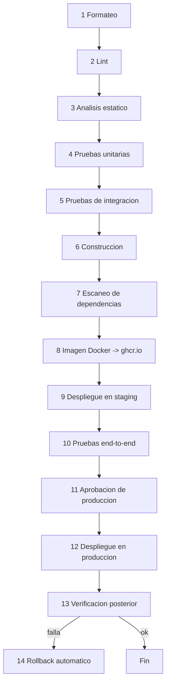

# DEPLOYMENT.md

## 0. Estado de este documento
- Etapa del proceso: 9 — Infraestructura y DevOps
- Estado: IaC (`infra/terraform/`) y artefactos de despliegue (`infra/docker/docker-compose.deploy.yml`/`Caddyfile`/`deploy.sh`) escritos y validados, pendientes de aplicar/desplegar de verdad — necesita cuentas reales en los tres proveedores y un dominio registrado (sección 17)
- Última actualización: 2026-07-30
- Depende de: Etapas 0-8 (especialmente Etapa 2 — escala/presupuesto, y Etapa 8 — controles de seguridad a aplicar aquí)
- Bloquea: Etapa 10 (observabilidad se conecta a esta infraestructura), Etapa 12 (backups), Etapa 13 (el pipeline despliega lo que ahí se construya)

## 1. Decisiones tomadas en esta etapa

| Decisión | Elegido | Motivo |
|---|---|---|
| Proveedor de cómputo | **Hetzner Cloud** (VPS, región UE) | Mejor precio/rendimiento en la UE dentro de 100-500€/mes (Etapa 2); datos en Alemania/Finlandia, favorable para RGPD |
| Base de datos administrada | **DigitalOcean Managed PostgreSQL** (región Frankfurt) | Hetzner no ofrece Postgres gestionado nativo; DO tiene backups automáticos, PITR y escalado vertical sencillo a coste razonable a esta escala |
| Redis | Autoalojado (contenedor en la misma VPS de cómputo) | Su uso aquí (BullMQ + pub/sub) tolera pérdida de estado — un reinicio implica reprocesar jobs, no perder datos de negocio (ya cubierto por reintentos/idempotencia); pagar Redis gestionado no se justifica a este volumen |
| Almacenamiento de objetos | **Hetzner Object Storage** (S3-compatible) | Co-localizado con el cómputo, evita un tercer proveedor solo para esto |
| DNS + protección básica | **Cloudflare** (plan gratuito) | DNS gratuito + mitigación básica de DoS/CDN para el tráfico web/API — no proxia MQTT (sección 6) |
| IaC | **Terraform** | Declarativo, con providers oficiales para Hetzner, DigitalOcean y Cloudflare; no implica Kubernetes |
| Reverse proxy / TLS | **Caddy** | HTTPS automático vía Let's Encrypt con configuración mínima — adecuado para un equipo de 3-6 personas sin tiempo para gestionar certificados a mano |
| Registro de imágenes Docker | **GitHub Container Registry (ghcr.io)** | Gratuito para repositorios privados de tamaño moderado, integrado con GitHub Actions sin credenciales adicionales |

## 2. Entornos

| Entorno | Cómputo | Base de datos | Object storage | Broker MQTT |
|---|---|---|---|---|
| **Desarrollo** | Docker Compose local (sección 5) | Contenedor Postgres local | MinIO local (sustituto S3) | Contenedor EMQX local |
| **Staging** | 1 VPS Hetzner pequeña (todo-en-uno vía Docker Compose) | DO Managed Postgres, tier mínimo | Hetzner Object Storage, bucket/prefijo `staging` | EMQX en la misma VPS |
| **Producción** | 1-2 VPS Hetzner (api con 2 réplicas para despliegue sin interrupciones, sección 10) | DO Managed Postgres, tier de producción | Hetzner Object Storage, bucket/prefijo `production` | EMQX en VPS dedicada o compartida (revisar si crece) |

Staging y producción están completamente aislados: cuentas/buckets/bases de datos distintas, sin compartir datos ni credenciales.

## 3. Variables de entorno (por proceso)

| Variable | Aplica a | Notas |
|---|---|---|
| `NODE_ENV` | todos | `development` / `staging` / `production` |
| `PROCESS_ROLE` | todos | `api` \| `ingestion` \| `worker` (Etapa 3, sección 4) |
| `DATABASE_URL` | api, worker | Cadena de conexión Postgres |
| `REDIS_URL` | api, ingestion, worker | |
| `JWT_PRIVATE_KEY` / `JWT_PUBLIC_KEY` / `JWT_KID` | api | Firma asimétrica (Etapa 8) |
| `ACCESS_TOKEN_TTL` / `REFRESH_TOKEN_TTL` | api | Valores exactos en Etapa 13 (coherentes con Etapa 2/8) |
| `MQTT_BROKER_URL` | ingestion | |
| `MQTT_INGESTION_USERNAME` / `MQTT_INGESTION_PASSWORD` | ingestion | Credencial propia de ingestion (`MQTT_PROTOCOL.md` sección 4), nunca una de gateway |
| `SMTP_HOST` / `SMTP_PORT` / `SMTP_USER` / `SMTP_PASSWORD` / `EMAIL_FROM` | worker | Envío de notificaciones/invitaciones |
| `S3_ENDPOINT` / `S3_BUCKET` / `S3_ACCESS_KEY` / `S3_SECRET_KEY` | api | Adjuntos, exportaciones futuras |
| `OTEL_EXPORTER_OTLP_ENDPOINT` | todos | Etapa 10 |
| `CORS_ALLOWED_ORIGINS` | api | Lista blanca (Etapa 8, sección 11) |
| `PLATFORM_ADMIN_BOOTSTRAP_EMAIL` | api (solo en el primer arranque) | Crea el primer Admin de plataforma (Etapa 13) |

Ninguna de estas variables (salvo `NODE_ENV`/`PROCESS_ROLE`, que no son secretas) se versiona con valores reales — ver sección 4.

## 4. Gestión de secretos
- **Desarrollo**: `.env.development` local, con valores de relleno (nunca reales), en `.gitignore` — nunca se commitea.
- **Staging/Producción**: secretos en **GitHub Actions Environments** (`staging`, `production`), inyectados al pipeline en el momento del despliegue y desde ahí a las variables de entorno del contenedor — nunca residen en el repositorio ni en la VPS en texto plano fuera de la ejecución del contenedor.
- El entorno `production` de GitHub Actions tiene **revisores obligatorios** configurados (sección 9, paso 11 del pipeline) — ningún despliegue a producción ocurre sin aprobación humana explícita.
- Coherente con `SECURITY.md` sección 7: ninguna herramienta nueva de gestión de secretos de terceros es necesaria en el MVP; se revisita si la complejidad operativa crece (p. ej. HashiCorp Vault) — no se añade sin necesidad medida.

## 5. Docker Compose local (desarrollo)
Ver [`docker-compose.yml`](../docker-compose.yml) en la raíz del repositorio. Incluye ya operativos: `postgres`, `redis`, `emqx`, `minio` (S3 local), `mailpit` (SMTP falso para ver los emails de invitación/alerta en desarrollo sin enviarlos de verdad). Los servicios `api`/`ingestion`/`worker` están definidos pero comentados — se activan cuando la Etapa 13 cree el proyecto NestJS real en `apps/backend` (el `Dockerfile` de referencia ya existe en [`infra/docker/Dockerfile`](../infra/docker/Dockerfile)).

## 6. Dominio, DNS, TLS, firewall, redes privadas
- **Dominio**: [SUPOSICIÓN, pendiente de tu decisión] se usa `example.com` como marcador en toda la documentación hasta que registres el dominio real.
- **DNS**: gestionado en Cloudflare (plan gratuito). Solo los registros de la API/web (`api.example.com`, `app.example.com`) están **proxiados** por Cloudflare (naranja) — el registro del broker MQTT (`mqtt.example.com`) está **sin proxiar** (gris/DNS-only), porque Cloudflare gratuito no proxia tráfico MQTT (TCP puro, no HTTP), solo lo resuelve.
- **TLS**: Caddy gestiona HTTPS automático (Let's Encrypt) para `api.example.com`/`app.example.com`. El broker EMQX gestiona su propio certificado Let's Encrypt (renovación vía `acme.sh` o el gestor de certificados integrado de EMQX) para `mqtt.example.com:8883`, independiente de Caddy.
- **Firewall** (Hetzner Cloud Firewall, a nivel de VPS): entrante permitido solo en 80 (HTTP, exclusivamente para el reto ACME HTTP-01 de Let's Encrypt y la redirección a HTTPS — nunca sirve contenido de negocio), 443 (HTTPS/WSS), 8883 (MQTTS) y 22 (SSH, restringido a IPs de administración conocidas — nunca abierto a cualquier IP). Todo lo demás, denegado por defecto. El puerto 80 se añadió en vivo (2026-08-04, primer despliegue real de staging): con `api`/`app` proxiados por Cloudflare, el reto TLS-ALPN-01 de Caddy falla siempre (Cloudflare termina el TLS en su borde), y sin el 80 abierto el reto HTTP-01 de repuesto tampoco podía llegar al origen (Cloudflare devolvía 522).
- **Redes privadas**: Postgres (gestionado) y Redis (contenedor) solo son alcanzables desde la red privada de Hetzner donde viven `api`/`ingestion`/`worker` — nunca expuestos con IP pública ni puerto abierto a internet.

## 7. Base de datos administrada, broker MQTT, Redis, almacenamiento — resumen operativo
- **PostgreSQL**: DO Managed Postgres, con backups automáticos diarios + WAL continuo (PITR) — mecánica completa de recuperación en Etapa 12.
- **EMQX**: nodo único en el MVP (coherente con [ADR-0003](ADR/0003-ingestion-suscripcion-directa.md) y la escala de Etapa 2) — clúster de varios nodos queda para cuando la escala lo justifique, no antes.
- **Redis**: contenedor con persistencia AOF activada (para no perder jobs en cola ante un reinicio simple, aunque no sea el sistema de registro de verdad — eso es Postgres).
- **Object storage**: un bucket por entorno (sección 2), con política de acceso restringida a las credenciales de la aplicación (principio de mínimo privilegio, `SECURITY.md`).

## 8. Escalabilidad, balanceo de carga, despliegue sin interrupciones, rollback

- **Horizontal**: `worker` escala añadiendo réplicas del contenedor (stateless, consume de la cola) — primer candidato si la profundidad de cola crece de forma sostenida (umbral concreto se define con métricas reales, Etapa 10). `api` corre con **2 réplicas desde el MVP** (no es escalado prematuro: es el mecanismo que permite despliegue sin interrupciones, sección siguiente) detrás de Caddy como balanceador. `ingestion` permanece en una instancia (ADR-0003) hasta que el volumen real lo justifique.
- **Vertical**: redimensionar la VPS de Hetzner o el tier de DO Managed Postgres — ambos soportan resize con una ventana de indisponibilidad breve (minutos), aceptable dado el RTO de 4h ya fijado (Etapa 2).
- **Balanceo de carga**: Caddy, como reverse proxy delante de las 2 réplicas de `api` — sin un balanceador dedicado de pago (Hetzner Load Balancer) hasta que haya más de una VPS de cómputo.
- **Despliegue sin interrupciones**: con 2 réplicas de `api`, el pipeline despliega una, comprueba su `/health`, la pone en servicio, y repite con la segunda — nunca las dos caen a la vez. `worker`/`ingestion` sí tienen una breve ventana de reinicio al desplegar (aceptable: no están sujetos al SLA de disponibilidad de la Etapa 2, que aplica a "API y aplicación Flutter", no a los procesos de fondo).
- **Rollback**: las imágenes Docker se etiquetan con el SHA del commit (nunca `latest` en producción) — un rollback es volver a desplegar la etiqueta anterior. Las migraciones de base de datos siguen el patrón *expand-contract* (añadir antes de quitar, Etapa 5) para que el código de la versión anterior siga funcionando contra el esquema nuevo durante la ventana de despliegue/rollback.

## 9. Pipeline de CI/CD (GitHub Actions)

Ver [`.github/workflows/ci-cd.yml`](../.github/workflows/ci-cd.yml) para la referencia ejecutable (algunos pasos referencian scripts que existirán a partir de la Etapa 13).

- Pasos 1-7 corren en **cada PR**, sin excepción — nada llega a `main` sin pasar formateo/lint/análisis estático/pruebas/escaneo.
- Paso 9 (staging) es automático al hacer merge a `main`.
- Paso 11 usa el **environment protection rule** nativo de GitHub Actions sobre el entorno `production` (revisor humano obligatorio) — no es un paso de aprobación simulado.
- Paso 13 (verificación posterior) comprueba `/health`, un endpoint autenticado de bajo riesgo, y que las métricas OTel siguen fluyendo (Etapa 10) — si falla, dispara el paso 14 automáticamente sin intervención manual.

## 10. Control de costes
- Alertas de presupuesto configuradas en Hetzner y DigitalOcean (aviso al 80% y 100% de un umbral mensual acorde a Etapa 2).
- Recursos etiquetados por entorno (`dev`/`staging`/`production`) para poder atribuir coste.
- Staging deliberadamente infra-dimensionado (todo-en-uno, sección 2) — no se paga por alta disponibilidad donde no aporta valor.
- Revisión mensual de coste real vs. presupuesto de Etapa 2 como parte del mantenimiento (Etapa 15).

## 11. Riesgos
- EMQX de nodo único (sección 7) es un punto único de fallo para la ingesta, igual que `ingestion` (ya aceptado en [ADR-0003](ADR/0003-ingestion-suscripcion-directa.md)) — mitigado por la persistencia de sesión/cola, no por redundancia todavía.
- Cloudflare gratuito no protege el puerto MQTT (sección 6) — ese puerto depende únicamente del firewall de Hetzner y del rate limiting de EMQX; a vigilar si aparecen intentos de abuso reales.
- Redis autoalojado sin gestión externa depende de que el equipo aplique bien sus propias actualizaciones de seguridad — mitigado por el escaneo de imagen Docker (Etapa 8) que también cubre esta imagen base.

## 12. Entregables de esta etapa
- Este documento (`DEPLOYMENT.md`).
- [`docker-compose.yml`](../docker-compose.yml) (raíz del repositorio).
- [`infra/docker/Dockerfile`](../infra/docker/Dockerfile) (referencia multi-stage para el monorepo NestJS).
- [`.github/workflows/ci-cd.yml`](../.github/workflows/ci-cd.yml) (pipeline de referencia).
- [`infra/terraform/`](../infra/terraform/README.md) (2026-07-30): IaC completo para las decisiones de la sección 1 — módulos `compute` (Hetzner Cloud: servidor + firewall + SSH), `database` (DigitalOcean Managed Postgres + firewall + usuario de aplicación), `object_storage` (Hetzner Object Storage vía provider `minio`, sin recurso `hcloud_*` nativo todavía), `dns` (registros Cloudflare api/app/mqtt); `dns-zone/` (zona del dominio, se aplica una sola vez); `environments/staging` y `environments/production` (aislados, DEPLOYMENT.md §2/§13). Validado con `terraform fmt`/`validate`/`plan` contra los proveedores reales (tokens con formato válido pero falsos, para forzar cada API a aceptar/rechazar la forma de la petición sin crear nada) — **sin aplicar ningún recurso real todavía**: pendiente de que existan cuentas en los tres proveedores y un dominio registrado (sección 17, sin cambios).
- [`infra/docker/docker-compose.deploy.yml`](../infra/docker/docker-compose.deploy.yml) + [`Caddyfile`](../infra/docker/Caddyfile) + [`deploy.sh`](../infra/docker/deploy.sh) + [`.env.example`](../infra/docker/.env.example) (2026-07-30): despliegue real distinto del `docker-compose.yml` de desarrollo — `api` con 2 réplicas nombradas (despliegue sin interrupciones, sección 8), `worker`/`ingestion`/`redis`/`emqx` autoalojados, Caddy como reverse proxy + TLS automático + servidor de estáticos para la app Flutter web, `otel-collector` reenviando a Grafana Cloud (nuevo [`infra/otel/otel-collector-prod.yaml`](../infra/otel/otel-collector-prod.yaml), OBSERVABILITY.md §2). `deploy.sh` aplica primero los `GRANT` que Terraform no puede (las tablas no existen todavía cuando se aplica `infra/terraform/modules/database`, nuevo [`infra/docker/postgres-init/02-grant-app-role-managed.sql`](../infra/docker/postgres-init/02-grant-app-role-managed.sql)), migra el esquema, y despliega `api_1`/`api_2` uno detrás del otro comprobando `/health`. Validado en local sin ninguna cuenta externa: `docker compose config`, `caddy validate`/`fmt`, `shellcheck` — todo limpio.
  - **Al construir esto se encontró y corrigió un bug crítico real, `BACKLOG.md` #22: la imagen `runtime` que `ci-cd.yml` ya construye y publica en cada commit no podía conectar con Postgres en absoluto** (motor de Prisma generado contra la variante equivocada de OpenSSL — `node:20-alpine` trae OpenSSL 3.x, el motor se generó para 1.1.x porque el CLI `openssl` no estaba instalado para que Prisma detectara la versión real). Nunca se había detectado porque `integration-tests` corre en el runner de GitHub Actions directamente, no dentro de la imagen construida. Corregido instalando `openssl` en las tres etapas del Dockerfile que lo necesitan; verificado en vivo con un login real de principio a fin dentro del contenedor (Argon2 + Postgres real + JWT RS256) antes y después del fix.
  - Nueva etapa `migrator` en `infra/docker/Dockerfile` (conserva el CLI de `prisma` que `runtime` quita a propósito) — `ci-cd.yml` ahora también la construye y publica (`:sha-migrator`), cambio puramente aditivo que no toca el build/push de `runtime` ni los pasos de despliegue (siguen siendo marcadores de posición).
  - **El commit con este fix pasó limpio en local pero falló Trivy en el primer run real de CI — segundo bug crítico, `BACKLOG.md` #23. Diagnóstico inicial equivocado, corregido después de un segundo run idéntico**: se atribuyó el fallo (362 MB de `node_modules` en la imagen de CI, con `eslint`/`jest`/`typescript`/`@nestjs/cli` incluidos, frente a 180 MB en local) a que `npm prune --omit=dev` fuera poco fiable entre entornos, y se "corrigió" sustituyéndolo por una etapa `prod-deps` dedicada con `npm ci --omit=dev`. El mismo fallo, idéntico, reapareció en el siguiente run de CI — la causa real no tenía nada que ver con `prune`/`prod-deps`: el primer paso `docker/build-push-action@v5` de `ci-cd.yml` (el que construye la imagen `image_tag`, la que sirve tráfico) no tenía `target:` explícito, así que Docker construía por defecto la ÚLTIMA etapa del Dockerfile — que pasó a ser `migrator` (no `runtime`) en cuanto se añadió esa etapa al final del fichero al corregir #22. Se descubrió inspeccionando el entrypoint de la imagen ya publicada (`docker inspect --format '{{.Config.Entrypoint}}'` → `["npx","prisma","migrate","deploy"]`, y `/app/dist` inexistente) — nunca se había reproducido en local porque las pruebas locales siempre usaron `--target runtime` explícito. Corregido añadiendo `target: runtime` a ese primer paso. Reproducido en local de forma determinista (sin `--target` → entrypoint de `migrator`; con `--target runtime` → imagen correcta) — no era un misterio de entorno, era una etapa nueva capturando un build sin `target`. La etapa `prod-deps` se conserva como endurecimiento razonable por sí solo, pero no era la causa del fallo real.

## 13. Criterios de aceptación de esta etapa
- Los tres entornos están completamente aislados (sin credenciales ni datos compartidos entre staging y producción).
- Cada uno de los 14 pasos de pipeline solicitados aparece en el workflow, en el orden correcto, con un mecanismo real (no simulado) para la aprobación de producción y el rollback.
- Ningún secreto real aparece en ningún archivo versionado del repositorio.

## 14. Pruebas necesarias derivadas
- Levantar `docker-compose.yml` en una máquina limpia y confirmar que Postgres, Redis, EMQX, MinIO y Mailpit arrancan sanos.
- Simular un fallo en el paso 13 (verificación posterior) y confirmar que el paso 14 revierte automáticamente a la imagen anterior sin intervención manual.
- Intentar fusionar a `main` con el paso 4 (pruebas unitarias) fallando y confirmar que el pipeline se detiene antes de construir la imagen.
- Confirmar que un intento de despliegue a `production` sin aprobación del revisor configurado queda bloqueado por GitHub Actions.

## 15. Lista de tareas de esta etapa
- [x] Elegir proveedor de cómputo, BD gestionada, almacenamiento, DNS.
- [x] Definir los tres entornos y su aislamiento.
- [x] Especificar variables de entorno y gestión de secretos.
- [x] Diseñar el pipeline de 14 pasos con mecanismo real de aprobación y rollback.
- [x] Crear `docker-compose.yml`, `Dockerfile` de referencia y workflow de GitHub Actions.
- [x] Escribir y validar el Terraform/IaC de las decisiones de la sección 1 (`infra/terraform/`, 2026-07-30) — sin aplicar ningún recurso real todavía.
- [x] Escribir el Docker Compose/Caddyfile/script de despliegue real (`infra/docker/docker-compose.deploy.yml`/`Caddyfile`/`deploy.sh`, 2026-07-30) — corrigió de paso `BACKLOG.md` #22 (bug crítico: la imagen `runtime` no podía conectar con Postgres) y #23 (encontrado en el primer run real de CI tras #22: la imagen publicada como `image_tag` no era `runtime` sino `migrator`, por faltar `target:` en `ci-cd.yml` — diagnóstico inicial equivocado sobre `npm prune`, corregido tras un segundo run idéntico).
- [x] Crear cuentas reales en Hetzner Cloud, DigitalOcean, Cloudflare y Brevo/Grafana Cloud, y registrar el dominio real (2026-07-30, `jmvsoluciones.com` vía Cloudflare Registrar).
- [x] Aplicar `infra/terraform/dns-zone` y `infra/terraform/environments/staging` contra recursos reales (2026-07-30) — ver detalle en el historial (sección 19): dos permisos de proveedor insuficientes encontrados y corregidos en el camino, sin pérdida de datos ni recursos a medio crear.
- [x] Copiar `docker-compose.deploy.yml`/`Caddyfile`/`deploy.sh` a la VPS real (`2.28.10.232`) y ejecutar el primer despliegue de verdad (2026-08-04) — confirmado contra la VPS/DNS/TLS reales, no solo en local. Ver detalle en el historial (sección 19): dos bugs reales encontrados y corregidos en el camino (base de datos de migración apuntando a `defaultdb`; esquema de nombres de entorno anidado incompatible con el certificado gratuito de Cloudflare).
- [x] Compilar `flutter build web` (Etapa 14) apuntando a la API real y copiarlo a `/opt/iot-platform/web/` en la VPS (2026-08-04) — `https://staging-app.jmvsoluciones.com/` sirve la app real. El login real falló dos veces tras el primer despliegue (path `/v1` inexistente en el cliente Flutter; `prisma/seed.ts` —admin de plataforma— nunca se ejecutaba en `deploy.sh`) — un preflight CORS que responde bien no prueba que el login funcione, lección de honestidad registrada en `BACKLOG.md` #25. Corregido y verificado con un login real de principio a fin (`200`, `accessToken` JWT válido) tras arreglar ambas causas y compilar `prisma/seed.ts` a JS plano en vez de depender de `ts-node` en producción (incompatible con Node 20 en el contenedor `migrator`).
- [x] Extender `ci-cd.yml` para que el paso 9 (staging) invoque `deploy.sh` de verdad (2026-08-04/05). Primer intento por SSH desde un runner de GitHub-hosted — tres bugs reales encontrados y corregidos (`ssh-keyscan` con código de salida no-cero; `~` sin expandir dentro de una variable bash; y, de fondo, el firewall de Hetzner solo permite el puerto 22 desde la IP de administración conocida, y los runners de GitHub-hosted usan rangos de IP grandes y cambiantes — habría exigido debilitar esa regla). Resuelto con un **runner autoalojado en la propia VPS de staging** (usuario dedicado `github-runner`, no root, en el grupo `docker`; se conecta él mismo hacia GitHub, sin cambios de firewall) — el despliegue ya no necesita SSH/SCP en absoluto, `deploy-staging` corre directamente en el servidor. Bug adicional corregido de paso: `deploy.sh` sobrescribía un `IMAGE_TAG` pasado explícitamente con el valor fijo dentro de `.env` al cargarlo — cada despliegue automático habría desplegado siempre el mismo commit. Verificado con un despliegue automático real de principio a fin. El paso 12 (producción) sigue como `echo` — no hay VPS de producción todavía, y depende de que exista Etapa 11 (E2E) real, ambos fuera de alcance por ahora.
- [ ] Revisión y validación por tu parte.
- [ ] Cerrar etapa y pasar a Etapa 10 (Observabilidad).

## 16. Dependencias
- Depende de Etapas 0-8.
- Bloquea Etapa 10 (dónde vive el colector OTel), Etapa 12 (mecánica de backup sobre esta infraestructura), Etapa 13 (el pipeline despliega el código que ahí se construya).

## 17. Aspectos que se aplazan explícitamente
- Elección y registro del dominio real — pendiente de ti.
- Clúster EMQX multi-nodo, balanceador de carga dedicado, Redis gestionado — cuando la escala lo justifique (Etapa 2 revisada), no antes.
- Gestor de secretos dedicado (Vault u otro) más allá de GitHub Actions Environments — si la complejidad operativa crece.

## 18. Errores frecuentes a evitar
- No usar la etiqueta `latest` en producción — rompe la capacidad de rollback determinista.
- No exponer Postgres/Redis con IP pública "para poder conectarme más fácil" — siempre a través de la red privada.
- No proxiar el puerto MQTT por Cloudflare esperando que la protección DoS gratuita lo cubra — no lo hace.
- No desplegar a producción sin que el paso de verificación posterior (13) haya confirmado salud real, no solo que el contenedor arrancó.

## 19. Historial de decisiones de esta etapa

| Fecha | Decisión | Alternativas consideradas |
|---|---|---|
| 2026-07-27 | Hetzner Cloud (cómputo) + DigitalOcean Managed Postgres + Hetzner Object Storage + Cloudflare DNS | AWS/GCP/Azure completo (descartado por coste a esta escala); un único proveedor todo-en-uno (Hetzner no ofrece Postgres gestionado nativo) |
| 2026-07-27 | Terraform para IaC, sin Ansible/config management dedicado | Ansible (descartado: innecesario para 1-2 servidores) |
| 2026-07-27 | Caddy como reverse proxy/TLS | Nginx + Certbot manual (más configuración para el mismo resultado); Traefik (válido, Caddy más simple para el equipo) |
| 2026-07-27 | 2 réplicas de `api` desde el MVP para despliegue sin interrupciones | 1 réplica con ventana de indisponibilidad aceptada (descartado: contradice el requisito explícito de "despliegue sin interrupciones") |
| 2026-07-30 | Hetzner Object Storage se gestiona vía el provider `minio` (`aminueza/minio`), no `hcloud_*` ni `aws` | No existe recurso `hcloud_*` nativo para Object Storage a fecha de escritura; el provider `aws` apuntado al endpoint S3-compatible es un patrón de la comunidad, no el documentado oficialmente por Hetzner — se prefirió `minio`, que sí lo es |
| 2026-07-30 | Producción: 1 VPS por defecto (2 réplicas de `api` como contenedores Docker en la misma VPS), no 2 VPS separadas | 2 VPS desde el principio (descartado por ahora: añade una dependencia de red privada entre VPS y de balanceo entre servidores sin que el volumen real lo haya pedido todavía, DEPLOYMENT.md §17) — el módulo `compute` soporta subir `server_count` cuando hagan falta métricas reales que lo justifiquen |
| 2026-07-30 | Estado de Terraform local (no remoto) mientras una sola persona aplique cambios | Terraform Cloud / backend S3 en el propio Object Storage desde el principio (descartado por ahora: complejidad operativa sin necesidad medida todavía, mismo criterio que el resto de esta etapa) — documentado como migración futura en `infra/terraform/README.md` |
| 2026-07-30 | Migraciones de esquema en producción corren desde una imagen `migrator` dedicada (conserva el CLI de `prisma`), invocada por `deploy.sh` en la VPS | Ejecutarlas desde el runner de GitHub Actions directamente (descartado: la IP del runner no está en la lista blanca del firewall de DO Managed Postgres — DEPLOYMENT.md §6 — y añadirla ampliaría esa lista blanca a rangos de IP grandes y cambiantes en vez de a la única IP ya confiada, la de la propia VPS) |
| 2026-07-30 | Los `GRANT`/`ALTER DEFAULT PRIVILEGES` del rol de aplicación restringido para DO Managed Postgres viven en un script SQL aparte (`infra/docker/postgres-init/02-grant-app-role-managed.sql`), ejecutado por `deploy.sh`, no en Terraform | Terraform no puede hacerlo directamente: las tablas todavía no existen cuando se aplica `infra/terraform/modules/database` (las crean las migraciones, que corren después) |
| 2026-07-30 | Tokens de Terraform (Hetzner, DigitalOcean) sin "Custom Scopes"/permisos granulares — acceso completo de lectura+escritura clásico | Custom Scopes granulares (descartado en la práctica: al aplicar `environments/staging` de verdad, un token de DigitalOcean con scopes personalizados para "Databases" bloqueó la creación del cluster con 403 porque `tags:create`/`tags:read` es una categoría de permiso separada que no se había incluido — ver detalle en `PROJECT_STATUS.md` 2026-07-30). Para un proyecto de un solo operador donde el token solo vive como variable de entorno local, el coste de mantenimiento de ir cazando qué scope granular falta cada vez que Terraform toca un tipo de recurso nuevo no compensa frente al riesgo, bajo en este contexto, del acceso completo |
| 2026-08-04 | Prefijo de entorno de un solo nivel (`staging-api.<dominio>`), no anidado (`api.staging.<dominio>`) | Subdominio anidado, ya escrito así desde Etapa 9 inicial (descartado en la práctica: el certificado Universal SSL gratuito de Cloudflare solo cubre el dominio raíz y un nivel de subdominio — confirmado contra `ssl/certificate_packs` de la API real de Cloudflare — un segundo nivel anidado queda fuera de esa cobertura y el TLS falla con `handshake_failure`); Total TLS/Advanced Certificate Manager (descartado: añadido de pago solo para evitar un cambio de nombre gratuito) |
| 2026-08-05 | Runner autoalojado de GitHub Actions (usuario dedicado `github-runner`, no root) en la propia VPS de staging para el job `deploy-staging` | Abrir el firewall de Hetzner a los rangos de IP de GitHub-hosted runners (descartado: son grandes y cambian con el tiempo, y contradice DEPLOYMENT.md §6/§18 — "SSH nunca abierto a cualquier IP"); mantener SSH desde un runner de GitHub-hosted con la clave de CI ya creada (descartado: exigiría la misma apertura de firewall de todas formas). El runner autoalojado se conecta él mismo hacia GitHub (saliente) — cero cambios de firewall, y el despliegue ya no necesita SSH/SCP en absoluto |
