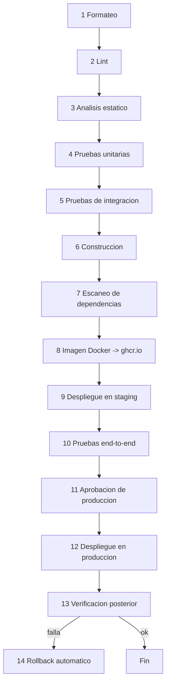

# DEPLOYMENT.md

## 0. Estado de este documento
- Etapa del proceso: 9 — Infraestructura y DevOps
- Estado: En análisis (propuesta completa, pendiente de tu validación)
- Última actualización: 2026-07-27
- Depende de: Etapas 0-8 (especialmente Etapa 2 — escala/presupuesto, y Etapa 8 — controles de seguridad a aplicar aquí)
- Bloquea: Etapa 10 (observabilidad se conecta a esta infraestructura), Etapa 12 (backups), Etapa 13 (el pipeline despliega lo que ahí se construya)

## 1. Decisiones tomadas en esta etapa

| Decisión | Elegido | Motivo |
|---|---|---|
| Proveedor de cómputo | **Hetzner Cloud** (VPS, región UE) | Mejor precio/rendimiento en la UE dentro de 100-500€/mes (Etapa 2); datos en Alemania/Finlandia, favorable para RGPD |
| Base de datos administrada | **DigitalOcean Managed PostgreSQL** (región Frankfurt) | Hetzner no ofrece Postgres gestionado nativo; DO tiene backups automáticos, PITR y escalado vertical sencillo a coste razonable a esta escala |
| Redis | Autoalojado (contenedor en la misma VPS de cómputo) | Su uso aquí (BullMQ + pub/sub) tolera pérdida de estado — un reinicio implica reprocesar jobs, no perder datos de negocio (ya cubierto por reintentos/idempotencia); pagar Redis gestionado no se justifica a este volumen |
| Almacenamiento de objetos | **Hetzner Object Storage** (S3-compatible) | Co-localizado con el cómputo, evita un tercer proveedor solo para esto |
| DNS + protección básica | **Cloudflare** (plan gratuito) | DNS gratuito + mitigación básica de DoS/CDN para el tráfico web/API — no proxia MQTT (sección 6) |
| IaC | **Terraform** | Declarativo, con providers oficiales para Hetzner, DigitalOcean y Cloudflare; no implica Kubernetes |
| Reverse proxy / TLS | **Caddy** | HTTPS automático vía Let's Encrypt con configuración mínima — adecuado para un equipo de 3-6 personas sin tiempo para gestionar certificados a mano |
| Registro de imágenes Docker | **GitHub Container Registry (ghcr.io)** | Gratuito para repositorios privados de tamaño moderado, integrado con GitHub Actions sin credenciales adicionales |

## 2. Entornos

| Entorno | Cómputo | Base de datos | Object storage | Broker MQTT |
|---|---|---|---|---|
| **Desarrollo** | Docker Compose local (sección 5) | Contenedor Postgres local | MinIO local (sustituto S3) | Contenedor EMQX local |
| **Staging** | 1 VPS Hetzner pequeña (todo-en-uno vía Docker Compose) | DO Managed Postgres, tier mínimo | Hetzner Object Storage, bucket/prefijo `staging` | EMQX en la misma VPS |
| **Producción** | 1-2 VPS Hetzner (api con 2 réplicas para despliegue sin interrupciones, sección 10) | DO Managed Postgres, tier de producción | Hetzner Object Storage, bucket/prefijo `production` | EMQX en VPS dedicada o compartida (revisar si crece) |

Staging y producción están completamente aislados: cuentas/buckets/bases de datos distintas, sin compartir datos ni credenciales.

## 3. Variables de entorno (por proceso)

| Variable | Aplica a | Notas |
|---|---|---|
| `NODE_ENV` | todos | `development` / `staging` / `production` |
| `PROCESS_ROLE` | todos | `api` \| `ingestion` \| `worker` (Etapa 3, sección 4) |
| `DATABASE_URL` | api, worker | Cadena de conexión Postgres |
| `REDIS_URL` | api, ingestion, worker | |
| `JWT_PRIVATE_KEY` / `JWT_PUBLIC_KEY` / `JWT_KID` | api | Firma asimétrica (Etapa 8) |
| `ACCESS_TOKEN_TTL` / `REFRESH_TOKEN_TTL` | api | Valores exactos en Etapa 13 (coherentes con Etapa 2/8) |
| `MQTT_BROKER_URL` | ingestion | |
| `MQTT_INGESTION_USERNAME` / `MQTT_INGESTION_PASSWORD` | ingestion | Credencial propia de ingestion (`MQTT_PROTOCOL.md` sección 4), nunca una de gateway |
| `SMTP_HOST` / `SMTP_PORT` / `SMTP_USER` / `SMTP_PASSWORD` / `EMAIL_FROM` | worker | Envío de notificaciones/invitaciones |
| `S3_ENDPOINT` / `S3_BUCKET` / `S3_ACCESS_KEY` / `S3_SECRET_KEY` | api | Adjuntos, exportaciones futuras |
| `OTEL_EXPORTER_OTLP_ENDPOINT` | todos | Etapa 10 |
| `CORS_ALLOWED_ORIGINS` | api | Lista blanca (Etapa 8, sección 11) |
| `PLATFORM_ADMIN_BOOTSTRAP_EMAIL` | api (solo en el primer arranque) | Crea el primer Admin de plataforma (Etapa 13) |

Ninguna de estas variables (salvo `NODE_ENV`/`PROCESS_ROLE`, que no son secretas) se versiona con valores reales — ver sección 4.

## 4. Gestión de secretos
- **Desarrollo**: `.env.development` local, con valores de relleno (nunca reales), en `.gitignore` — nunca se commitea.
- **Staging/Producción**: secretos en **GitHub Actions Environments** (`staging`, `production`), inyectados al pipeline en el momento del despliegue y desde ahí a las variables de entorno del contenedor — nunca residen en el repositorio ni en la VPS en texto plano fuera de la ejecución del contenedor.
- El entorno `production` de GitHub Actions tiene **revisores obligatorios** configurados (sección 9, paso 11 del pipeline) — ningún despliegue a producción ocurre sin aprobación humana explícita.
- Coherente con `SECURITY.md` sección 7: ninguna herramienta nueva de gestión de secretos de terceros es necesaria en el MVP; se revisita si la complejidad operativa crece (p. ej. HashiCorp Vault) — no se añade sin necesidad medida.

## 5. Docker Compose local (desarrollo)
Ver [`docker-compose.yml`](../docker-compose.yml) en la raíz del repositorio. Incluye ya operativos: `postgres`, `redis`, `emqx`, `minio` (S3 local), `mailpit` (SMTP falso para ver los emails de invitación/alerta en desarrollo sin enviarlos de verdad). Los servicios `api`/`ingestion`/`worker` están definidos pero comentados — se activan cuando la Etapa 13 cree el proyecto NestJS real en `apps/backend` (el `Dockerfile` de referencia ya existe en [`infra/docker/Dockerfile`](../infra/docker/Dockerfile)).

## 6. Dominio, DNS, TLS, firewall, redes privadas
- **Dominio**: [SUPOSICIÓN, pendiente de tu decisión] se usa `example.com` como marcador en toda la documentación hasta que registres el dominio real.
- **DNS**: gestionado en Cloudflare (plan gratuito). Solo los registros de la API/web (`api.example.com`, `app.example.com`) están **proxiados** por Cloudflare (naranja) — el registro del broker MQTT (`mqtt.example.com`) está **sin proxiar** (gris/DNS-only), porque Cloudflare gratuito no proxia tráfico MQTT (TCP puro, no HTTP), solo lo resuelve.
- **TLS**: Caddy gestiona HTTPS automático (Let's Encrypt) para `api.example.com`/`app.example.com`. El broker EMQX gestiona su propio certificado Let's Encrypt (renovación vía `acme.sh` o el gestor de certificados integrado de EMQX) para `mqtt.example.com:8883`, independiente de Caddy.
- **Firewall** (Hetzner Cloud Firewall, a nivel de VPS): entrante permitido solo en 443 (HTTPS/WSS), 8883 (MQTTS) y 22 (SSH, restringido a IPs de administración conocidas — nunca abierto a cualquier IP). Todo lo demás, denegado por defecto.
- **Redes privadas**: Postgres (gestionado) y Redis (contenedor) solo son alcanzables desde la red privada de Hetzner donde viven `api`/`ingestion`/`worker` — nunca expuestos con IP pública ni puerto abierto a internet.

## 7. Base de datos administrada, broker MQTT, Redis, almacenamiento — resumen operativo
- **PostgreSQL**: DO Managed Postgres, con backups automáticos diarios + WAL continuo (PITR) — mecánica completa de recuperación en Etapa 12.
- **EMQX**: nodo único en el MVP (coherente con [ADR-0003](ADR/0003-ingestion-suscripcion-directa.md) y la escala de Etapa 2) — clúster de varios nodos queda para cuando la escala lo justifique, no antes.
- **Redis**: contenedor con persistencia AOF activada (para no perder jobs en cola ante un reinicio simple, aunque no sea el sistema de registro de verdad — eso es Postgres).
- **Object storage**: un bucket por entorno (sección 2), con política de acceso restringida a las credenciales de la aplicación (principio de mínimo privilegio, `SECURITY.md`).

## 8. Escalabilidad, balanceo de carga, despliegue sin interrupciones, rollback

- **Horizontal**: `worker` escala añadiendo réplicas del contenedor (stateless, consume de la cola) — primer candidato si la profundidad de cola crece de forma sostenida (umbral concreto se define con métricas reales, Etapa 10). `api` corre con **2 réplicas desde el MVP** (no es escalado prematuro: es el mecanismo que permite despliegue sin interrupciones, sección siguiente) detrás de Caddy como balanceador. `ingestion` permanece en una instancia (ADR-0003) hasta que el volumen real lo justifique.
- **Vertical**: redimensionar la VPS de Hetzner o el tier de DO Managed Postgres — ambos soportan resize con una ventana de indisponibilidad breve (minutos), aceptable dado el RTO de 4h ya fijado (Etapa 2).
- **Balanceo de carga**: Caddy, como reverse proxy delante de las 2 réplicas de `api` — sin un balanceador dedicado de pago (Hetzner Load Balancer) hasta que haya más de una VPS de cómputo.
- **Despliegue sin interrupciones**: con 2 réplicas de `api`, el pipeline despliega una, comprueba su `/health`, la pone en servicio, y repite con la segunda — nunca las dos caen a la vez. `worker`/`ingestion` sí tienen una breve ventana de reinicio al desplegar (aceptable: no están sujetos al SLA de disponibilidad de la Etapa 2, que aplica a "API y aplicación Flutter", no a los procesos de fondo).
- **Rollback**: las imágenes Docker se etiquetan con el SHA del commit (nunca `latest` en producción) — un rollback es volver a desplegar la etiqueta anterior. Las migraciones de base de datos siguen el patrón *expand-contract* (añadir antes de quitar, Etapa 5) para que el código de la versión anterior siga funcionando contra el esquema nuevo durante la ventana de despliegue/rollback.

## 9. Pipeline de CI/CD (GitHub Actions)

Ver [`.github/workflows/ci-cd.yml`](../.github/workflows/ci-cd.yml) para la referencia ejecutable (algunos pasos referencian scripts que existirán a partir de la Etapa 13).

- Pasos 1-7 corren en **cada PR**, sin excepción — nada llega a `main` sin pasar formateo/lint/análisis estático/pruebas/escaneo.
- Paso 9 (staging) es automático al hacer merge a `main`.
- Paso 11 usa el **environment protection rule** nativo de GitHub Actions sobre el entorno `production` (revisor humano obligatorio) — no es un paso de aprobación simulado.
- Paso 13 (verificación posterior) comprueba `/health`, un endpoint autenticado de bajo riesgo, y que las métricas OTel siguen fluyendo (Etapa 10) — si falla, dispara el paso 14 automáticamente sin intervención manual.

## 10. Control de costes
- Alertas de presupuesto configuradas en Hetzner y DigitalOcean (aviso al 80% y 100% de un umbral mensual acorde a Etapa 2).
- Recursos etiquetados por entorno (`dev`/`staging`/`production`) para poder atribuir coste.
- Staging deliberadamente infra-dimensionado (todo-en-uno, sección 2) — no se paga por alta disponibilidad donde no aporta valor.
- Revisión mensual de coste real vs. presupuesto de Etapa 2 como parte del mantenimiento (Etapa 15).

## 11. Riesgos
- EMQX de nodo único (sección 7) es un punto único de fallo para la ingesta, igual que `ingestion` (ya aceptado en [ADR-0003](ADR/0003-ingestion-suscripcion-directa.md)) — mitigado por la persistencia de sesión/cola, no por redundancia todavía.
- Cloudflare gratuito no protege el puerto MQTT (sección 6) — ese puerto depende únicamente del firewall de Hetzner y del rate limiting de EMQX; a vigilar si aparecen intentos de abuso reales.
- Redis autoalojado sin gestión externa depende de que el equipo aplique bien sus propias actualizaciones de seguridad — mitigado por el escaneo de imagen Docker (Etapa 8) que también cubre esta imagen base.

## 12. Entregables de esta etapa
- Este documento (`DEPLOYMENT.md`).
- [`docker-compose.yml`](../docker-compose.yml) (raíz del repositorio).
- [`infra/docker/Dockerfile`](../infra/docker/Dockerfile) (referencia multi-stage para el monorepo NestJS).
- [`.github/workflows/ci-cd.yml`](../.github/workflows/ci-cd.yml) (pipeline de referencia).

## 13. Criterios de aceptación de esta etapa
- Los tres entornos están completamente aislados (sin credenciales ni datos compartidos entre staging y producción).
- Cada uno de los 14 pasos de pipeline solicitados aparece en el workflow, en el orden correcto, con un mecanismo real (no simulado) para la aprobación de producción y el rollback.
- Ningún secreto real aparece en ningún archivo versionado del repositorio.

## 14. Pruebas necesarias derivadas
- Levantar `docker-compose.yml` en una máquina limpia y confirmar que Postgres, Redis, EMQX, MinIO y Mailpit arrancan sanos.
- Simular un fallo en el paso 13 (verificación posterior) y confirmar que el paso 14 revierte automáticamente a la imagen anterior sin intervención manual.
- Intentar fusionar a `main` con el paso 4 (pruebas unitarias) fallando y confirmar que el pipeline se detiene antes de construir la imagen.
- Confirmar que un intento de despliegue a `production` sin aprobación del revisor configurado queda bloqueado por GitHub Actions.

## 15. Lista de tareas de esta etapa
- [x] Elegir proveedor de cómputo, BD gestionada, almacenamiento, DNS.
- [x] Definir los tres entornos y su aislamiento.
- [x] Especificar variables de entorno y gestión de secretos.
- [x] Diseñar el pipeline de 14 pasos con mecanismo real de aprobación y rollback.
- [x] Crear `docker-compose.yml`, `Dockerfile` de referencia y workflow de GitHub Actions.
- [ ] Revisión y validación por tu parte (incluida la elección de dominio real, sección 6).
- [ ] Cerrar etapa y pasar a Etapa 10 (Observabilidad).

## 16. Dependencias
- Depende de Etapas 0-8.
- Bloquea Etapa 10 (dónde vive el colector OTel), Etapa 12 (mecánica de backup sobre esta infraestructura), Etapa 13 (el pipeline despliega el código que ahí se construya).

## 17. Aspectos que se aplazan explícitamente
- Elección y registro del dominio real — pendiente de ti.
- Clúster EMQX multi-nodo, balanceador de carga dedicado, Redis gestionado — cuando la escala lo justifique (Etapa 2 revisada), no antes.
- Gestor de secretos dedicado (Vault u otro) más allá de GitHub Actions Environments — si la complejidad operativa crece.

## 18. Errores frecuentes a evitar
- No usar la etiqueta `latest` en producción — rompe la capacidad de rollback determinista.
- No exponer Postgres/Redis con IP pública "para poder conectarme más fácil" — siempre a través de la red privada.
- No proxiar el puerto MQTT por Cloudflare esperando que la protección DoS gratuita lo cubra — no lo hace.
- No desplegar a producción sin que el paso de verificación posterior (13) haya confirmado salud real, no solo que el contenedor arrancó.

## 19. Historial de decisiones de esta etapa

| Fecha | Decisión | Alternativas consideradas |
|---|---|---|
| 2026-07-27 | Hetzner Cloud (cómputo) + DigitalOcean Managed Postgres + Hetzner Object Storage + Cloudflare DNS | AWS/GCP/Azure completo (descartado por coste a esta escala); un único proveedor todo-en-uno (Hetzner no ofrece Postgres gestionado nativo) |
| 2026-07-27 | Terraform para IaC, sin Ansible/config management dedicado | Ansible (descartado: innecesario para 1-2 servidores) |
| 2026-07-27 | Caddy como reverse proxy/TLS | Nginx + Certbot manual (más configuración para el mismo resultado); Traefik (válido, Caddy más simple para el equipo) |
| 2026-07-27 | 2 réplicas de `api` desde el MVP para despliegue sin interrupciones | 1 réplica con ventana de indisponibilidad aceptada (descartado: contradice el requisito explícito de "despliegue sin interrupciones") |
