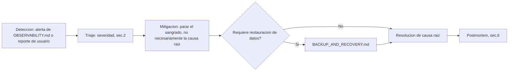

# INCIDENT_RESPONSE.md

## 0. Estado de este documento
- Etapa del proceso: 12 — Backup y recuperación
- Estado: En análisis
- Última actualización: 2026-07-27
- Depende de: `OBSERVABILITY.md` (detección), `BACKUP_AND_RECOVERY.md` (recuperación de datos), `DEPLOYMENT.md` (aprobación de acciones sobre producción)

## 1. Decisiones tomadas en esta etapa

| Decisión | Elegido |
|---|---|
| Niveles de severidad | 4 niveles (Sev1-Sev4), con tiempos de respuesta numéricos, no adjetivos |
| Comunicación con clientes durante un incidente | Email directo a los Admin de organización afectados — sin página de estado pública en el MVP |
| Quién puede declarar un incidente / aprobar una restauración | Cualquier miembro del equipo puede declarar; solo un Admin de plataforma aprueba una restauración completa (`BACKUP_AND_RECOVERY.md`) |
| Postmortem | Obligatorio para Sev1/Sev2, sin buscar culpables (blameless), con acciones de seguimiento con dueño y fecha |

## 2. Niveles de severidad

| Nivel | Definición | Reconocimiento | Objetivo de resolución |
|---|---|---|---|
| **Sev1** | Servicio caído para todas las organizaciones, o pérdida/exposición de datos | ≤ 15 min | Foco total hasta mitigar |
| **Sev2** | Degradación significativa (función clave rota, latencia muy alta) o afecta a varias organizaciones | ≤ 1 hora | ≤ 8 horas laborables |
| **Sev3** | Afecta a una organización o a una función secundaria | Siguiente día laborable | Según prioridad normal |
| **Sev4** | Cosmético, o con solución alternativa disponible | Backlog | Sin objetivo de tiempo |

Un Sev1 con pérdida/exposición de datos activa automáticamente el procedimiento de `BACKUP_AND_RECOVERY.md` y, si hay datos personales afectados, el procedimiento de notificación de [`PRIVACY.md` §9](PRIVACY.md#9-notificación-de-brechas-de-seguridad-art-33-34-rgpd) (plazo de 72h a la AEPD) por implicación RGPD.

## 3. Flujo de un incidente



- **Mitigación antes que causa raíz**: en Sev1/Sev2, el primer objetivo es detener el impacto (p. ej. rollback del último despliegue, `DEPLOYMENT.md` sección 8) — investigar la causa raíz en profundidad es el segundo paso, no el primero.

## 4. Roles durante un incidente
- **Cualquier persona del equipo** puede declarar un incidente al detectarlo (por alerta de `OBSERVABILITY.md` o reporte de un cliente) — no se espera confirmación de un superior antes de empezar a mitigar un Sev1.
- **Coordinador del incidente**: quien lo declaró, hasta que otra persona lo asuma explícitamente — evita que "todos coordinan" y en la práctica nadie lo hace.
- **Aprobación de restauración completa**: exclusiva de un Admin de plataforma (`BACKUP_AND_RECOVERY.md` sección 4), igual nivel de control que un despliegue a producción.

## 5. Comunicación
- **Interna**: canal del equipo (el mismo de las alertas operativas, `OBSERVABILITY.md` sección 9).
- **Con clientes**: email directo a los Admin de organización afectados en Sev1/Sev2 — primera actualización dentro de 30 minutos de declarado el incidente, después cada hora hasta resolver. Sin página de estado pública en el MVP (equipo pequeño, pocas organizaciones piloto — se aplaza, sección 14).
- Ningún mensaje a clientes revela detalles técnicos sensibles (credenciales, nombres de tabla) — mismo principio que los errores de la API (`SECURITY.md` sección 13).

## 6. Plantilla de postmortem (obligatoria en Sev1/Sev2)
```markdown
# Postmortem: <título>
- Fecha del incidente:
- Severidad:
- Duración total:
- Organizaciones afectadas:

## Resumen
## Cronología (hora a hora)
## Causa raíz
## Impacto (datos, usuarios, tiempo)
## Qué funcionó bien
## Qué falló
## Acciones de seguimiento (dueño, fecha)
```
Blameless: el objetivo es identificar fallos de sistema/proceso, no de personas — condición necesaria para que el equipo reporte incidentes con honestidad en vez de ocultarlos.

## 7. Relación con Backup y recuperación
- Un incidente **no** implica automáticamente una restauración de base de datos — la mayoría (caída de un proceso, latencia alta, un bug sin pérdida de datos) se resuelve con un rollback o una corrección de código.
- Se activa `BACKUP_AND_RECOVERY.md` solo cuando hay corrupción o pérdida de datos real — y primero se evalúa si el borrado lógico (`BACKUP_AND_RECOVERY.md` sección 7) ya resuelve el caso antes de considerar una restauración completa o selectiva.

## 8. Riesgos
- Con un equipo de 3-6 personas, no hay guardia 24/7 real — un Sev1 fuera de horario puede tardar más que el objetivo de 15 minutos de reconocimiento. Se acepta como limitación conocida del tamaño de equipo, no se contrata una guardia externa en el MVP.
- Sin página de estado pública, la comunicación depende de tener los emails de contacto de cada organización actualizados — a verificar como parte del alta de organización (Etapa 1).

## 9. Entregables de esta etapa
- Este documento (`INCIDENT_RESPONSE.md`), complementario a `BACKUP_AND_RECOVERY.md`.

## 10. Criterios de aceptación de esta etapa
- Cada nivel de severidad tiene un tiempo de reconocimiento y un objetivo de resolución numéricos.
- El postmortem es obligatorio y tiene plantilla fija, no "se documentará si hay tiempo".

## 11. Pruebas necesarias derivadas
- Simulacro de incidente (game day): provocar una caída controlada en staging, cronometrar el reconocimiento y la mitigación, y confirmar que el flujo de la sección 3 se sigue sin ambigüedad sobre quién hace qué.
- Confirmar que una alerta Sev1 de `OBSERVABILITY.md` llega al canal correcto en menos de los 15 minutos objetivo.

## 12. Lista de tareas de esta etapa
- [x] Definir niveles de severidad con tiempos numéricos.
- [x] Definir flujo, roles y plantilla de postmortem.
- [x] Conectar con `BACKUP_AND_RECOVERY.md` (cuándo se activa una restauración).
- [ ] Revisión y validación por tu parte.
- [ ] Cerrar etapa y pasar a Etapa 13 (desarrollo backend).

## 13. Dependencias
- Depende de `OBSERVABILITY.md`, `BACKUP_AND_RECOVERY.md`, `DEPLOYMENT.md`.
- Alimenta Etapa 15 (revisión periódica y mejora continua a partir de postmortems).

## 14. Aspectos que se aplazan explícitamente
- Página de estado pública — cuando el número de organizaciones lo justifique.
- Guardia 24/7 formal — cuando el equipo crezca o el SLA contractual lo exija.
- ~~Procedimiento de notificación RGPD detallado — pendiente de `PRIVACY.md`.~~ Resuelto: ver [`PRIVACY.md` §9](PRIVACY.md#9-notificación-de-brechas-de-seguridad-art-33-34-rgpd).

## 15. Errores frecuentes a evitar
- No perseguir la causa raíz antes de mitigar en un Sev1 — primero se para el impacto.
- No dejar un postmortem de Sev1/Sev2 sin acciones de seguimiento con dueño y fecha concretos — sin eso, no se aprende nada del incidente.
- No comunicar a clientes con jerga técnica ni detalles que puedan usarse para atacar el sistema.

## 16. Historial de decisiones de esta etapa

| Fecha | Decisión | Alternativas consideradas |
|---|---|---|
| 2026-07-27 | 4 niveles de severidad con tiempos numéricos | Niveles cualitativos sin cifra ("urgente", "normal") |
| 2026-07-27 | Comunicación por email directo, sin página de estado pública en el MVP | Página de estado pública desde el día 1 (descartado: coste/esfuerzo no justificado con pocas organizaciones piloto) |
| 2026-07-27 | Postmortem blameless obligatorio en Sev1/Sev2 | Postmortem opcional o solo para incidentes muy graves |
