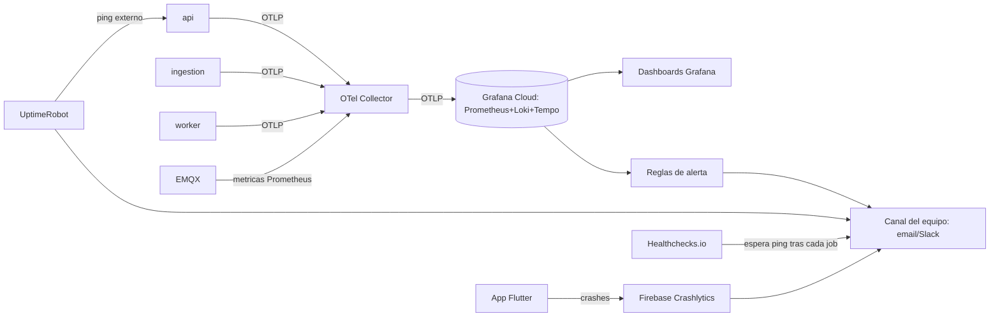

# OBSERVABILITY.md

## 0. Estado de este documento
- Etapa del proceso: 10 — Observabilidad
- Estado: En análisis (propuesta completa, pendiente de tu validación)
- Última actualización: 2026-07-27
- Depende de: Etapas 3 (procesos), 6 (MQTT), 8 (seguridad de logs), 9 (infraestructura)
- Bloquea: Etapa 12 (backups se apoyan en el mecanismo de "dead man's switch" de esta etapa), Etapa 13 (instrumentación real del código)

**Principio rector**: la plataforma debe detectar los problemas antes de que un usuario tenga que reportarlos. Cada sección de este documento existe para cerrar una forma concreta de "nos enteramos tarde".

> **Aviso de nomenclatura**: el módulo "Alertas" de `FUNCTIONAL_REQUIREMENTS.md` (umbral de sensor, dispositivo offline) es un **producto para el cliente final**. Las "alertas" de este documento son **operativas, para el equipo interno**, sobre la salud del sistema — comparten nombre, no mecanismo ni destinatario. No se mezclan en el mismo canal.

## 1. Decisiones tomadas en esta etapa

| Decisión | Elegido | Motivo |
|---|---|---|
| Backend de métricas/logs/trazas (destino de OpenTelemetry) | **Grafana Cloud** (plan gratuito) | OTLP nativo, incluye Grafana+Prometheus+Loki+Tempo sin que el equipo opere ese stack; el plan gratuito cubre la escala de Etapa 2 |
| Monitorización externa (uptime) | **UptimeRobot** (plan gratuito) | Independiente de nuestra infraestructura — si Hetzner/DO caen del todo, sigue avisando |
| Dead man's switch (backups, jobs programados) | **Healthchecks.io** (plan gratuito) | Especializado en "avísame si NO recibes un ping", justo lo que hace falta para "¿se ejecutó el backup de anoche?" |
| Crash reporting móvil | **Firebase Crashlytics** | Estándar de facto en el ecosistema Flutter, gratuito, capta crashes nativos (no solo excepciones Dart) que OTel no cubre bien en móvil |
| Propagación de traza a través de BullMQ | Contexto de traza (`traceparent` W3C) serializado como campo del job | BullMQ no propaga contexto de traza automáticamente — hay que hacerlo a mano para no perder la traza entre `ingestion` y `worker` |

## 2. Arquitectura de observabilidad

Cada proceso (`api`/`ingestion`/`worker`) exporta a un **OTel Collector** local (mismo patrón en los tres entornos, `DEPLOYMENT.md`); el collector decide a dónde reenviar según el entorno (`infra/otel/otel-collector-dev.yaml` para desarrollo — exporta a consola, sin dependencia externa; producción/staging reenvían a Grafana Cloud). Ningún proceso de aplicación conoce la clave de Grafana Cloud directamente — solo el collector.

## 3. Logs estructurados
- Formato JSON, un objeto por línea, con como mínimo: `timestamp`, `level`, `message`, `correlationId` (sección 5), `processRole`, `module`, y cuando aplique `organizationId`/`actorUserId` (nunca el email ni datos personales completos, solo el id).
- **Nunca** en el log: contraseñas, secretos de gateway, tokens completos, payloads MQTT en crudo sin redactar (`SECURITY.md` sección 9, ya fijado — se repite aquí porque es la etapa donde se implementa el logging real).
- Nivel de log por entorno: `debug` en desarrollo, `info` en staging/producción (con `warn`/`error` siempre activos).

## 4. Métricas técnicas
| Métrica | Por qué |
|---|---|
| Latencia API (p50/p95/p99) por endpoint | Contraste directo con los límites de `NON_FUNCTIONAL_REQUIREMENTS.md` sección 5 |
| Tasa de error HTTP 4xx/5xx | Salud general de `api` |
| Mensajes MQTT recibidos/rechazados por `ingestion` | Contraste con `MQTT_PROTOCOL.md` sección 6 (motivos de rechazo, sección 8) |
| Profundidad y throughput de cada cola BullMQ | Sección 7 |
| Conexiones activas EMQX, tasa de mensajes/s | Sección 8 |
| Uso de CPU/memoria por proceso | Umbral de escalado vertical/horizontal (`DEPLOYMENT.md` sección 8) |
| Conexiones activas al pool de Postgres vs. máximo | Detecta agotamiento de pool antes de que falle una petición |

## 5. Identificadores de correlación
- **HTTP**: contexto de traza W3C (`traceparent`) generado automáticamente por el SDK de OTel; se expone además como `X-Request-Id` en la respuesta (más fácil de citar por un usuario/soporte que un `traceparent` completo).
- **MQTT → cola → worker**: `ingestion` genera un `correlationId` al recibir cada mensaje válido y lo adjunta como campo del job de BullMQ (junto con el `traceparent` serializado) — `worker` lo recoge y continúa la misma traza. Sin este paso manual, la traza se cortaría en la frontera de la cola (BullMQ no propaga contexto de traza por sí solo).
- Toda alerta/notificación derivada de un mensaje de telemetría lleva el `correlationId` de origen en sus metadatos (`alerts.details`, `DATA_MODEL.md`) — permite responder "¿qué mensaje concreto disparó esta alerta?" sin adivinar.

## 6. Health checks
- `GET /health` (liveness): el proceso responde, sin comprobar dependencias — usado por Docker/Caddy para saber si reiniciar el contenedor.
- `GET /health/ready` (readiness): comprueba dependencias críticas del proceso (`api`: Postgres + Redis; `ingestion`: Redis + conexión MQTT; `worker`: Postgres + Redis) — usado por el pipeline de despliegue (`DEPLOYMENT.md` sección 9, paso 13) antes de dar tráfico a una réplica nueva.

## 7. Monitorización de colas y dead-letter queues
- Panel de BullMQ (Bull Board) expuesto solo en red privada/VPN de administración, nunca público.
- Política de reintentos: 5 intentos con backoff exponencial (base 2s) antes de mover un job a la cola de fallidos (dead-letter) — no se descarta nunca silenciosamente.
- Un job en dead-letter dispara una alerta operativa inmediata (sección 9) — implica que telemetría o una notificación no se procesó pese a los reintentos, requiere revisión humana.
- Métrica de profundidad de dead-letter > 0 sostenida es, por sí sola, una condición de alerta (no debería acumularse nunca en operación normal).

## 8. Monitorización MQTT
- Métricas nativas de EMQX (conexiones activas, mensajes/s entrantes, tasa de rechazo por ACL, sesiones persistentes) exportadas vía su integración Prometheus al mismo OTel Collector.
- Contraste directo con los umbrales de `NON_FUNCTIONAL_REQUIREMENTS.md` (≥3 msg/s sostenidos, ≥150 msg/s en pico) — una desviación grande y sostenida de estos números es señal de un problema (gateways caídos masivamente, o un ataque).

## 9. Alertas operativas (equipo interno, no de producto)

| Condición | Umbral | Canal |
|---|---|---|
| Latencia API p95 | > 500ms durante 5 min | Email/Slack del equipo |
| Tasa de error 5xx | > 1% durante 5 min | Email/Slack |
| Profundidad de cola sostenida | > 500 jobs durante 10 min | Email/Slack |
| Job en dead-letter | Cualquiera (sección 7) | Email/Slack inmediato |
| Certificado TLS | < 14 días para expirar | Email/Slack |
| Backup sin confirmar (Healthchecks.io) | Sin ping en la ventana esperada (Etapa 12) | Email/Slack inmediato |
| Presupuesto de infraestructura | 80% / 100% del umbral mensual (`DEPLOYMENT.md` sección 10) | Email/Slack |
| Uptime externo (UptimeRobot) | 2 comprobaciones fallidas seguidas | Email/Slack/SMS |
| % de gateways offline en una organización | > 30% simultáneamente (posible corte de red regional, no solo dispositivos sueltos) | Email/Slack |

## 10. Dashboards (Grafana)
1. **Salud de plataforma**: uptime, latencia, tasa de error, uso de recursos por proceso.
2. **Estado de campo**: gateways/dispositivos online vs. offline por organización, mapa de calor de última hora de conexión.
3. **Colas y MQTT**: profundidad, throughput, dead-letter, métricas EMQX.
4. **Negocio**: alertas de producto abiertas, tiempo medio de reconocimiento/resolución, mensajes procesados/día.
5. **Coste** (`DEPLOYMENT.md` sección 10): gasto acumulado del mes vs. presupuesto.

## 11. Crash reporting móvil
- Firebase Crashlytics integrado en la app Flutter (Android/iOS) desde el primer build de Etapa 14 — captura crashes nativos y excepciones Dart no controladas, con el mismo `correlationId`/`userId` (sin datos personales adicionales) para poder cruzarlo con los logs del backend si el crash ocurrió durante una petición concreta.

## 12. Estado de proveedores externos
- MVP: el único proveedor externo activo es el **SMTP** de envío de email — se monitoriza la tasa de fallo de envío (métrica técnica, sección 4) y se alerta si supera un umbral (p. ej. >5% de fallos en 15 min).
- V2/Futuro (clima, satélite — `BACKLOG.md`): cada integración nueva debe exponer su propio estado (última llamada exitosa, tasa de error) reutilizando este mismo patrón — no se diseña su detalle ahora, se deja fijado el principio para no tener que rediscutirlo.

## 13. Riesgos
- El plan gratuito de Grafana Cloud tiene límites de volumen de métricas/logs — a vigilar contra el crecimiento real (Etapa 2); si se supera, la alternativa es un stack autoalojado (Prometheus+Loki+Tempo+Grafana en la misma VPS), documentado aquí como plan B, no implementado salvo que haga falta.
- Un fallo en la propagación manual del `correlationId` entre `ingestion` y `worker` (sección 5) rompería la trazabilidad de un mensaje concreto sin romper el procesamiento en sí — riesgo de "funciona pero es difícil de depurar", no de pérdida de datos.

## 14. Entregables de esta etapa
- Este documento (`OBSERVABILITY.md`).
- [`infra/otel/otel-collector-dev.yaml`](../infra/otel/otel-collector-dev.yaml).
- Servicio `otel-collector` activado en `docker-compose.yml`.

## 15. Criterios de aceptación de esta etapa
- Cada elemento de la lista original del usuario (logs, métricas técnicas/negocio, trazas, correlación, health checks, monitorización externa, dashboards, alertas, crash reporting, colas, MQTT, dead-letter, costes, backups, certificados, proveedores externos) tiene una decisión concreta, no una mención vaga.
- Toda alerta de la sección 9 tiene un umbral numérico, no un adjetivo.

## 16. Pruebas necesarias derivadas
- Provocar una excepción no controlada en `worker` y confirmar que aparece en Grafana con el mismo `correlationId` que el mensaje MQTT que la originó.
- Detener el proceso `worker` con jobs en cola y confirmar que la métrica de profundidad de cola sube y dispara la alerta del umbral correspondiente.
- Dejar caducar (simulado) un certificado de prueba y confirmar que la alerta de "< 14 días" se dispara.
- Apagar por completo la VPS de staging y confirmar que UptimeRobot lo detecta y notifica sin depender de nuestra propia infraestructura.

## 17. Lista de tareas de esta etapa
- [x] Diseñar logs, métricas, trazas, correlación, health checks.
- [x] Elegir herramientas concretas (Grafana Cloud, UptimeRobot, Healthchecks.io, Crashlytics).
- [x] Definir umbrales numéricos de alerta.
- [x] Crear el collector de referencia y activarlo en `docker-compose.yml`.
- [ ] Revisión y validación por tu parte.
- [ ] Cerrar etapa y pasar a Etapa 11 (estrategia de pruebas).

## 18. Dependencias
- Depende de Etapas 3, 6, 8, 9.
- Bloquea Etapa 12 (el "dead man's switch" de Healthchecks.io es el gancho de observabilidad de los backups), Etapa 13 (instrumentación real).

## 19. Aspectos que se aplazan explícitamente
- Stack autoalojado de observabilidad (plan B si se supera el plan gratuito de Grafana Cloud).
- Estado de proveedores externos más allá de SMTP — se diseña con cada integración V2/Futuro concreta.

## 20. Errores frecuentes a evitar
- No monitorizar la disponibilidad **desde dentro** de la propia infraestructura como único mecanismo — si todo cae, nada interno puede avisar; de ahí UptimeRobot como pieza externa independiente.
- No dejar que un job fallido desaparezca tras agotar reintentos — siempre a dead-letter con alerta, nunca descartado en silencio.
- No loguear el payload MQTT completo sin redactar — puede contener valores que, combinados, identifiquen a un cliente concreto, y no aporta nada que las métricas ya agregadas no den.
- No confundir las alertas de producto (clientes) con las alertas operativas (equipo) al nombrar canales o documentación — usan destinatarios y propósitos distintos.

## 21. Historial de decisiones de esta etapa

| Fecha | Decisión | Alternativas consideradas |
|---|---|---|
| 2026-07-27 | Grafana Cloud (plan gratuito) como backend de OTel | Stack autoalojado Prometheus+Loki+Tempo+Grafana (más carga operativa para un equipo de 3-6) |
| 2026-07-27 | UptimeRobot + Healthchecks.io para monitorización externa y dead man's switch | Un único proveedor todo-en-uno (más caro a esta escala) |
| 2026-07-27 | Firebase Crashlytics para crash reporting móvil, separado de OTel | Instrumentar crashes móviles con OTel (soporte menos maduro que Crashlytics para crashes nativos) |
| 2026-07-27 | Propagación manual de `traceparent` a través de los jobs de BullMQ | Asumir que OTel lo propaga solo (no es cierto para colas) |
