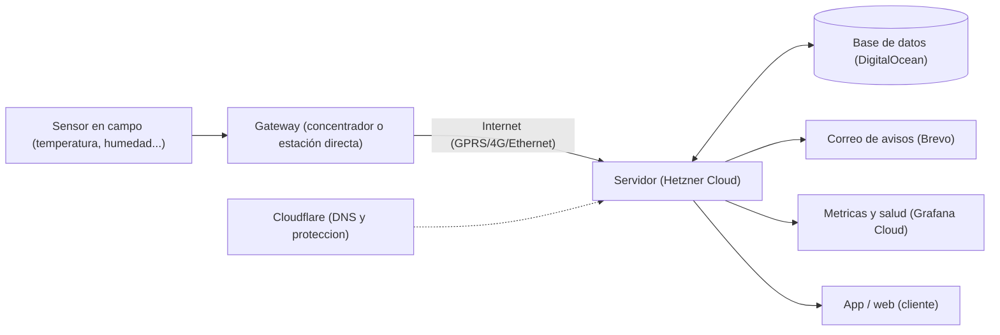
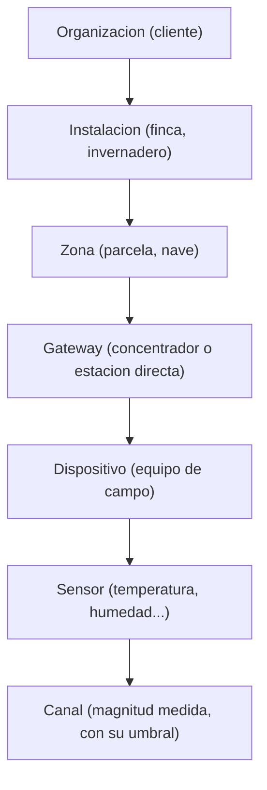
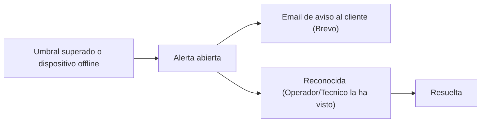
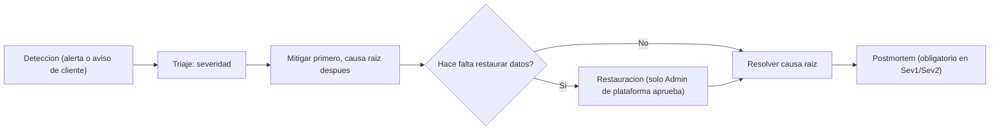

# OPERATIONS_GUIDE.md

## 0. Estado de este documento
- No es una etapa numerada del proceso 0-15 (`PROJECT_STATUS.md`) — es un manual de referencia para operar el sistema ya en marcha, escrito para alguien que no tiene por qué saber qué hace cada programa.
- Creado: 2026-08 (tras el primer `terraform apply` real de `dns-zone`/`environments/staging`, ver `PROJECT_STATUS.md`).
- Se apoya en, y debe mantenerse coherente con: `ARCHITECTURE.md`, `PERMISSIONS.md`, `DEPLOYMENT.md`, `MAINTENANCE.md`, `INCIDENT_RESPONSE.md`, `OBSERVABILITY.md`, `BACKUP_AND_RECOVERY.md`. Si alguno de esos cambia, esta guía puede quedar desactualizada — la fuente de verdad siempre es el resto de `docs/`, no este documento.
- También existe como página web navegable (diagramas, tarjetas) — pide que se regenere si hace falta.

## 1. Cómo usar esta guía
No hace falta leerla de principio a fin:
- ¿Algo no funciona ahora mismo? → Sección 3, "Primeros auxilios".
- ¿Quieres entender qué es cada cuenta creada (Hetzner, DigitalOcean...)? → Sección 4.
- ¿Dudas de cómo funciona la app para los clientes? → Sección 6.
- ¿Una palabra no suena? → Sección 12, Glosario.

## 2. Panorama general

Todo esto corre sobre un único servidor por ahora (entorno de *staging* ya creado; producción se creará de la misma forma cuando se decida pasar a real). No hay equipo de guardia 24/7 ni página de estado pública todavía — decisión consciente para este tamaño de equipo (sección 9), no un olvido.

## 3. Primeros auxilios: algo no funciona

Antes de asumir lo peor, seguir este orden — resuelve la gran mayoría de problemas:

1. **¿Es solo la web, o también el servidor entero?** Entrar a `https://app.jmvsoluciones.com`. Si no carga nada en absoluto, sospechar del servidor o del DNS antes que de la aplicación.
2. **Comprobar Cloudflare**: panel → dominio → pestaña *DNS*. ¿Los registros `api`/`app` siguen ahí y "proxied"? Si Cloudflare muestra un aviso de incidente propio, el problema no es nuestro.
3. **Comprobar que el servidor está vivo**: panel de Hetzner Cloud → servidor → estado "Running". Revisar consumo de recursos en *Monitoring* si aparece apagado o reiniciando solo.
4. **Mirar Grafana Cloud**: dashboard de salud — tasa de error, latencia, uso de CPU/memoria. Si todo está en verde ahí pero la web no responde, sospechar de Cloudflare o del dominio, no del servidor.
5. **Revisar si el último despliegue fue el disparador**: GitHub → pestaña *Actions*. Un fallo justo después de un despliegue reciente apunta al código nuevo, no a la infraestructura — la respuesta suele ser un *rollback* (sección 4.7).
6. **Si hay pérdida o corrupción de datos real**: parar aquí, no intentar arreglarlo a mano. Ir directo a la sección 9 — hay un procedimiento de restauración concreto, y actuar antes de tiempo puede empeorarlo.

## 4. Las piezas del sistema

### 4.1 Hetzner Cloud — el servidor
El ordenador que corre la aplicación día y noche. Todo lo demás (base de datos, correo, DNS) vive fuera; este servidor solo ejecuta el código.
- **Tareas habituales**: comprobar que está "Running"; revisar CPU/memoria/disco en *Monitoring*; ampliar tamaño vía Terraform si el tráfico crece (nunca a mano en la consola).
- **Problemas frecuentes**:
  - *Disco lleno*: imágenes Docker antiguas acumuladas — `deploy.sh` ya limpia las de más de 72h; si persiste, revisar con `docker system df`.
  - *No se puede entrar por SSH*: el firewall solo admite la IP de administración configurada. Si se cambia de red, hay que actualizar esa IP vía Terraform.
  - *Va lento*: revisar primero Grafana antes de asumir que hace falta un servidor más grande.

### 4.2 DigitalOcean — la base de datos
Aquí vive todo el dato real: organizaciones, usuarios, instalaciones, sensores, cada lectura de telemetría. Base de datos "gestionada" — DigitalOcean hace los backups automáticos y parches.
- **Tareas habituales**: consultar métricas del cluster (conexiones activas, uso de disco); rara vez hace falta entrar directamente.
- **Problemas frecuentes**:
  - *"Too many connections"*: el plan más pequeño tiene un límite — si la app crece, subir de tier (Terraform).
  - *Disco creciendo rápido*: normal según entran más sensores; si crece de forma anómala, revisar si algún dispositivo envía datos duplicados/basura.
  - *No conecta tras un cambio*: revisar el firewall de la base de datos (solo admite la IP del servidor Hetzner) — si cambia el servidor, hay que actualizar esa lista.

### 4.3 Cloudflare — red y DNS
Traduce `jmvsoluciones.com` a la dirección real del servidor y actúa de escudo delante de él.
- **Tareas habituales**: añadir/editar registros DNS; revisar que la zona diga "Active".
- **Problemas frecuentes**:
  - *Un subdominio nuevo no resuelve*: comprobar que el registro existe y que la nube está en naranja ("proxied") para `api`/`app`, o gris ("DNS only") para `mqtt` — así a propósito.
  - *Tokens confusos*: hay un token de API normal (uso diario) y la "Global API Key" (solo se usó una vez, para crear la zona) — no mezclarlos.
  - *Cambios que tardan en verse*: la propagación puede tardar minutos, no debería tardar horas.

### 4.4 El dominio (jmvsoluciones.com)
Registrado directamente con Cloudflare Registrar — su renovación y su DNS viven en el mismo sitio.
- **Tareas habituales**: confirmar que la renovación automática está activada; atender el correo de verificación de ICANN si se pide tras un cambio de contacto.
- **Problemas frecuentes**: el aviso de "verifica tu email" de ICANN es serio — sin confirmar en 15 días, el dominio se suspende automáticamente por normativa.

### 4.5 Brevo — correo saliente
Envía los correos automáticos: invitaciones, recuperación de contraseña, avisos de alerta por email.
- **Tareas habituales**: vigilar la cuota gratuita (300/día); revisar tasa de entrega si un cliente dice no recibir un correo.
- **Problemas frecuentes**:
  - *Correos a spam*: revisar que el dominio siga verificado (DKIM/DMARC) — puede "desverificarse" si alguien borra esos registros DNS en Cloudflare por error.
  - *Se agota la cuota diaria*: con muchas organizaciones activas puede pasar — subir de plan (de pago).
  - *La clave SMTP deja de funcionar*: se revocó por error en Brevo — generar una nueva y actualizar el `.env` del servidor.

### 4.6 Grafana Cloud — observabilidad
El "panel de instrumentos" del sistema: métricas técnicas, y más adelante logs y trazas. Primera parada cuando algo "va lento" o "falla a veces".
- **Tareas habituales**: revisar dashboards de salud ante cualquier reporte raro; vigilar el límite del plan gratuito.
- **Problemas frecuentes**: dashboard sin datos ("No data") → revisar que el servidor esté corriendo y que `GRAFANA_CLOUD_OTLP_AUTH` siga siendo válido.

### 4.7 GitHub / GitHub Actions — código y despliegue automático
GitHub guarda el código fuente. GitHub Actions revisa automáticamente cada cambio (pruebas, seguridad) y construye una versión lista para desplegar.
- **Tareas habituales**: revisar la pestaña *Actions* tras cada cambio importante.
- **Problemas frecuentes**: un paso en rojo casi siempre es una prueba fallida o una vulnerabilidad nueva en una dependencia (Trivy/npm audit), no un fallo de infraestructura.

### 4.8 Docker / Docker Compose — cómo corre el software en el servidor
Cada "contenedor" es una caja sellada con una pieza del sistema. Docker Compose dice qué cajas deben estar encendidas y cómo se hablan.
- **Tareas habituales**: casi ninguna directa — `deploy.sh` ya actualiza las cajas.
- **Problemas frecuentes**: una caja "unhealthy" suele ser una variable faltante o mal escrita en el `.env` del servidor — revisar logs de ese contenedor.

### 4.9 Terraform — el plano de la infraestructura
El "plano de construcción" de todo lo anterior, escrito como código.
- **Tareas habituales**: solo se toca cuando cambia la infraestructura en sí (servidor más grande, nuevo entorno) — vive en `infra/terraform/`, en el propio ordenador.
- **Problemas frecuentes**:
  - *Token con permisos insuficientes*: ya pasó dos veces al aplicar por primera vez (Cloudflare, DigitalOcean) — un error 403/"permission" casi siempre es esto.
  - *Aplicarlo desde dos sitios a la vez*: nunca ejecutar `terraform apply` en paralelo — podría corromper el estado.
  - *`secrets.env`/`secrets.ps1` no cargan las variables*: comprobar terminal correcta (Bash vs. PowerShell) y que se ejecutó el paso de "cargar" antes del comando de Terraform.

## 5. Piezas pendientes de crear

La documentación del proyecto ya decidió usar estas dos, pero no se crearon las cuentas todavía:

- **UptimeRobot**: comprueba desde fuera si la web responde — independiente de Hetzner/DigitalOcean, así que si toda la infraestructura cae a la vez, sigue pudiendo avisar.
- **Healthchecks.io**: al revés que una alarma normal — avisa cuando algo **no** pasa (p. ej., si el backup nocturno no se confirma a la hora esperada).

## 6. La plataforma (producto): roles y permisos

| Rol | Ámbito | Qué puede hacer |
|---|---|---|
| Admin de plataforma | Todas las organizaciones | Da de alta organizaciones y su primer usuario. No opera el día a día de ninguna ni ve su telemetría — puede suspender/reactivar una organización entera, o dar mantenimiento a su directorio de instalaciones/sensores si hace falta soporte. |
| Admin de organización | Una organización, todas sus instalaciones | Gestiona usuarios de su equipo, instalaciones, gateways, dispositivos, sensores y umbrales de alerta. |
| Técnico | Toda la organización, u opcionalmente instalaciones concretas | Da de alta y mantiene gateways/dispositivos/sensores. No gestiona usuarios. |
| Operador | Igual que Técnico | Consulta datos, reconoce y resuelve alertas. No crea ni edita infraestructura. |
| Solo lectura | Igual que Técnico | Solo consulta datos e informes — ni siquiera resuelve alertas. |

Por defecto, Técnico/Operador/Solo lectura ven **todas** las instalaciones de su organización. Solo si un Admin de organización les asigna instalaciones concretas empiezan a ver únicamente esas.

## 7. Jerarquía de los datos

Si un cliente dice "no veo mis datos", casi siempre el problema está en algún eslabón de esta cadena, no en el servidor.

## 8. Ciclo de vida de una alerta (producto)

No confundir con los "incidentes" de infraestructura (sección 9) — esto es lo que ve el cliente cuando, por ejemplo, un sensor supera su umbral.

Un Usuario de solo lectura puede ver una alerta pero nunca reconocerla ni resolverla.

## 9. Cuando algo falla de verdad (infraestructura)

| Nivel | Qué significa | Reconocer en | Resolver en |
|---|---|---|---|
| Sev1 | Todo el servicio caído, o pérdida/exposición de datos | ≤ 15 min | Foco total hasta mitigar |
| Sev2 | Algo importante roto o muy lento, afecta a varios clientes | ≤ 1 hora | ≤ 8 horas laborables |
| Sev3 | Afecta solo a una organización o algo secundario | Siguiente día laborable | Prioridad normal |
| Sev4 | Cosmético, con alternativa disponible | Backlog | Sin plazo |

**Regla de oro**: en un Sev1/Sev2, primero se para el daño (p. ej. revertir el último despliegue), y solo después se investiga por qué pasó.

Comunicación con clientes: email directo a los Admin de organización afectados, primera actualización dentro de 30 minutos, luego cada hora hasta resolver. Sin página de estado pública todavía — consciente, para el tamaño de equipo actual.

## 10. Calendario de mantenimiento

| Frecuencia | Tarea |
|---|---|
| Cada cambio de código | Escaneo de dependencias, pruebas y lint — automático en GitHub Actions |
| Semanal | Re-escaneo de dependencias aunque no haya cambios |
| Mensual | Simulacro de restauración de backup en entorno aislado |
| Cada 90 días | Rotar credenciales de infraestructura (base de datos, SMTP, admin de EMQX) |
| Automático, revisar mensualmente | Renovación de certificados TLS — solo confirmar que no falló |
| Trimestral | Revisar coste de infraestructura frente al presupuesto (sección 11) |
| Trimestral | Revisar si el volumen real se acerca a los umbrales de `MAINTENANCE.md` §3 |

## 11. Presupuesto y costes

Objetivo del proyecto: 100-500 €/mes en infraestructura. Orden de magnitud de lo ya creado en *staging*:

| Partida | Coste aproximado |
|---|---|
| Servidor Hetzner (cx23) | ≈ 5 €/mes |
| Postgres DigitalOcean (1 vCPU/2GB) | ≈ 15 $/mes |
| Object Storage Hetzner | Céntimos/mes al principio |
| Cloudflare / dominio | Coste del dominio, sin margen |
| Brevo / Grafana Cloud | 0 € en el plan gratuito inicial |

Producción costará más (más réplicas, quizá servidor mayor) — revisar cada trimestre en vez de sobre-dimensionar sin datos reales de uso.

## 12. Dónde vive cada credencial

| Credencial | Dónde vive |
|---|---|
| Tokens de Hetzner / DigitalOcean / Cloudflare | `infra/terraform/secrets.env` y `secrets.ps1` — solo en el ordenador del operador, nunca en git (`.gitignore`) |
| `terraform.tfvars` de cada entorno | Solo local — nunca en git |
| Claves SMTP (Brevo), OTLP (Grafana) | Gestor de contraseñas hasta escribirse en el `.env` real del servidor, en el momento del despliegue |
| Clave privada SSH | `~/.ssh/` del operador — nunca sale de la máquina |
| Secretos de despliegue en CI/CD | Pendiente: GitHub Actions Environments (staging/producción), cuando se conecte el despliegue automático de verdad |

Si un secreto se expone por accidente (ya pasó dos veces durante la configuración inicial: una vez en un archivo versionado antes de subirlo, otra en una conversación) — la respuesta correcta siempre es revocar/regenerar esa credencial en el panel del proveedor cuanto antes, no solo "tener más cuidado la próxima vez".

## 13. Glosario

- **Backend**: el código que corre en el servidor y responde a la app.
- **DNS**: traduce un nombre (`jmvsoluciones.com`) a una dirección de servidor real.
- **API**: la puerta por la que la app pide datos al servidor.
- **MQTT**: el idioma que hablan los gateways/sensores para enviar sus lecturas.
- **Contenedor (Docker)**: una caja sellada con una pieza del software y todo lo que necesita para correr.
- **Terraform / IaC**: infraestructura descrita como código, para crearla de forma repetible.
- **CI/CD**: el robot (GitHub Actions) que revisa y empaqueta el código automáticamente.
- **Multi-tenant**: varias organizaciones comparten la infraestructura, cada una solo ve sus propios datos.
- **RLS (Row-Level Security)**: barrera dentro de la base de datos que impide leer filas de otra organización, incluso si hubiera un error en el código.
- **Staging**: entorno de pruebas, copia del real pero sin clientes de verdad.
- **Uptime**: porcentaje de tiempo que el sistema está disponible.
- **Rollback**: volver a la versión anterior del software cuando la nueva causa un problema.

## 14. Referencia rápida

| Dato | Valor |
|---|---|
| Servidor (staging) | `2.28.10.232` |
| Dominio | `jmvsoluciones.com` |
| Región servidor | Falkenstein (Hetzner, `fsn1`) |
| Región base de datos | Frankfurt (DigitalOcean, `fra1`) |
| Región Grafana Cloud | EU Germany (`eu-central-1`) |

Paneles: [Hetzner Cloud](https://console.hetzner.cloud) · [DigitalOcean](https://cloud.digitalocean.com) · [Cloudflare](https://dash.cloudflare.com) · [Brevo](https://app.brevo.com) · [Grafana Cloud](https://grafana.com) · [Repositorio GitHub](https://github.com/javimven/iot-platform)
