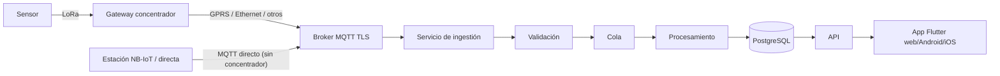

# PRODUCT_REQUIREMENTS.md

## 0. Estado de este documento
- Fase: 0 — Descubrimiento y definición de producto
- Estado: En análisis (decisiones clave ya tomadas, pendiente de cerrar detalle funcional en Fase 1)
- Última actualización: 2026-07-27

Ver también [`PROJECT_STATUS.md`](../PROJECT_STATUS.md) para el estado global de todas las fases.

---

## 1. Visión general del producto

Plataforma SaaS multitenant de monitorización IoT, orientada inicialmente al sector **agro/ambiental** (fincas, invernaderos, estaciones de monitorización ambiental), con vocación de mantenerse lo bastante genérica como para no acoplarse en exceso a ese sector en el modelo de datos ni en el protocolo.

Cada organización (cliente) accede en exclusiva a sus propios usuarios, instalaciones, gateways, dispositivos, sensores, mediciones, alertas y configuraciones, sobre una infraestructura compartida (SaaS multi-tenant), con aislamiento lógico estricto en backend y base de datos.

Los dispositivos y sensores de campo se conectan mediante dos topologías: (a) gateways concentradores que agregan sensores vía LoRa y transmiten al backend vía GPRS, Ethernet u otras conexiones, o (b) estaciones de conexión directa (NB-IoT u otra tecnología con IP propia) que se conectan al broker sin concentrador intermedio. En ambos casos el transporte es MQTT con TLS. El backend ingiere, valida y procesa la telemetría de forma asíncrona y tolerante a fallos (duplicados, desorden, reconexiones, picos), y la expone vía API REST/WebSocket a una aplicación Flutter (web, Android, iOS).

Existen 5 perfiles de usuario: administrador de plataforma, administrador de organización, técnico, operador y usuario de solo lectura.

## 2. Objetivo del producto

Permitir a organizaciones del sector agro/ambiental (y, por diseño, de otros sectores en el futuro) desplegar y supervisar redes de sensores de campo de forma remota, recibir alertas ante condiciones anómalas o pérdida de conectividad, y consultar el histórico de mediciones, sin que cada organización necesite operar su propia infraestructura.

## 3. Alcance

### 3.1 Dentro de alcance (borrador, sujeto a Fase 1)
- Gestión de organizaciones, usuarios, miembros, roles y permisos.
- Gestión de instalaciones, zonas, gateways, dispositivos y sensores.
- Ingesta, validación y almacenamiento de telemetría.
- Vista de últimas lecturas y gráficas históricas.
- Alertas por umbral y por pérdida de conectividad (offline).
- Notificaciones básicas (email / in-app).
- Autenticación y gestión de sesiones de usuario.
- Auditoría de acciones administrativas.

### 3.2 Fuera de alcance en el MVP (ver sección 9)
- Comandos remotos a dispositivos.
- Gestión de firmware.
- API keys para integraciones de terceros.
- MFA.
- Autoservicio de alta de organizaciones.
- Permisos granulares configurables por organización (más allá de los 5 roles fijos).

## 4. Actores y roles

| Rol | Ámbito | Descripción preliminar |
|---|---|---|
| Administrador de plataforma | Global (todas las organizaciones) | Da de alta organizaciones y su primer admin de organización. Soporte y operación de la plataforma. No opera datos de campo del día a día. |
| Administrador de organización | Una organización | Gestiona usuarios/miembros, instalaciones, gateways, dispositivos, sensores y configuración de alertas de su organización. |
| Técnico | Una organización | Aprovisiona/mantiene gateways y dispositivos, gestiona configuración técnica de sensores. |
| Operador | Una organización | Consulta datos, reconoce y resuelve alertas, no gestiona altas/bajas de infraestructura. |
| Usuario de solo lectura | Una organización | Solo consulta datos e informes, sin capacidad de modificar ni resolver alertas. |

> La matriz detallada de permisos por rol se define en la Fase 4 (Modelo de permisos).

## 5. Glosario (preliminar)

- **Organización**: cliente de la plataforma; unidad de aislamiento multitenant.
- **Instalación** (de cara al usuario, **Finca**): ubicación física gestionada por una organización (p. ej. una finca o invernadero).
- **Zona** (de cara al usuario, **Parcela**): subdivisión de una instalación (p. ej. una parcela o nave). Desde [ADR-0006](ADR/0006-infraestructura-ui-oculta-zona-dispositivo-sensor.md), no es un concepto visible en la UI de gestión ("Infraestructura") mientras no exista ningún concentrador LoRa real con varios dispositivos remotos — se crea de forma transparente al aprovisionar una Estación. El nombre "Parcela" queda reservado para la futura sección "Satélite" (`BACKLOG.md` #7), donde sí vuelve a tener sentido como polígono real sobre el terreno.
- **Gateway** (de cara al usuario, **Estación**): unidad que abre la conexión MQTT hacia el backend. Puede ser un **concentrador LoRa** (agrupa varios dispositivos y transmite vía GPRS/Ethernet/otros) o una **estación de conexión directa** (NB-IoT u otra tecnología con IP propia, sin concentrador intermedio) — ver [ADR-0004](ADR/0004-unidad-de-conexion-lora-y-nbiot.md). En la UI, "Estación" es el término único, independiente de `connectivity_type`.
- **Dispositivo**: equipo de campo asociado a un gateway, que aloja uno o varios sensores. Oculto en la UI de gestión mientras no exista un caso real de concentrador LoRa ([ADR-0006](ADR/0006-infraestructura-ui-oculta-zona-dispositivo-sensor.md)).
- **Sensor**: fuente concreta de una magnitud medida (temperatura, humedad, etc.). También oculto en la UI hoy — sus Canales aparecen como "Canales de la Estación" directamente ([ADR-0006](ADR/0006-infraestructura-ui-oculta-zona-dispositivo-sensor.md)).
- **Canal**: magnitud concreta que reporta una Estación (temperatura, humedad, conductividad, lluvia...). Catálogo ampliable en `channel_types` — ver `DATA_MODEL.md`.
- **Telemetría**: serie histórica de mediciones de un sensor.
- **Última lectura**: valor más reciente conocido de un sensor, mantenido en tabla propia para lectura rápida.
- **Alerta**: condición anómala detectada (umbral superado, dispositivo offline, riesgo de enfermedad, etc.) con ciclo de vida propio.
- **Campaña**: periodo de cultivo asociado a una Estación (cultivo, fecha de inicio/fin, notas) — ver `BACKLOG.md` #12.

## 6. Suposiciones actuales

- [SUPOSICIÓN] Idioma principal de la interfaz: español, con inglés como segundo idioma diferido a Fase 2 (no confirmado).
- [SUPOSICIÓN] Conjunto inicial de tipos de sensor: temperatura ambiente, humedad relativa, humedad de suelo, nivel de depósito/agua, batería/señal de gateway. Se ampliará si se confirma otro conjunto.
- [SUPOSICIÓN] Conectividad de campo: GPRS/4G como transporte principal gateway→broker en instalaciones rurales, Ethernet como alternativa en instalaciones con conectividad fija; LoRa siempre como enlace sensor→gateway.
- [SUPOSICIÓN] Alimentación de dispositivos de campo probablemente por batería/panel solar ⇒ el estado de batería es telemetría relevante desde el MVP.
- [SUPOSICIÓN] No existe hardware de gateway/sensor específico ya elegido; el protocolo MQTT debe mantenerse razonablemente agnóstico de fabricante.
- [SUPOSICIÓN] Proyecto greenfield, sin sistema legacy que migrar.
- [SUPOSICIÓN] Despliegue inicial en un único proveedor cloud o VPS, sin multi-región desde el día 1.
- [SUPOSICIÓN] Carpeta de proyecto: `C:\Users\javim\iot-platform` (indicar si se prefiere otra ubicación/nombre; aún no se ha inicializado como repositorio git).

## 7. Decisiones ya tomadas (Fase 0)

| Pregunta | Decisión |
|---|---|
| Sector / caso de uso principal | Agro / ambiental |
| Alta de organizaciones (MVP) | Manual, únicamente por el administrador de plataforma |
| Modelo de despliegue/negocio | SaaS multi-tenant en infraestructura compartida (aislamiento lógico, no instancias dedicadas) |
| Tamaño de equipo y plazo | Equipo pequeño (3-6 personas), horizonte de unos meses para el MVP |

## 8. Preguntas abiertas (menores, no bloqueantes para cerrar Fase 0)

- ¿Se requiere geolocalización/mapa de instalaciones desde el MVP, o puede diferirse?
- ¿Hay ya clientes piloto identificados o el MVP se valida internamente primero?
- ¿El canal de notificación mínimo aceptable para el MVP es solo email, o se necesita push móvil desde el día 1?

## 9. Propuesta de alcance por fases (borrador)

### 9.1 MVP (Fase 1 de producto)
Módulos de dominio incluidos (numeración según el listado maestro de 20 módulos):
1. Usuarios — alta por invitación, login, perfil.
2. Organizaciones — alta manual por admin de plataforma.
3. Miembros — asociación usuario↔organización.
4. Roles — los 5 roles fijos del sistema.
5. Permisos — matriz fija aplicada en backend, sin configuración por organización.
6. Instalaciones.
7. Zonas.
8. Gateways — alta, aprovisionamiento, estado online/offline.
9. Dispositivos.
10. Sensores.
11. Telemetría — ingestión MQTT → cola → validación → almacenamiento, con deduplicación y tolerancia a desorden.
12. Últimas lecturas.
13. Alertas — umbral simple + detección de offline; ciclo abierta/reconocida/resuelta.
14. Notificaciones — email (canal mínimo).
15. Sesiones — login, refresh rotativo, revocación.
16. Credenciales de dispositivos — por gateway, sin credenciales compartidas.
17. Auditoría — acciones administrativas críticas.

Frontend Flutter (MVP): login, selector de organización, dashboard de últimas lecturas por instalación/zona, listado de gateways/dispositivos/sensores con estado, gráfica histórica simple, listado de alertas con reconocer/resolver, gestión básica de usuarios de la organización.

Explícitamente fuera del MVP: comandos remotos, firmware, API keys, MFA.

### 9.2 Fase 2
- Comandos remotos + confirmación de ejecución.
- Firmware (gestión de versiones y distribución).
- API keys para integraciones de terceros.
- Informes en PDF con gráficas, intervalo personalizable y máx/mín/medias por día; exportación CSV/Excel con el mismo selector (`BACKLOG.md` #6).
- Resumen periódico por email (diario/semanal) como paso intermedio antes del informe PDF completo (`BACKLOG.md` #6).
- MFA para roles críticos (admin de plataforma / admin de organización).
- Notificaciones ampliadas: push móvil (FCM/APNs), SMS, webhooks.
- Permisos granulares configurables por organización.
- Multi-idioma en la interfaz (`BACKLOG.md` #11 — alcance exacto de "quién controla qué ve cada usuario" pendiente de confirmar).
- Pestaña de tiempo/clima por instalación vía API de terceros (`BACKLOG.md` #5).
- Campañas: qué se planta y cuándo, comparar evolución durante la campaña (`BACKLOG.md` #12).
- Selector manual de método de agregación en gráficas (forzar media/acumulado distinto del automático del MVP).
- Retención/archivado de telemetría configurable por organización.

### 9.3 Futuro / backlog
- Reglas de alertas avanzadas (combinadas, ventanas de tiempo, detección de anomalías) — incluye alertas de riesgo de enfermedades agronómicas (`BACKLOG.md` #8).
- Automatizaciones tipo "si esto entonces aquello" sobre comandos remotos.
- Pestaña de recomendaciones (p. ej. sobre riego, `BACKLOG.md` #9) y agente de IA sobre los datos con feedback del usuario (`BACKLOG.md` #10).
- Acceso a servicios de terceros vía API (p. ej. imágenes satelitales para humedad de parcela, `BACKLOG.md` #7).
- Instancias dedicadas / on-premise para clientes grandes (si se confirma demanda).
- Facturación / planes de suscripción.
- Marca blanca por organización.
- Integraciones externas (Grafana, Home Assistant, ERPs agrícolas).
- Sincronización offline-first robusta en apps móviles para zonas sin cobertura.

> Esta división es un borrador de partida. Se refinará en la Fase 1 (requisitos funcionales) con criterios de aceptación por función.

## 10. Flujo de datos (alto nivel, sin arquitectura definitiva)

## 11. Criterios de éxito del MVP (borrador, a completar en Fase 1)
- Una organización puede operar de principio a fin: alta manual → invitar usuarios → registrar instalación/zona/gateway/dispositivo/sensor → recibir telemetría real → verla en dashboard y gráfica histórica → recibir y resolver una alerta.
- Ninguna organización puede ver ni modificar datos de otra (verificado con pruebas de aislamiento).
- El sistema tolera desconexión de un gateway y reanuda la ingesta sin pérdida ni duplicación visible de datos al reconectar.

## 12. Documentos relacionados
- `FUNCTIONAL_REQUIREMENTS.md` — borrador (Etapa 1)
- `NON_FUNCTIONAL_REQUIREMENTS.md` — borrador (Etapa 2)
- `ARCHITECTURE.md` — borrador (Etapa 3)
- `PERMISSIONS.md` — borrador (Etapa 4, no estaba en la lista original de documentos pero se necesitaba para detallar RBAC)
- `DATA_MODEL.md` — pendiente (Etapa 5)
- `SECURITY.md` / `THREAT_MODEL.md` — pendiente (Fase 8)
- `MQTT_PROTOCOL.md` — pendiente (Fase 6)
- `API_DESIGN.md` / `OPENAPI.yaml` — pendiente (Fase 7)
- `DEPLOYMENT.md` / `OBSERVABILITY.md` — pendiente (Fases 9-10)
- `TESTING_STRATEGY.md` — pendiente (Fase 11)
- `BACKUP_AND_RECOVERY.md` / `INCIDENT_RESPONSE.md` — pendiente (Fase 12)
- `PRIVACY.md` — completo (creado 2026-07-27, tras cerrar Etapa 13)
- `ADR/` — decisiones arquitectónicas, se irán añadiendo a partir de la Fase 3

## 13. Historial de decisiones

| Fecha | Decisión | Alternativas consideradas | Origen |
|---|---|---|---|
| 2026-07-27 | Sector inicial: agro/ambiental | Genérico, industrial, cadena de frío | Respuesta del usuario |
| 2026-07-27 | Alta de organizaciones: manual por admin de plataforma | Autoservicio con aprobación, autoservicio libre | Respuesta del usuario |
| 2026-07-27 | Modelo de despliegue: SaaS multi-tenant compartido | Híbrido, on-premise | Respuesta del usuario |
