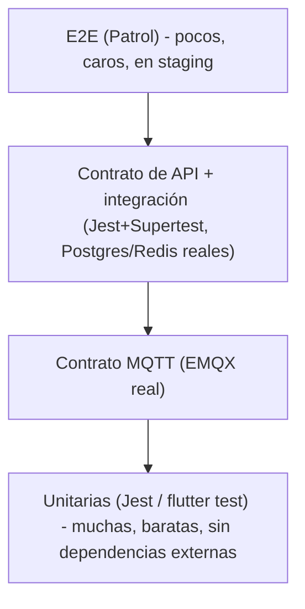

# TESTING_STRATEGY.md

## 0. Estado de este documento
- Etapa del proceso: 11 — Estrategia de pruebas
- Estado: En análisis (consolidación + decisiones nuevas, pendiente de tu validación)
- Última actualización: 2026-07-27
- Depende de: Etapas 0-10 (cada una ya dejó "pruebas necesarias derivadas" — esta etapa las organiza en una estrategia única, sin repetir su detalle)
- Bloquea: Etapa 13 (implementación sigue esta estrategia desde el primer commit)

Las etapas anteriores ya dejaron decenas de pruebas concretas dispersas (cada documento tiene su sección "Pruebas necesarias derivadas"). Este documento no las repite: fija la **pirámide de pruebas**, las **herramientas** por nivel, los **objetivos de cobertura** medibles, y resuelve las categorías que **aún no tenían dueño** (carga, resiliencia, migraciones, actualización móvil, backups).

## 1. Decisiones tomadas en esta etapa

| Decisión | Elegido |
|---|---|
| Pruebas unitarias backend | Jest |
| Pruebas unitarias Flutter | `flutter test` + `mocktail` |
| Pruebas E2E (las 3 plataformas) | `integration_test` + **Patrol** (no Playwright — CanvasKit de Flutter Web es opaco al DOM) |
| Contrato de API | `express-openapi-validator` (valida en runtime contra `OPENAPI.yaml`) + Supertest para escenarios de negocio |
| Contrato MQTT | Suite propia publicando mensajes contra un EMQX real de pruebas |
| Carga HTTP | k6 |
| Carga MQTT | `emqtt_bench` (herramienta oficial de EMQX — coherente con el broker ya elegido) |
| Resiliencia | Scripts de manipulación de contenedores Docker Compose (parar/matar/reiniciar), sin plataforma de chaos engineering dedicada |
| Cobertura objetivo | 80% líneas en `modules/**` (lógica de dominio); sin mínimo forzado en bootstrap/config |

## 2. Pirámide de pruebas

| Nivel | Cuándo corre | Entorno |
|---|---|---|
| Unitarias | Cada PR (`ci-cd.yml`, job `unit-tests`) | Sin dependencias externas |
| Integración | Cada PR (`ci-cd.yml`, job `integration-tests`) | Postgres/Redis efímeros en el runner |
| Contrato MQTT | Cada PR | EMQX efímero en el runner |
| Contrato de API | Cada PR | Contra el build local, validado frente a `OPENAPI.yaml` |
| E2E | Tras desplegar a staging (`ci-cd.yml`, job `e2e-staging`) | Staging real |
| Carga, resiliencia | Programadas (semanal), no en cada PR | Staging |
| Backups/restauración | Programada (mensual, Etapa 12) | Entorno aislado, nunca producción |

## 3. Pruebas unitarias
- Backend: servicios de dominio, guards de permisos (evaluación de la matriz de `PERMISSIONS.md` en aislamiento), función de agregación por tipo de canal (`average`/`sum`/`count_true`, Etapa 6), validadores de DTO.
- Flutter: lógica de estado (Riverpod providers), formateo/parsing, widgets críticos sin backend real (mocks).
- Cobertura: 80% líneas en código de dominio (`apps/backend/src/modules/**`, `apps/mobile/lib/features/**`) — no se persigue el 100%: código de arranque/configuración no aporta valor probado exhaustivamente.

## 4. Pruebas de integración
- Contra Postgres/Redis reales (no mocks) — configurado en `ci-cd.yml` (`integration-tests`, Etapa 9). **Primera prueba real: `apps/backend/test/integration/rls-isolation.spec.ts`** (añadida 2026-07-28, la primera vez que este proyecto corrió contra un Postgres real de cualquier tipo). Encontró dos bugs críticos de aislamiento multi-tenant que los 46 tests unitarios (Prisma mockeado) nunca pudieron detectar — ver `DATA_MODEL.md` §7/§9 para el detalle. El `ci-cd.yml` actualizado en el mismo cambio, pero **sin confirmar con un run real de GitHub Actions todavía** (el pipeline completo nunca se ha disparado — ver cabecera de `ci-cd.yml`).
- Repositorios y consultas reales (incluye las de agregación de `readings`, Etapa 7).
- Migraciones: se aplican desde cero en cada ejecución (ya implícito al levantar el Postgres efímero) — ver sección 8 para la prueba adicional contra datos realistas.
- **El rol de conexión de la prueba debe ser el rol de aplicación restringido (`iot_platform_app`), nunca el propietario de las tablas** — un superusuario/dueño se salta RLS por completo, dando una falsa sensación de cobertura. `rls-isolation.spec.ts` incluye una prueba que falla explícitamente si esto se rompe (`rolsuper`/`rolbypassrls` deben ser `false`).

## 5. Pruebas de contrato MQTT
Suite dedicada (`MQTT_PROTOCOL.md` sección 15 ya listó los casos) ejecutada contra un EMQX real de pruebas, no un mock del broker — un mock no verificaría que la ACL generada realmente se aplica. Publica mensajes válidos e inválidos y verifica el resultado en la cola/BD, no solo que `ingestion` "no explota".

## 6. Pruebas de contrato de API
- **Validación de esquema en runtime**: middleware (`express-openapi-validator`) que rechaza cualquier respuesta real que no cumpla `OPENAPI.yaml` — detecta que la documentación y la implementación no diverjan, en vez de confiar en que alguien actualice ambas a mano.
- **Escenarios de negocio**: Supertest sobre los flujos completos (login con selección de organización, `API_DESIGN.md` sección 3; CRUD de cada recurso; idempotencia con `Idempotency-Key` repetido).

## 7. Pruebas de aislamiento multitenant
Además de los casos ya listados (`DATA_MODEL.md` sección 12), se añade una **meta-prueba**: consulta `pg_policies`/`pg_tables` al final de la suite de integración y falla si alguna tabla con columna `organization_id` **no** tiene RLS activado — evita que una tabla nueva se añada en el futuro sin pasar por Etapa 5/8, sin depender de que alguien se acuerde de revisarlo manualmente.

**Estado real (2026-07-28)**: `rls-isolation.spec.ts` cubre el caso concreto ya encontrado (dos organizaciones, aislamiento end-to-end, rol sin `BYPASSRLS`), pero la meta-prueba genérica descrita arriba (escanear automáticamente *todas* las tablas con `organization_id` contra `pg_policies`) todavía no está escrita — sigue siendo la siguiente mejora natural de esta sección, ahora con más urgencia dado lo que se acaba de encontrar.

## 8. Pruebas de roles y permisos
La matriz de `PERMISSIONS.md` sección 4 se usa como **dato de prueba**, no solo como documentación: una fixture (YAML/JSON) que refleja esa tabla exactamente, recorrida en un test parametrizado que llama a cada endpoint con cada rol y compara el código de respuesta esperado. Si la matriz cambia, la fixture cambia con ella — documento y prueba no pueden divergir en silencio.

## 9. Pruebas de migraciones
- Aplicación desde cero: ya cubierta (sección 4).
- **Nueva**: mensualmente, se restaura el último backup de producción (Etapa 12) en un entorno aislado y se aplica la siguiente migración pendiente contra ese volumen de datos real — detecta migraciones que funcionan en una BD vacía de test pero son lentas o fallan con datos reales (bloqueo de tabla larga, por ejemplo).
- Migraciones siempre *expand-contract* (`DEPLOYMENT.md` sección 8): la prueba de compatibilidad hacia atrás consiste en ejecutar la suite de integración de la versión **anterior** del código contra el esquema **nuevo** ya migrado, y confirmar que sigue pasando.

## 10. Pruebas de carga
- **HTTP (k6)**: escenarios ya definidos con cifras en `NON_FUNCTIONAL_REQUIREMENTS.md`/`API_DESIGN.md` — p. ej. confirmar p95 ≤ 300ms en listados bajo carga simulada de varias organizaciones a la vez.
- **MQTT (`emqtt_bench`)**: 3 msg/s sostenidos (1h) y 150 msg/s de pico (60s) — cifras ya fijadas en `NON_FUNCTIONAL_REQUIREMENTS.md` sección 3 y `MQTT_PROTOCOL.md` sección 15, aquí se fija la herramienta concreta que las ejecuta.
- Frecuencia: semanal contra staging, y obligatoria antes de cualquier cambio que toque `ingestion`/`worker`/particionamiento de `telemetry`.

## 11. Pruebas de resiliencia
- Matar `worker` con jobs en cola (ya en `ARCHITECTURE.md` sección 15) y `ingestion` a mitad de ráfaga — mecanizadas como script que para/reinicia contenedores de `docker-compose.yml` y verifica cero pérdida de datos.
- Reiniciar EMQX y confirmar que los gateways reconectan y no se pierden mensajes en tránsito (persistencia de sesión, `DEPLOYMENT.md` sección 7).
- Cortar la conexión a Postgres brevemente (parar el contenedor/instancia) y confirmar que `api` responde con error controlado (no un 500 genérico) y se recupera sola al restaurarse la conexión.
- Sin plataforma de chaos engineering dedicada (tipo Chaos Mesh): no se justifica sin Kubernetes: los mismos scripts de Docker Compose cubren los escenarios relevantes a esta escala.

## 12. Pruebas de backups y restauración
Cadencia y criterio de aceptación fijados aquí; mecánica completa en Etapa 12: restauración mensual en entorno aislado, dentro del RTO de 4h (`NON_FUNCTIONAL_REQUIREMENTS.md`), con verificación de integridad (recuento de filas por tabla clave + checksum de una muestra) antes de dar el simulacro por válido.

## 13. Pruebas de actualización móvil
- **Compatibilidad hacia atrás de la API**: se guarda una copia de `OPENAPI.yaml` etiquetada en cada release móvil publicada. Un cambio de backend se contrasta contra las últimas 2-3 versiones móviles publicadas (no solo la última) — una tienda de apps (Android/iOS) no fuerza la actualización inmediata, así que versiones antiguas siguen en uso real durante semanas.
- **Migración de almacenamiento local**: si una versión nueva de la app cambia el esquema de lo que guarda localmente (caché, preferencias), se prueba la ruta de actualización desde la versión anterior instalada, no solo una instalación limpia.
- Sin comandos remotos en el MVP (V2) — no aplica todavía la prueba de "app antigua enviando un comando con formato obsoleto".

## 14. Pruebas ya definidas en etapas anteriores (referencia, no se repiten)
| Categoría | Dónde está el detalle |
|---|---|
| Mensajes duplicados/desordenados | `FUNCTIONAL_REQUIREMENTS.md` §23, `DATA_MODEL.md` §12 |
| Desconexión de gateways (LWT) | `MQTT_PROTOCOL.md` §15 |
| Reintentos y dead-letter | `OBSERVABILITY.md` §7, §16 |
| Comandos remotos | Diferido a V2 — sin pruebas todavía, se reutilizará el patrón de idempotencia ya probado en telemetría/API |

## 15. Riesgos
- Patrol es un framework más joven que Playwright/Cypress — su comunidad y documentación son menores; se acepta por ser la opción que sí funciona igual de bien contra CanvasKit que contra HTML renderer, evitando mantener dos estrategias de E2E distintas por plataforma.
- La meta-prueba de RLS (sección 7) depende de que el usuario de test tenga permiso para consultar `pg_policies` — a verificar que el rol de aplicación (sin `BYPASSRLS`, `DATA_MODEL.md`) no lo bloquee.

## 16. Entregables de esta etapa
- Este documento (`TESTING_STRATEGY.md`).
- [`.github/workflows/scheduled-load-resilience.yml`](../.github/workflows/scheduled-load-resilience.yml) (referencia, sección 10-11).

## 17. Criterios de aceptación de esta etapa
- Cada categoría de prueba solicitada explícitamente por el usuario tiene una herramienta concreta y una cadencia definida (en PR, semanal, mensual).
- Ninguna categoría quedó como "se probará más adelante" sin al menos una referencia a dónde y cuándo.

## 18. Pruebas necesarias derivadas de esta etapa
- Ejecutar `ci-cd.yml` completo contra un PR con una prueba unitaria fallando y confirmar que el pipeline se detiene antes de `integration-tests`.
- Añadir una tabla nueva con `organization_id` sin RLS y confirmar que la meta-prueba de la sección 7 la detecta y falla.
- Modificar `PERMISSIONS.md` sin actualizar la fixture de la sección 8 y confirmar que el test parametrizado falla (evidencia de que documento y prueba están realmente acoplados).

## 19. Lista de tareas de esta etapa
- [x] Fijar pirámide de pruebas, herramientas y cadencias.
- [x] Resolver las categorías sin dueño (carga, resiliencia, migraciones, actualización móvil, backups).
- [x] Crear el workflow de referencia de pruebas programadas.
- [ ] Revisión y validación por tu parte.
- [ ] Cerrar etapa y pasar a Etapa 12 (backup y recuperación).

## 20. Dependencias
- Depende de Etapas 0-10.
- Bloquea Etapa 13 (el código se escribe siguiendo esta estrategia desde el primer módulo, no se añaden pruebas al final).

## 21. Aspectos que se aplazan explícitamente
- Pruebas de comandos remotos (V2).
- Mutation testing — no justificado a este tamaño de equipo/plazo.
- Chaos engineering dedicado (Chaos Mesh u otro) — solo si se introduce Kubernetes en el futuro, no antes.

## 22. Errores frecuentes a evitar
- No perseguir 100% de cobertura de línea — 80% en dominio es el objetivo, más que eso en código de bajo riesgo es coste sin beneficio.
- No probar el contrato de API solo "a mano" de vez en cuando — la validación de esquema en runtime (sección 6) debe correr en cada PR, no ser una revisión ocasional.
- No dar por buena una migración solo porque pasa en una BD de test vacía — la prueba mensual contra datos reales (sección 9) es la que de verdad importa para tablas grandes como `telemetry`.
- No tratar un test intermitente como "normal" — se marca, se abre una incidencia, y se corrige o se elimina; no se ignora indefinidamente.

## 23. Historial de decisiones de esta etapa

| Fecha | Decisión | Alternativas consideradas |
|---|---|---|
| 2026-07-27 | Patrol/`integration_test` para E2E en las 3 plataformas | Playwright (descartado: no inspecciona bien CanvasKit de Flutter Web) |
| 2026-07-27 | k6 (HTTP) + `emqtt_bench` (MQTT) para pruebas de carga | Herramienta única para ambos (no existe una que cubra bien HTTP y MQTT a la vez con la misma calidad) |
| 2026-07-27 | Resiliencia con scripts de Docker Compose, sin chaos engineering dedicado | Chaos Mesh/Litmus (descartado: requieren Kubernetes, no justificado) |
| 2026-07-27 | Cobertura objetivo 80% en dominio, sin mínimo global | 100% de cobertura global (descartado: coste sin beneficio en código de bajo riesgo) |
| 2026-07-27 | Meta-prueba de RLS sobre `pg_policies` | Confiar en revisión manual de PR para no olvidar activar RLS en tablas nuevas |
